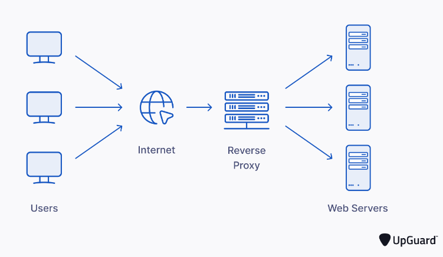

# whats a reverse proxy

A reverse proxy is a server (either an application or cloud service) positioned between clients (like browsers) and backend web servers. It intercepts client requests before they reach the origin server, routing them to the appropriate backend server. This setup ensures that clients do not directly interact with the backend servers.

Using a reverse proxy offers several advantages, including improved security, performance, and scalability.

To clients, the responses they receive appear to come directly from the web server, even though they passed through the reverse proxy.

Image credit goes to [https://www.cloudflare.com/](https://www.cloudflare.com/)

In a typical client server architecture without a reverse proxy deployed, client’s requests will go directly to the origin server who will in return response back directly to the client.
$
But with the architecture in the image, requests from clients and responses from the origin backend servers shall always pass through the reverse proxy.

Why do we need the reverse proxy? Multiple reasons:

### Load balancing

Popular websites with millions of daily users need to handle large amounts of traffic efficiently. Relying on a single server can cause performance issues or downtime due to the heavy load. To solve this, the website can use multiple servers to share the traffic. However, managing traffic across several servers requires a good load balancing solution, and this is where reverse proxies help.

Reverse proxies act as middlemen between users and the backend servers, distributing incoming requests across all available servers. This prevents any single server from getting overloaded. If a server goes down, the reverse proxy automatically redirects traffic to other working servers, ensuring the site stays available. By managing load balancing, reverse proxies boost scalability, reliability, and performance, allowing high-traffic websites to serve millions of users smoothly.

### Web acceleration: compressing data

Reverse proxies can compress both incoming and outgoing data.

By reducing the size of HTTP requests to the origin server and compressing HTTP responses to clients, bandwidth usage decreases. Smaller data means faster transfers across the network, leading to improved response times.

For example, web pages often have multiple resources like HTML, CSS, JavaScript, and images. Compressing these files at the reverse proxy level reduces their size, speeding up page load times and making the site faster for users. Smaller page sizes also lead to quicker rendering in browsers.

### Web acceleration: Caching

Caching is crucial for improving web application performance, and reverse proxies help make it happen. Imagine a user in Paris accessing a website with servers in Los Angeles. Instead of connecting directly to the distant server, the user is routed to a local reverse proxy in Paris. This proxy acts as a gateway, handling requests on behalf of the user.

Here's where caching comes in: when the reverse proxy receives data from the L.A. server, it stores a copy locally. For future users in Paris, the proxy serves this cached content, bypassing the need to connect to the server in Los Angeles. This dramatically speeds up load times, as users get content from the local cache instead of waiting for data to travel across long distances. By combining caching with reverse proxies, websites can deliver faster performance, regardless of where users are located.

## Security 

Reverse proxies can hide the identity and details of origin servers.

With a reverse proxy, a website or service doesn't need to expose the IP address of its origin server(s), making it harder for attackers to target or exploit vulnerabilities in the backend servers.

A reverse proxy can also enforce access controls, rate limiting, and filter incoming traffic, blocking suspicious IP addresses (blacklisting). This helps protect against common attacks like **DOS** and **DDOS**.

**DOS (Denial of Service)** attacks aim to overwhelm a server by flooding it with an excessive amount of requests, causing it to slow down or crash, making the website or service unavailable.

**DDOS (Distributed Denial of Service)** attacks are more powerful, using multiple compromised systems (often across the globe) to flood the target server, making it even harder to defend. Reverse proxies help mitigate these by distributing traffic and filtering out malicious requests before they reach the origin server.

### Maintenance

A reverse proxy in front of multiple backend servers allows you to perform maintenance, upgrades, or even shut down individual servers without affecting users. From the client’s perspective, the website remains fully accessible because the reverse proxy handles all communication and redirects requests to available servers. This ensures that maintenance on backend servers doesn’t disrupt the website’s functionality or availability for users.

### SSL Termination

A reverse proxy can handle SSL/TLS encryption and decryption on behalf of backend servers.  The reverse proxy decrypts incoming encrypted traffic, processes it, and forwards the unencrypted traffic to the backend servers. This offloads the computational load of encryption from the backend servers, improving their performance.

Here are some widely used reverse proxy solutions for load balancing, caching, SSL termination, and security:

1. **Nginx**: A high-performance, open-source reverse proxy known for speed, scalability, and flexibility. It handles reverse proxying, load balancing, SSL termination, HTTP/2, and caching.
2. **Apache HTTP Server (mod_proxy)**: Apache, a popular web server, can act as a reverse proxy with its mod_proxy module. It forwards requests to backend servers based on rules, offering flexibility and extensive features.
3. **HAProxy**: A reliable, open-source TCP/HTTP load balancer and proxy server known for distributing traffic efficiently. It supports advanced load balancing, SSL termination, health checks, and session persistence.