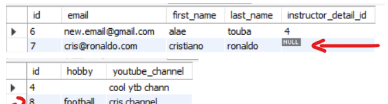
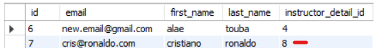
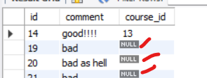

- [If you are using hibernate with Maven with Java 9, 10, 11 .. ( >8)](#if-you-are-using-hibernate-with-maven-with-java-9-10-11---8)
- [Spring and hibernate for beginners course (udemy): hibernate part](#spring-and-hibernate-for-beginners-course-udemy-hibernate-part)
  - [Set up a java project to work with hibernate (using maven quickstart)](#set-up-a-java-project-to-work-with-hibernate-using-maven-quickstart)
  - [Hibernate CRUD operations](#hibernate-crud-operations)
    - [Create](#create)
    - [Read](#read)
    - [Using the query language HQL](#using-the-query-language-hql)
    - [Delete](#delete)
    - [Update](#update)
  - [Hibernate OneToOne mapping (unidirictional)](#hibernate-onetoone-mapping-unidirictional)
  - [Hiberanate OneToOne mapping (bidirictional)](#hiberanate-onetoone-mapping-bidirictional)
  - [Hibernate OneToMany (unidirectional)](#hibernate-onetomany-unidirectional)
  - [Hibernate OneToMany mapping (bidirectional)](#hibernate-onetomany-mapping-bidirectional)
  - [EAGER vs LAZY loading](#eager-vs-lazy-loading)
  - [Hibernate ManyToMany mapping (bidirectional)](#hibernate-manytomany-mapping-bidirectional)
  - [How To View Hibernate SQL Parameter Values in the console:](#how-to-view-hibernate-sql-parameter-values-in-the-console)
- [Hibernate advanced developpement techniques (chad darby, udemy course)](#hibernate-advanced-developpement-techniques-chad-darby-udemy-course)
  - [Mapping a collection (**Set**)](#mapping-a-collection-set)
  - [Mapping a collection (**List**)](#mapping-a-collection-list)
  - [Mapping a collection (**Map**)](#mapping-a-collection-map)
  - [Mapping a collection (**Sorted set**)](#mapping-a-collection-sorted-set)
  - [Mapping a collection (**sorted Map**)](#mapping-a-collection-sorted-map)
  - [Embeddable](#embeddable)
  - [Mapping **Enums**](#mapping-enums)
  - [Mapping inheritence (**Single Table strategy**)](#mapping-inheritence-single-table-strategy)
  - [Mapping inheritence (**Table per Class strategy**)](#mapping-inheritence-table-per-class-strategy)
  - [Mapping inheritence (**Joined Table strategy**)](#mapping-inheritence-joined-table-strategy)
  - [Mapping inheritence (**Mapped Superclass strategy**)](#mapping-inheritence-mapped-superclass-strategy)
  - [Recap](#recap)
  - [Comparaison](#comparaison)

# If you are using hibernate with Maven with Java 9, 10, 11 .. ( >8)    

You should include this at your pom.xml

```xml
 <!-- Support for Java 9/10/11 -->
<!-- API, java.xml.bind module -->
<dependency>
    <groupId>jakarta.xml.bind</groupId>
    <artifactId>jakarta.xml.bind-api</artifactId>
    <version>2.3.2</version>
</dependency>

<!-- Runtime, com.sun.xml.bind module -->
<dependency>
    <groupId>org.glassfish.jaxb</groupId>
    <artifactId>jaxb-runtime</artifactId>
    <version>2.3.2</version>
</dependency>
```


# Spring and hibernate for beginners course (udemy): hibernate part

## Set up a java project to work with hibernate (using maven quickstart)

* Create a maven quick start project

* Add dependencies to: mysql connector, hibernate orm

* Create a database named: **hibernate-testing-db**

* Create the hibernate configuration file: **hibernate.cfg.xml** inside **src/main/resources** (or inside any folder that is in the classpath)

    ```xml
    <!DOCTYPE hibernate-configuration PUBLIC
        "-//Hibernate/Hibernate Configuration DTD 3.0//EN"
        "http://www.hibernate.org/dtd/hibernate-configuration-3.0.dtd">

    <hibernate-configuration>

        <session-factory>

            <!-- JDBC Database connection settings -->
            <property name="connection.driver_class">com.mysql.cj.jdbc.Driver</property>
            <property name="connection.url">jdbc:mysql://localhost:3306/hibernate-testing-db</property>
            <property name="connection.username">root</property>
            <property name="connection.password"></property>

            <!-- I dont really understand this -->
            <!-- the most used value is 1-->
            <property name="connection.pool_size">100</property>

            <!-- Select our SQL dialect -->
            <property name="hibernate.dialect">org.hibernate.dialect.MySQL5Dialect</property>

            <!-- Echo the SQL to stdout -->
            <property name="show_sql">true</property>

            <!-- Set the current session context -->
            <property name="current_session_context_class">thread</property>

            <!-- create tables if they dont exist (automatically), otherwise update-->
            <property name="hbm2ddl.auto">update</property>
        </session-factory>

    </hibernate-configuration>
    ```

* Create the entity: a class named **Student**:
    
    ```java
    package org.example;

    import javax.persistence.*;

    @Entity
    @Table(name = "students")
    public class Student {

        @Id
        @GeneratedValue(strategy = GenerationType.AUTO)
        private int id;

        @Column(name = "first_name")
        private String firstName;

        @Column(name = "last_name")
        private String lastName;

        @Column(name = "email")
        private String email;

        public Student(){}

        public Student(String firstName, String lastName, String email) {
            this.firstName = firstName;
            this.lastName = lastName;
            this.email = email;
        }

        public int getId() {
            return id;
        }

        public String getFirstName() {
            return firstName;
        }

        public String getLastName() {
            return lastName;
        }

        public String getEmail() {
            return email;
        }

        public void setId(int id) {
            this.id = id;
        }

        public void setFirstName(String firstName) {
            this.firstName = firstName;
        }

        public void setLastName(String lastName) {
            this.lastName = lastName;
        }

        public void setEmail(String email) {
            this.email = email;
        }

        @Override
        public String toString() {
            return "Student{" +
                    "id=" + id +
                    ", firstName='" + firstName + '\'' +
                    ", lastName='" + lastName + '\'' +
                    ", email='" + email + '\'' +
                    '}';
        }
    }
    ```

    **@GeneratedValue(strategy = GenerationType.AUTO)** indicates that the persistence provider should automatically pick an appropriate strategy for the particular database. This is the default GenerationType, i.e. if we just use @GeneratedValue annotation then this value of GenerationType will be used.

* Create the Main class class (named **App**) to test this:
    
    ```java
    package org.example;


    import org.hibernate.Session;
    import org.hibernate.SessionFactory;
    import org.hibernate.cfg.Configuration;


    public class App {
        public static void main( String[] args ) {

            // create session factory
            SessionFactory factory = new Configuration()
                    .configure("hibernate.cfg.xml")
                    .addAnnotatedClass(Student.class)
                    .buildSessionFactory();

            // create session
            Session session = factory.getCurrentSession();

            try {
                // create a student object
                System.out.println("Creating new student object...");
                Student tempStudent = new Student("alae", "touba", "alae@gmail.com");

                // start a transaction
                session.beginTransaction();

                // save the student object
                System.out.println("Saving the student...");
                session.save(tempStudent);

                // commit transaction
                session.getTransaction().commit();

                System.out.println("Done!");
            }
            finally {
                factory.close();
            }
        }
    }
    ```

After executing the code we will notice that the table "students" gets created automatically and after each execution it gets updated!


## Hibernate CRUD operations

* Set up a java project to work with hibernate (using maven quickstart)

* Create a maven quick start project

* Add dependencies to: mysql connector, hibernate orm

* Create a database named: **hibernate-testing-db**

* Create the hibernate configuration file: **hibernate.cfg.xml** inside **src/main/resources** (or inside any folder that is in the classpath)

    ```xml
    <!DOCTYPE hibernate-configuration PUBLIC
        "-//Hibernate/Hibernate Configuration DTD 3.0//EN"
        "http://www.hibernate.org/dtd/hibernate-configuration-3.0.dtd">

    <hibernate-configuration>

        <session-factory>

            <!-- JDBC Database connection settings -->
            <property name="connection.driver_class">com.mysql.cj.jdbc.Driver</property>
            <property name="connection.url">jdbc:mysql://localhost:3306/hibernate-testing-db</property>
            <property name="connection.username">root</property>
            <property name="connection.password"></property>

            <!-- I dont really understand this -->
            <!-- the most used value is 1-->
            <property name="connection.pool_size">100</property>

            <!-- Select our SQL dialect -->
            <property name="hibernate.dialect">org.hibernate.dialect.MySQL5Dialect</property>

            <!-- Echo the SQL to stdout -->
            <property name="show_sql">true</property>

            <!-- Set the current session context -->
            <property name="current_session_context_class">thread</property>

            <!-- create tables if they dont exist (automatically), otherwise update-->
            <property name="hbm2ddl.auto">update</property>
        </session-factory>

    </hibernate-configuration>
    ```

* Create the entity: a class named **Student**:
    
    ```java
    package org.example;

    import javax.persistence.*;

    @Entity
    @Table(name = "students")
    public class Student {

        @Id
        @GeneratedValue(strategy = GenerationType.AUTO)
        private int id;

        @Column(name = "first_name")
        private String firstName;

        @Column(name = "last_name")
        private String lastName;

        @Column(name = "email")
        private String email;

        public Student(){}

        public Student(String firstName, String lastName, String email) {
            this.firstName = firstName;
            this.lastName = lastName;
            this.email = email;
        }

        public int getId() {
            return id;
        }

        public String getFirstName() {
            return firstName;
        }

        public String getLastName() {
            return lastName;
        }

        public String getEmail() {
            return email;
        }

        public void setId(int id) {
            this.id = id;
        }

        public void setFirstName(String firstName) {
            this.firstName = firstName;
        }

        public void setLastName(String lastName) {
            this.lastName = lastName;
        }

        public void setEmail(String email) {
            this.email = email;
        }

        @Override
        public String toString() {
            return "Student{" +
                    "id=" + id +
                    ", firstName='" + firstName + '\'' +
                    ", lastName='" + lastName + '\'' +
                    ", email='" + email + '\'' +
                    '}';
        }
    }
    ```

    **@GeneratedValue(strategy = GenerationType.AUTO)** indicates that the persistence provider should automatically pick an appropriate strategy for the particular database. This is the default GenerationType, i.e. if we just use @GeneratedValue annotation then this value of GenerationType will be used.


Now for each operation (i.e delete, read, update, etc) I will create a Driver class (Main class) that shows how to the operation.

### Create

Create a class named **PrimaryKeyDemo**:

Here we will see how to save entites without primary key value (primary keys will be generated automatically).

```java
package org.example;

import org.hibernate.Session;
import org.hibernate.SessionFactory;
import org.hibernate.cfg.Configuration;

public class PrimaryKeyDemo {

    public static void main(String[] args) {

        // create session factory
        SessionFactory factory = new Configuration()
                .configure("hibernate.cfg.xml")
                .addAnnotatedClass(Student.class)
                .buildSessionFactory();

        // create session
        Session session = factory.getCurrentSession();

        try {
            // create 3 student objects
            System.out.println("Creating 3 student objects...");
            Student s1 = new Student("alae", "touba", "alae@gmail.com");
            Student s2 = new Student("hamza", "jebbar", "hamza@jebbar.com");
            Student s3 = new Student("khalil", "elbasri", "khalil@yahoo.fr");

            // start a transaction
            session.beginTransaction();

            // save the student object
            System.out.println("Saving the students...");
            session.save(s1);
            session.save(s2);
            session.save(s3);

            // commit transaction
            session.getTransaction().commit();

            System.out.println("Done!");
        }
        finally {
            factory.close();
        }
    }
}
```

Notice that i didnt specify the primary key and it will be generated AUTOmatically **(@GeneratedValue(strategy = GenerationType.AUTO))**.

Here is a look at the table that gets created and populated.


### Read

Create a class named: **ReadStudentDemo**.

Here we will see how to get an entity with primary key.

We will be using the **get** method. As params, it takes an identifier, and either an entity name or a class types.

```java
public Object get(Class clazz, Serializable id) throws HibernateException
public Object get(String entityName, Serializable id) throws HibernateException
```


```java
package org.example;

import org.hibernate.Session;
import org.hibernate.SessionFactory;
import org.hibernate.cfg.Configuration;

public class ReadStudentDemo {
    public static void main(String[] args) {
        // create session factory
        SessionFactory factory = new Configuration()
                .configure("hibernate.cfg.xml")
                .addAnnotatedClass(Student.class)
                .buildSessionFactory();

        // create session
        Session session = factory.getCurrentSession();

        try {
            int id = 1;

            session.beginTransaction();

            // retrieve student based on the id primary key (using the entity type )
            Student student = session.get(Student.class, id);
            System.out.println("Get complete: " + student);


            //retrieve student based on the id primary key (using the entity name: fully qualified name of the entity)
            student = (Student) session.get(Student.class.getName(), 1);
            System.out.println("Get complete: " + student);


            // commit the transaction
            session.getTransaction().commit();
        }
        finally {
            factory.close();
        }
    }
}
```

Here is the Output in the console:

```
Get complete: Student{id=1, firstName='alae', lastName='touba', email='alae@gmail.com'}
Get complete: Student{id=1, firstName='alae', lastName='touba', email='alae@gmail.com'}
```

### Using the query language HQL

Create a class named **QueryStudentsDemo**.
    
We will see how to use HQL (hibernate query language) to query students but HQL queries can be used also to do update, delete, insert, etc.

```java
package org.example;

import java.util.List;

import org.hibernate.Session;
import org.hibernate.SessionFactory;
import org.hibernate.cfg.Configuration;

import javax.persistence.TypedQuery;

public class QueryStudentDemo {

    public static void main(String[] args) {

        // create session factory
        SessionFactory factory = new Configuration()
                .configure("hibernate.cfg.xml")
                .addAnnotatedClass(Student.class)
                .buildSessionFactory();

        // create session
        Session session = factory.getCurrentSession();

        try {

            // start a transaction
            session.beginTransaction();

            // query all students
            TypedQuery<Student> typedQuery = session.createQuery("from Student",
                                                        Student.class);

            List<Student> students = typedQuery.getResultList();

            // query students: lastName='Doe'
            students = session
                            .createQuery("from Student s where s.lastName='touba'",
                                    Student.class)
                            .getResultList();

            // query students: lastName='touba' OR firstName='hamza'
            students = session
                            .createQuery("from Student s where"
                                + " s.lastName='touba' OR s.firstName='hamza'",
                                    Student.class)
                            .getResultList();

            // query students where email LIKE '%gmail.com'
            students = session
                            .createQuery("from Student s where"
                                    + " s.email LIKE '%gmail.com'", Student.class)
                            .getResultList();

            // query student by firstName and get single result
            TypedQuery<Student> query = session
                        .createQuery("from Student s where s.firstName = 'alae'", Student.class);
                        
            Student student = query.getSingleResult();

            // query with named params using setParameter
            String firstName = "alae";
            String lastName = "touba";
            
            TypedQuery<Student> query = session
                            .createQuery("from Student s where s.firstName = :firstName AND s.lastName = :lastName", Student.class)
                            .setParameter("firstName", firstName)
                            .setParameter("lastName", lastName);
                
            Student student = query.getSingleResult();

            // query with named params using setProperties
            Map<String, String> stud = new HashMap<>();
            stud.put("firstName", "alae");
            stud.put("lastName", "touba");
            
            TypedQuery<Student> query = session
                            .createQuery("from Student s where s.firstName = :firstName AND s.lastName = :lastName", Student.class)
                            .setProperties(stud);
            
            Student student = query.getSingleResult();

            // commit transaction
            session.getTransaction().commit();

            System.out.println("Done!");
        }
        finally {
            factory.close();
        }
    }

    private static void displayStudents(List<Student> students) {
        for (Student tempStudent : students) {
            System.out.println(tempStudent);
        }
    }
}
``` 

### Delete 

Create a class named **DeleteStudentDemo**.
    
We will see how to delete an entity using primary key and using a query (HQL)

```java
package org.example;

import org.hibernate.Session;
import org.hibernate.SessionFactory;
import org.hibernate.cfg.Configuration;
public class DeleteStudentDemo {

    public static void main(String[] args) {

        // create session factory
        SessionFactory factory = new Configuration()
                .configure("hibernate.cfg.xml")
                .addAnnotatedClass(Student.class)
                .buildSessionFactory();

        // create session
        Session session = factory.getCurrentSession();

        try {
            int id = 1;

            session.beginTransaction();

            // retrieve student based on the id: primary key
            Student myStudent = session.get(Student.class, id);

            // delete the student
            System.out.println("Deleting student: " + myStudent);
            session.delete(myStudent);

            session.getTransaction().commit();

            // delete student with id=2 using a query
            System.out.println("Deleting student id=2");
            id = 2;

            session = factory.getCurrentSession();
            session.beginTransaction();
            session.createQuery("delete from Student where id=2").executeUpdate();

            // commit the transaction
            session.getTransaction().commit();

            System.out.println("Done!");
        }
        finally {
            factory.close();
        }
    }
}
```

Here is the console's output:

```bash
Getting student with id: 1
...
Deleting student: Student{id=1, firstName='alae', lastName='touba', email='alae@gmail.com'}
...
Deleting student id=2
...
Done!
```

Now if we go and see the content of the database we will see that the users with id 1 and 2 are gone.

### Update

Create a class named **UpdateStudentDemo**.
  
We will see how easy to get an entity with its primary key and update it and also how to use HQL to update multiple entities with more control.

```java
package org.example;

import org.hibernate.Session;
import org.hibernate.SessionFactory;
import org.hibernate.cfg.Configuration;

public class UpdateStudentDemo {

    public static void main(String[] args) {

        // create session factory
        SessionFactory factory = new Configuration()
                .configure("hibernate.cfg.xml")
                .addAnnotatedClass(Student.class)
                .buildSessionFactory();

        // create session
        Session session = factory.getCurrentSession();

        try {
            int id = 1;

            session.beginTransaction();

            // retrieve student based on the id: primary key and then update it
            Student myStudent = session.get(Student.class, id);
            myStudent.setFirstName("Scooby");


            // Using a query to update multiple students
            session.createQuery("update Student set email='foo@gmail.com'")
                    .executeUpdate();

            // Using a named query to update a student
            int updatedEntities = session
                .createQuery("update Student s set s.firstName = :newFirstName where s.firstName = :oldFirstName ")
                .setParameter("oldFirstName", "ALAE")
                .setParameter("newFirstName", "alae")
                .executeUpdate();
            /*
            * This also works (without the alias):
            * update Student set firstName = :newFirstName where firstName = :oldFirstName 
            */

            System.out.println(updatedEntities); //1

                    
            session.getTransaction().commit();
        }
        finally {
            factory.close();
        }
    }
}
```

## Hibernate OneToOne mapping (unidirictional)

This is a full example of OneToOne.

We will have two tables, the schema of the tables will be as follow in the DB:\
**instructors** (id, first_name, last_name, email, instructor_detail_id) \
**instructors_details**(id, youtube_channel, hobby)
		
A constructor has a constructor detail and each instructor detail belongs to only one instructor => OneToOne.

instructor_detail_id is a foreign key that references the instructor's detail in the instructor_detail table (**instructor_detail_id** is a **foreign key** that **references** the the **id** column that is the **primary key** in the instructors_details table)
	
This a **unidirectional OneToOn**e, meaning that we only can go from instructor to instructor's detail

<br>

Lets follow these steps to create the project:

* Create a maven quick start project

* Add dependencies to: mysql connector, hibernate orm

* Create a database named: **hibernate-testing-db** (tables will be gererated automatically)

* Create the hibernate configuration file: **hibernate.cfg.xml** inside **src/main/resources** (or inside any folder that is in the classpath)

    ```xml
    <!DOCTYPE hibernate-configuration PUBLIC
        "-//Hibernate/Hibernate Configuration DTD 3.0//EN"
        "http://www.hibernate.org/dtd/hibernate-configuration-3.0.dtd">

    <hibernate-configuration>

        <session-factory>

            <!-- JDBC Database connection settings -->
            <property name="connection.driver_class">com.mysql.cj.jdbc.Driver</property>
            <property name="connection.url">jdbc:mysql://localhost:3306/hibernate-testing-db</property>
            <property name="connection.username">root</property>
            <property name="connection.password"></property>

            <!-- I dont really understand this -->
            <!-- the most used value is 1-->
            <property name="connection.pool_size">100</property>

            <!-- Select our SQL dialect -->
            <property name="hibernate.dialect">org.hibernate.dialect.MySQL5Dialect</property>

            <!-- Echo the SQL to stdout -->
            <property name="show_sql">true</property>

            <!-- Set the current session context -->
            <property name="current_session_context_class">thread</property>

            <!-- create tables if they dont exist (automatically), otherwise update-->
            <property name="hbm2ddl.auto">update</property>
        </session-factory>

    </hibernate-configuration>
    ```

* Create a class named **Instructor**

    ```java
    package org.example;

    import javax.persistence.*;

    @Entity
    @Table(name = "instructors")
    public class Instructor {

        @Id
        @GeneratedValue(strategy = GenerationType.AUTO)
        @Column(name = "id")
        private int id;

        @Column(name = "first_name")
        private String firstName;

        @Column(name = "last_name")
        private String lastName;

        @Column(name = "email")
        private  String email;

        @OneToOne(cascade = CascadeType.ALL)
        @JoinColumn(name = "instructor_detail_id")
        private InstructorDetail instructorDetail;

        public Instructor(){}

        public Instructor(String firstName, String lastName, String email){
            this.firstName = firstName;
            this.lastName = lastName;
            this.email = email;
        }

        public int getId() {
            return id;
        }

        public String getFirstName() {
            return firstName;
        }

        public String getLastName() {
            return lastName;
        }

        public String getEmail() {
            return email;
        }

        public InstructorDetail getInstructorDetail() {
            return instructorDetail;
        }

        public void setId(int id) {
            this.id = id;
        }

        public void setFirstName(String firstName) {
            this.firstName = firstName;
        }

        public void setLastName(String lastName) {
            this.lastName = lastName;
        }

        public void setEmail(String email) {
            this.email = email;
        }

        public void setInstructorDetail(InstructorDetail instructorDetail) {
            this.instructorDetail = instructorDetail;
        }

        @Override
        public String toString() {
            return "Instructor{" +
                    "id=" + id +
                    ", firstName='" + firstName + '\'' +
                    ", lastName='" + lastName + '\'' +
                    ", email='" + email + '\'' +
                    '}';
        }
    }
    ```

* Create a class named **InstructorDetail**
  
    ```java
    package org.example;


    import javax.persistence.*;

    @Entity
    @Table(name = "instructors_details")

    public class InstructorDetail {

        @Id
        @Column(name = "id")
        @GeneratedValue(strategy = GenerationType.AUTO)
        private int id;

        @Column(name = "youtube_channel")
        private String youtubeChannel;

        @Column(name = "hobby")
        private String hobby;

        public InstructorDetail(){}

        public InstructorDetail(String youtubeChannel, String hobby){
            this.youtubeChannel = youtubeChannel;
            this.hobby = hobby;
        }

        public int getId() {
            return id;
        }

        public String getYoutubeChannel() {
            return youtubeChannel;
        }

        public String getHobby() {
            return hobby;
        }

        public void setId(int id) {
            this.id = id;
        }

        public void setYoutubeChannel(String youtubeChannel) {
            this.youtubeChannel = youtubeChannel;
        }

        public void setHobby(String hobby) {
            this.hobby = hobby;
        }

        @Override
        public String toString() {
            return "InstructorDetail{" +
                    "id=" + id +
                    ", youtubeChannel='" + youtubeChannel + '\'' +
                    ", hobby='" + hobby + '\'' +
                    '}';
        }
    }
    ```

* (Creating an instructor with its instructor detail) create a Main class:

    ```java
    package org.example;

    import org.hibernate.Session;
    import org.hibernate.SessionFactory;
    import org.hibernate.cfg.Configuration;

    public class Main {
        public static void main(String[] args) {

            SessionFactory factory = new Configuration()
                    .configure("hibernate.cfg.xml")
                    .addAnnotatedClass(Instructor.class)
                    .addAnnotatedClass(InstructorDetail.class)
                    .buildSessionFactory();

            Session session = factory.getCurrentSession();

            try{
                //create instuctor
                Instructor instructor = new Instructor("alae", "touba", "alae@gmail.com");

                //create instructor's detail
                InstructorDetail instructorDetail = new InstructorDetail("www.youtube.com/channel",
                        "programming");

                //link them
                instructor.setInstructorDetail(instructorDetail);

                session.beginTransaction();

                //save the instructor object in the instructors table
                //=> this will save also the instuctorDetail object in instructors_details table
                // because of CASCADING
                session.save(instructor);

                session.getTransaction().commit();
            }finally {
                factory.close();
            }
        }
    }
    ```

    We created an instance of the **Instructor** class and an instance of the **InstructorDetail** class and then we linked them togeter and we save the **Instructor** instance. After executing the code both instances will be saved saved to the DB into 2 different tables (instructors and instructors_details).

    Here is the content of the DB:

       


* Creating only an instructor
    
    ```java
    session.beginTransaction();
    Instructor instructor = new Instructor("yassine", "capitos", "yassine@gmail.com");
	session.save(instructor);
    session.getTransaction().commit();
    ```
    
    
    notice the column **instructor_detaill_id** is NULL.

* Creating a instructor detail and linking it to an existing instructor in the db
    
    we will link this instructor detail to the previous instructor (yassine)

    ```java
    session.beginTransaction();
    
    InstructorDetail instructorDetail = new InstructorDetail("youtube", "video games");
    Instructor instructor = session.get(Instructor.class, 1);
    instructor.setInstructorDetail(instructorDetail);
    
    session.getTransaction().commit();
    ```

    

* Deleting an instructor:

    ```java
    session.beginTransaction();
    Instructor instructor = session.get(Instructor.class, 1);

    //test if instructor with id 1 exists in the DB because get returns null if it founds nothing
    if(instructor != null){
        // delete the instructor with id 1 from the instructors table
        // => this will also delete the instructor detail associated with this instructor
        // from the instructors_details table because of cascading deletes
        session.delete(instructor);
    }

    session.getTransaction().commit();
    ```    

    we got the instructor with id 1 and we deleted it from **instructors** table, this will also delete its associated detail from **instructors_details** table.

    


* Deleting an instructor's details

    ```java
    session.beginTransaction();

    //getting the instructor
    Instructor instructor = session.get(Instructor.class, instructorId);   

    //getting the instructor's detail
    InstructorDetail instructorDetail = instructor.getInstructorDetail();  

    //breaking the link
    instructor.setInstructorDetail(null); 

    //deleting the instructor's detail
    session.delete(instructorDetail); 	

    session.getTransaction().commit();
    ```

* Updating an instructor
    
    ```java
    session.beginTransaction();

    Instructor instructor = session.get(Instructor.class, instructorId);
    instructor.setFirstName("alex");

    session.getTransaction().commit();
    ```
    
    
* Updating an instructor detail
	
	* method1: directly by its id (<=>instructor's detail id):
    
        ```java
		session.beginTransaction();

		InstructorDetail instructorDetail = session.get(InstructorDetail.class, instructorDetailId);
		instructorDetail.setYoutubeChannel("youtube/channel01");

		session.getTransaction().commit();
        ```

	* method2: by the instructor:

        ```java
        session.beginTransaction();

        //getting the instructor
        Instructor instructor = session.get(Instructor.class, instructorId);	

        //getting its instructor detail and modifyng it
        instructor.getInstructorDetail().setYoutubeChannel("youtube");	

        session.getTransaction().commit();
        ```
        


## Hiberanate OneToOne mapping (bidirictional)

We will have two tables in the db:\
**instructors** (id, first_name, last_name, email, instructor_detail_id) \
**instructors_details**(id, youtube_channel, hobby)
		
A constructor has a constructor detail and each instructor detail belongs to only one instructor => OneToOne.

instructor_detail_id is a foreign key that references the instructor's detail in the instructor_detail table


This relationship will be bidirictioanl which means we can go from an instructor to its instructors details and vice versa.

<br>

Lets follow these steps to create the project:

* Create a maven quick start project

* Add dependencies to: mysql connector, hibernate orm

    For example, for a Maven quick start project, with java version 11, this is how pom.xml looks like.

    ```xml
    <?xml version="1.0" encoding="UTF-8"?>

    <project xmlns="http://maven.apache.org/POM/4.0.0" 
        xmlns:xsi="http://www.w3.org/2001/XMLSchema-instance" 
	    xsi:schemaLocation="http://maven.apache.org/POM/4.0.0 http://maven.apache.org/xsd/maven-4.0.0.xsd">

        <modelVersion>4.0.0</modelVersion>

        <groupId>com.alae.programming</groupId>
        <artifactId>playing-with-hibernate</artifactId>
        <version>0.0.1-SNAPSHOT</version>

        <name>playing-with-hibernate</name>
        <!-- FIXME change it to the project's website -->
        <url>http://www.example.com</url>

        <properties>
            <project.build.sourceEncoding>UTF-8</project.build.sourceEncoding>
            <maven.compiler.release>11</maven.compiler.release>
        </properties>

        <dependencies>
            <dependency>
                <groupId>junit</groupId>
                <artifactId>junit</artifactId>
                <version>4.11</version>
                <scope>test</scope>
            </dependency>

            <!-- Support for Java 9/10/11 -->
            <!-- API, java.xml.bind module -->
            <dependency>
                <groupId>jakarta.xml.bind</groupId>
                <artifactId>jakarta.xml.bind-api</artifactId>
                <version>2.3.2</version>
            </dependency>

            <!-- Runtime, com.sun.xml.bind module -->
            <dependency>
                <groupId>org.glassfish.jaxb</groupId>
                <artifactId>jaxb-runtime</artifactId>
                <version>2.3.2</version>
            </dependency>

            <!-- https://mvnrepository.com/artifact/org.hibernate/hibernate-core -->
            <dependency>
                <groupId>org.hibernate</groupId>
                <artifactId>hibernate-core</artifactId>
                <version>5.6.8.Final</version>
            </dependency>


            <!-- https://mvnrepository.com/artifact/mysql/mysql-connector-java -->
            <dependency>
                <groupId>mysql</groupId>
                <artifactId>mysql-connector-java</artifactId>
                <version>8.0.16</version>
            </dependency>

        </dependencies>

        <build>
            <pluginManagement>
                <!-- lock down plugins versions to avoid using Maven defaults (may be moved to parent pom) -->
                <plugins>
                    <!-- clean lifecycle, see https://maven.apache.org/ref/current/maven-core/lifecycles.html#clean_Lifecycle -->
                    <plugin>
                        <artifactId>maven-clean-plugin</artifactId>
                        <version>3.1.0</version>
                    </plugin>
                    <!-- default lifecycle, jar packaging: see https://maven.apache.org/ref/current/maven-core/default-bindings.html#Plugin_bindings_for_jar_packaging -->
                    <plugin>
                        <artifactId>maven-resources-plugin</artifactId>
                        <version>3.0.2</version>
                    </plugin>
                    <plugin>
                        <artifactId>maven-compiler-plugin</artifactId>
                        <version>3.8.0</version>
                    </plugin>
                    <plugin>
                        <artifactId>maven-surefire-plugin</artifactId>
                        <version>2.22.1</version>
                    </plugin>
                    <plugin>
                        <artifactId>maven-jar-plugin</artifactId>
                        <version>3.0.2</version>
                    </plugin>
                    <plugin>
                        <artifactId>maven-install-plugin</artifactId>
                        <version>2.5.2</version>
                    </plugin>
                    <plugin>
                        <artifactId>maven-deploy-plugin</artifactId>
                        <version>2.8.2</version>
                    </plugin>
                    <!-- site lifecycle, see https://maven.apache.org/ref/current/maven-core/lifecycles.html#site_Lifecycle -->
                    <plugin>
                        <artifactId>maven-site-plugin</artifactId>
                        <version>3.7.1</version>
                    </plugin>
                    <plugin>
                        <artifactId>maven-project-info-reports-plugin</artifactId>
                        <version>3.0.0</version>
                    </plugin>
                </plugins>
            </pluginManagement>
        </build>
    </project>
    ```

* Create a database named: **hibernate-testing-db** (tables will be gererated automatically)

* Create the hibernate configuration file: **hibernate.cfg.xml** inside **src/main/resources** (or inside any folder that is in the classpath)

    ```xml
    <!DOCTYPE hibernate-configuration PUBLIC
        "-//Hibernate/Hibernate Configuration DTD 3.0//EN"
        "http://www.hibernate.org/dtd/hibernate-configuration-3.0.dtd">

    <hibernate-configuration>

        <session-factory>

            <!-- JDBC Database connection settings -->
            <property name="connection.driver_class">com.mysql.cj.jdbc.Driver</property>
            <property name="connection.url">jdbc:mysql://localhost:3306/hibernate-testing-db</property>
            <property name="connection.username">root</property>
            <property name="connection.password"></property>

            <!-- I dont really understand this -->
            <!-- the most used value is 1-->
            <property name="connection.pool_size">100</property>

            <!-- Select our SQL dialect -->
            <property name="hibernate.dialect">org.hibernate.dialect.MySQL5Dialect</property>

            <!-- Echo the SQL to stdout -->
            <property name="show_sql">true</property>

            <!-- Set the current session context -->
            <property name="current_session_context_class">thread</property>

            <!-- create tables if they dont exist (automatically), otherwise update-->
            <property name="hbm2ddl.auto">update</property>
        </session-factory>

    </hibernate-configuration>
    ```

* Create a class named **Instructor**

    ```java
    package org.example;

    import javax.persistence.*;

    @Entity
    @Table(name = "instructors")
    public class Instructor {

        @Id
        @GeneratedValue(strategy = GenerationType.AUTO)
        @Column(name = "id")
        private int id;

        @Column(name = "first_name")
        private String firstName;

        @Column(name = "last_name")
        private String lastName;

        @Column(name = "email")
        private  String email;

        @OneToOne(cascade = CascadeType.ALL)
        @JoinColumn(name = "instructor_detail_id")
        private InstructorDetail instructorDetail;

        public Instructor(){}

        public Instructor(String firstName, String lastName, String email){
            this.firstName = firstName;
            this.lastName = lastName;
            this.email = email;
        }

        public int getId() {
            return id;
        }

        public String getFirstName() {
            return firstName;
        }

        public String getLastName() {
            return lastName;
        }

        public String getEmail() {
            return email;
        }

        public InstructorDetail getInstructorDetail() {
            return instructorDetail;
        }

        public void setId(int id) {
            this.id = id;
        }

        public void setFirstName(String firstName) {
            this.firstName = firstName;
        }

        public void setLastName(String lastName) {
            this.lastName = lastName;
        }

        public void setEmail(String email) {
            this.email = email;
        }

        public void setInstructorDetail(InstructorDetail instructorDetail) {
            this.instructorDetail = instructorDetail;
        }

        @Override
        public String toString() {
            return "Instructor{" +
                    "id=" + id +
                    ", firstName='" + firstName + '\'' +
                    ", lastName='" + lastName + '\'' +
                    ", email='" + email + '\'' +
                    '}';
        }
    }
    ```

* Create a class named **InstrucotorDetail**
  
    ```java
    package org.example;


    import javax.persistence.*;

    @Entity
    @Table(name = "instructors_details")

    public class InstructorDetail {

        @Id
        @Column(name = "id")
        @GeneratedValue(strategy = GenerationType.AUTO)
        private int id;

        @Column(name = "youtube_channel")
        private String youtubeChannel;

        @Column(name = "hobby")
        private String hobby;

        @OneToOne(mappedBy = "instructorDetail", cascade = CascadeType.ALL)
        private Instructor instructor;

        public InstructorDetail(){}

        public InstructorDetail(String youtubeChannel, String hobby){
            this.youtubeChannel = youtubeChannel;
            this.hobby = hobby;
        }

        public int getId() {
            return id;
        }

        public String getYoutubeChannel() {
            return youtubeChannel;
        }

        public String getHobby() {
            return hobby;
        }

        public void setId(int id) {
            this.id = id;
        }

        public void setYoutubeChannel(String youtubeChannel) {
            this.youtubeChannel = youtubeChannel;
        }

        public void setHobby(String hobby) {
            this.hobby = hobby;
        }

        public Instructor getInstructor() {
            return instructor;
        }

        public void setInstructor(Instructor instructor) {
            this.instructor = instructor;
        }

        @Override
        public String toString() {
            return "InstructorDetail{" +
                    "id=" + id +
                    ", youtubeChannel='" + youtubeChannel + '\'' +
                    ", hobby='" + hobby + '\'' +
                    '}';
        }
    }
    ```

    whats the use of mappedBy? to tell hibernate not to create a column for instructor field in the courses table, because this collumn is mapped by the instructorDetail field (which means the instructor_detail_id column in instructors table) of the Instructor class.

* Creating instructor and its instructor detail
  
	```java
    //create instuctor
    Instructor instructor = new Instructor("alae", "touba", "alae@gmail.com");

    //create instructor's detail
    InstructorDetail instructorDetail = new InstructorDetail("www.youtube.com/channel",
            "programming");

    //link them
    instructor.setInstructorDetail(instructorDetail);
    instructorDetail.setInstructor(instructor);

    session.beginTransaction();

    //save the instructor object in the instructors table
    //=> this will save also the instuctorDetail object in instructors_details table
    // because of CASCADING
    session.save(instructor);

    session.getTransaction().commit();
    ```
* Creating an instructor

    ```java
    session.beginTransaction();
    Instructor instructor = new Instructor("yassine", "capitos", "yassine@gmail.com");
	session.save(instructor);
    session.getTransaction().commit();
    ```

* Creating an instructor Detail:

    ```java
    session.beginTransaction();

    InstructorDetail instructorDetail = new InstructorDetail("cris channel", "football");
    session.save(instructorDetail);
    
    session.getTransaction().commit();
    ```

* Linking an existing instructor with an existing instructor detail

    * content of the DB before

        

    * code

        ```java
        session.beginTransaction();
			
        Instructor instructor = session.get(Instructor.class, 7);
        InstructorDetail instructorDetail = session.get(InstructorDetail.class, 8);
        
        instructor.setInstructorDetail(instructorDetail);
        instructorDetail.setInstructor(instructor);
        
        session.getTransaction().commit();
        ```


    * content of the DB after

        

* Creating an instructor detail and linking it to an existing instructor in the db
    
    ```java
     session.beginTransaction();
    
    InstructorDetail instructorDetail = new InstructorDetail("youtube", "video games");
    Instructor instructor = session.get(Instructor.class, 1);
    instructor.setInstructorDetail(instructorDetail);
    
    session.getTransaction().commit();
    ```

* Creating an instructor and linking it to an already existing instructor detail

    ```java
    Instructor instructor = new Instructor("alae", "touba", "alae@gmail.com");
    
    //supposing that the existing instructor detail has id 4 in the DB
    InstructorDetail instructorDetail = session.get(InstructorDetail.class, 4);
    
    /*
    * we will update the instructor detail object and because of cascading, a new instructure will be created in the DB
    * and we mustn't forget to do the link from the instructor side
    */
    
    instructor.setInstructorDetail(instructorDetail);
    instructorDetail.setInstructor(instructor);
    session.getTransaction().commit();
    ```

* Get the instructor from the instructor detail object

    here is what we have in the db now:

    

    ```java
    int instructorDetailId = 6;

    session.beginTransaction();

    //get the instructor's detail from table (instructors_details)
    InstructorDetail instructorDetail = session.get(InstructorDetail.class, instructorDetailId);

    if(instructorDetail != null){
        // get the instructor
        Instructor instructor = instructorDetail.getInstructor();

        System.out.println(instructorDetail);
        System.out.println(instructor);
    }


    session.getTransaction().commit();
    ```

    here is the output in the console:

    ```bash
    ...
    InstructorDetail{id=6, youtubeChannel='www.youtube.com/channel', hobby='programming'}
    Instructor{id=5, firstName='alae', lastName='touba', email='alae@gmail.com'}
    ```

* Updating an instructor

    * method1: directly

        ```java
        session.beginTransaction();

        Instructor instructor = session.get(Instructor.class, instructorId);
        instructor.setFirstName("alex");

        session.getTransaction().commit();    
        ```

    * method2: using the instructor detail:

        ```java
        session.beginTransaction();
        
        int instructorDetailId = 4;
        InstructorDetail instructorDetail = session.get(InstructorDetail.class, instructorDetailId);
            
        instructorDetail.getInstructor().setEmail("new.email@gmail.com");
        session.getTransaction().commit();
        ```

        Watch out for NullPointerException errors, here I assume that an instructor Detail with id 4 exists in the database, and, it has an instructor :)
 

* Updating an instructor detail
	
    * method1: directly
    
        ```java
		session.beginTransaction();

		InstructorDetail instructorDetail = session.get(InstructorDetail.class, instructorDetailId);
		instructorDetail.setYoutubeChannel("youtube/channel01");

		session.getTransaction().commit();
        ```

	* method2: by the instructor:

        ```java
        session.beginTransaction();

        //getting the instructor
        Instructor instructor = session.get(Instructor.class, instructorId);	

        //getting its instructor detail and modifying it
        instructor.getInstructorDetail().setYoutubeChannel("youtube");	

        session.getTransaction().commit();
        ```


* Deleting instructor's detail 

    Will delete instructor also because of cascade delete on the instructor detail entity.

    ```java
    int instructorDetailId = 6;

    session.beginTransaction();

    InstructorDetail instructorDetail = session.get(InstructorDetail.class, instructorDetailId);
    if(instructorDetail != null){
        // delete the instructor's detail from the instructors_details table
        // =>will also delete the instructor from the instructors table
        // because of cascade ALL that we have in the InstructorDetail class
        session.delete(instructorDetail);
    }

    session.getTransaction().commit();
    ```

* Deleteing the instructor's detail without deleting the instructor
	
    For this, we dont want cascading delete in the InstructorDetail.java entity. So we will change its code to look like this
	
    ```java
    @OneToOne(mappedBy = "instructorDetail", cascade = {
            CascadeType.DETACH, CascadeType.MERGE, CascadeType.PERSIST, CascadeType.REFRESH
    })
    private Instructor instructor;
    ```

    Now here is the code to delete the instrcutor's details (from instructors_details table) without deleting the instructor (from instructors table)

    ```java
    int instructorDetailId = 8;

    session.beginTransaction();

    InstructorDetail instructorDetail = session.get(InstructorDetail.class, instructorDetailId);

    if(instructorDetail != null){
        // remove the associated object reference
        // break bidirectional link
        instructorDetail.getInstructor().setInstructorDetail(null);

        // delete instructor detail from "instructors_details" table
        session.delete(instructorDetail);
    }

    session.getTransaction().commit();
    ```


## Hibernate OneToMany (unidirectional)

We will have a one to many relationship between two entities: **Course** and **Review** (a course has many reviews)

<br>
lets follow these steps to create the project:

* Create a maven quick start project

* Add dependencies to: mysql connector, hibernate ORM

* Create a database named: **hibernate-testing-db** (tables will be generacted automatically, how good is that :) ?)

* Create the hibernate configuration file: **hibernate.cfg.xml** inside **src/main/resources** (or inside any folder that is in the classpath)

    ```xml
    <!DOCTYPE hibernate-configuration PUBLIC
        "-//Hibernate/Hibernate Configuration DTD 3.0//EN"
        "http://www.hibernate.org/dtd/hibernate-configuration-3.0.dtd">

    <hibernate-configuration>

        <session-factory>

            <!-- JDBC Database connection settings -->
            <property name="connection.driver_class">com.mysql.cj.jdbc.Driver</property>
            <property name="connection.url">jdbc:mysql://localhost:3306/hibernate-testing-db</property>
            <property name="connection.username">root</property>
            <property name="connection.password"></property>

            <property name="connection.pool_size">100</property>

            <!-- Select our SQL dialect -->
            <property name="hibernate.dialect">org.hibernate.dialect.MySQL5Dialect</property>

            <!-- Echo the SQL to stdout -->
            <property name="show_sql">true</property>

            <!-- Set the current session context -->
            <property name="current_session_context_class">thread</property>

            <!-- create tables if they dont exist (automatically), otherwise update-->
            <property name="hbm2ddl.auto">update</property>
        </session-factory>

    </hibernate-configuration>
    ```

* Create the **Course** entity:

    ```java
    package org.example;


    import javax.persistence.*;
    import java.util.*;

    @Entity
    @Table(name = "courses")
    public class Course {

        @Id
        @GeneratedValue(strategy = GenerationType.AUTO)
        @Column(name = "id")
        private int id;

        @Column(name = "title")
        private String title;

        public Course(String title){
            this.title = title;
        }

        public Course(){}


        public int getId() {
            return id;
        }

        public String getTitle() {
            return title;
        }

        public void setId(int id) {
            this.id = id;
        }

        public void setTitle(String title) {
            this.title = title;
        }

        @OneToMany(fetch = FetchType.LAZY, cascade = CascadeType.ALL)
        @JoinColumn(name = "course_id")
        private List<Review> reviews;

        public void addReview(Review review){
            if(reviews == null){
                reviews = new ArrayList<>();
            }

            reviews.add(review);
        }

        public List<Review> getReviews() {
            return reviews;
        }

        public void setReviews(List<Review> reviews) {
            this.reviews = reviews;
        }

        @Override
        public String toString() {
            return "Course{" +
                    "id=" + id +
                    ", title='" + title + '\'' +
                    '}';
        }
    }
    ```

* Create the **Review** entity:

    ```java
    package org.example;

    import javax.persistence.*;

    @Entity
    @Table(name = "reviews")
    public class Review {

        @Id
        @GeneratedValue(strategy = GenerationType.AUTO)
        private int id;

        @Column(name = "comment")
        private String comment;

        public Review(){}

        public Review(String comment){
            this.comment = comment;
        }

        public int getId() {
            return id;
        }

        public void setId(int id) {
            this.id = id;
        }

        public String getComment() {
            return comment;
        }

        public void setComment(String comment) {
            this.comment = comment;
        }

        @Override
        public String toString() {
            return "Review{" +
                    "id=" + id +
                    ", comment='" + comment + '\'' +
                    '}';
        }
    }
    ```

* Insert a course with its reviews 

    ```java
    package org.example;

    import org.hibernate.Session;
    import org.hibernate.SessionFactory;
    import org.hibernate.cfg.Configuration;

    import java.util.List;

    public class Main {
        public static void main(String[] args) {

            SessionFactory factory = new Configuration()
                    .configure("hibernate.cfg.xml")
                    .addAnnotatedClass(Course.class)
                    .addAnnotatedClass(Review.class)
                    .buildSessionFactory();

            Session session = factory.getCurrentSession();

            try{

                session.beginTransaction();

                Course course = new Course("course1");

                Review review1 = new Review("comment on course1");
                Review review2 = new Review("commen2 on course1");

                course.addReview(review1);
                course.addReview(review2);

                session.save(course);

                session.getTransaction().commit();


            }finally {
                session.close();
                factory.close();
            }
        }
    }
    ```

    We just needed to add the reviews to the course's reviews list and save the course (without saving the reviews).

    Here is what the db looks like afetr this operation:

    

* Add reviews to an existing course:

    ```java
    session.beginTransaction();

    int courseId = 1;
    Course course = session.get(Course.class, courseId);
    course.addReview(new Review("review"));
    session.getTransaction().commit();
    ```

* Getting the course reviews

    ```java
    session.beginTransaction();

    int courseId = 1;
    Course course = session.get(Course.class, courseId);
    List<Review> reviews = course.getReviews();
    System.out.println(reviews);

    session.getTransaction().commit();
    ```

* Deleting a course (will also delete its reviews due to cascading delete)

    ```java
    session.beginTransaction();

    int courseId = 1;
    Course course = session.get(Course.class, courseId);
    session.delete(course);
    session.getTransaction().commit();
    ```

* Deleting a course's reviews

    In this example we want to delete all bad reviews for a course. 

    ```java
    // create session
    Session session = factory.getCurrentSession();

    try {
        session.beginTransaction();
        
        Course course = session.get(Course.class, 13);
        
        if (course != null) {
            List<Review> notBadReviews = new ArrayList<Review>();
			List<Review> badReviews = new ArrayList<Review>();
		
			course.getReviews().forEach(review -> {
				if (review.getComment().contains("bad")) {
					badReviews.add(review);
				} else {
					notBadReviews.add(review);
				}
			});
			
			//breaking the link
			course.setReviews(notBadReviews);
			
			//deleting the wanted reviews from DB
			badReviews.forEach(review -> session.delete(review));
        }
        
        session.getTransaction().commit();

    } finally {
        factory.close();
    }
    ```

    If you try to just break the link between a course and its reviews like this:

    ```java
    Course course = session.get(Course.class, 13);
                
    List<Review> notBadReviews = course
                    .getReviews()
                    .stream()
                    .filter(review -> !review.getComment().contains("bad"))
                    .collect(Collectors.toList());

    course.setReviews(notBadReviews);
    ```

    Then bad reviews will not be deleted from the DB, they will just get separated from their course. Below is a screenshot of the **reviews** table
    
    

* Updating a course's review

    * directly using its primary id

        ```java
        session.beginTransaction();
        int reviewId = 14;
        Review review = session.get(Review.class, reviewId);
        review.setComment(review.getComment() + "!!");
        session.getTransaction().commit();
        ```

    * using the course

        ```java
        session.beginTransaction();
		
        Course course = session.get(Course.class, 13);
        Review review = course.getReviews().get(0);
        course.getReviews().get(0).setComment(review.getComment() + "!!");
        
        session.getTransaction().commit();
        ```

## Hibernate OneToMany mapping (bidirectional)


We will have 3 entities: Instructor, InstructorDetail, Course .

An instrcutor has one instrcutor detail and an instrcutor detail belongs to an instrcutor => one to one.

An instructor has many courses & a course belongs to only one instrucor => ManyToMany.

<br>
Lets follow these steps to create the project:

* Create a maven quick start project

* Add dependencies to: mysql connector, hibernate orm

* Create a database named: **hibernate-testing-db** (tables will be generated )

* Create the hibernate configuration file: **hibernate.cfg.xml** inside **src/main/resources** (or inside any folder that is in the classpath)

    ```xml
    <!DOCTYPE hibernate-configuration PUBLIC
        "-//Hibernate/Hibernate Configuration DTD 3.0//EN"
        "http://www.hibernate.org/dtd/hibernate-configuration-3.0.dtd">

    <hibernate-configuration>

        <session-factory>

            <!-- JDBC Database connection settings -->
            <property name="connection.driver_class">com.mysql.cj.jdbc.Driver</property>
            <property name="connection.url">jdbc:mysql://localhost:3306/hibernate-testing-db</property>
            <property name="connection.username">root</property>
            <property name="connection.password"></property>

            <!-- I dont really understand this -->
            <!-- the most used value is 1-->
            <property name="connection.pool_size">100</property>

            <!-- Select our SQL dialect -->
            <property name="hibernate.dialect">org.hibernate.dialect.MySQL5Dialect</property>

            <!-- Echo the SQL to stdout -->
            <property name="show_sql">true</property>

            <!-- Set the current session context -->
            <property name="current_session_context_class">thread</property>

            <!-- create tables if they dont exist (automatically), otherwise update-->
            <property name="hbm2ddl.auto">update</property>
        </session-factory>

    </hibernate-configuration>
    ```
* Create the **Instructor** entity

    ```java
    package org.example;

    import javax.persistence.*;
    import java.util.*;

    @Entity
    @Table(name = "instructors")
    public class Instructor {

        @Id
        @GeneratedValue(strategy = GenerationType.AUTO)
        @Column(name = "id")
        private int id;

        @Column(name = "first_name")
        private String firstName;

        @Column(name = "last_name")
        private String lastName;

        @Column(name = "email")
        private  String email;

        @OneToOne(cascade = CascadeType.ALL)
        @JoinColumn(name = "instructor_detail_id")
        private InstructorDetail instructorDetail;

        @OneToMany(mappedBy = "instructor", cascade = {
                CascadeType.DETACH, CascadeType.MERGE, CascadeType.PERSIST, CascadeType.REFRESH
        })
        private List<Course> courses;

        public Instructor(){}

        public Instructor(String firstName, String lastName, String email){
            this.firstName = firstName;
            this.lastName = lastName;
            this.email = email;
        }

        public int getId() {
            return id;
        }

        public String getFirstName() {
            return firstName;
        }

        public String getLastName() {
            return lastName;
        }

        public String getEmail() {
            return email;
        }


        public void setId(int id) {
            this.id = id;
        }

        public void setFirstName(String firstName) {
            this.firstName = firstName;
        }

        public void setLastName(String lastName) {
            this.lastName = lastName;
        }

        public void setEmail(String email) {
            this.email = email;
        }

        public InstructorDetail getInstructorDetail() {
            return instructorDetail;
        }

        public void setInstructorDetail(InstructorDetail instructorDetail) {
            this.instructorDetail = instructorDetail;
        }


        public List<Course> getCourses() {
            return courses;
        }

        public void setCourses(List<Course> courses) {
            this.courses = courses;
        }

        //convenience method
        /*
        public void addCourse(Course course){
            if(courses == null){
                courses = new ArrayList<>();
            }

            courses.add(course);
        }
        */


        @Override
        public String toString() {
            return "Instructor{" +
                    "id=" + id +
                    ", firstName='" + firstName + '\'' +
                    ", lastName='" + lastName + '\'' +
                    ", email='" + email + '\'' +
                    '}';
        }
    }
    ```

* Create the **InstructorDetail** entity

    ```java
    package org.example;


    import javax.persistence.*;

    @Entity
    @Table(name = "instructors_details")

    public class InstructorDetail {

        @Id
        @Column(name = "id")
        @GeneratedValue(strategy = GenerationType.AUTO)
        private int id;

        @Column(name = "youtube_channel")
        private String youtubeChannel;

        @Column(name = "hobby")
        private String hobby;

        @OneToOne(mappedBy = "instructorDetail", cascade = {
                CascadeType.DETACH, CascadeType.MERGE, CascadeType.PERSIST, CascadeType.REFRESH
        })
        private Instructor instructor;


        public InstructorDetail(){}

        public InstructorDetail(String youtubeChannel, String hobby){
            this.youtubeChannel = youtubeChannel;
            this.hobby = hobby;
        }

        public int getId() {
            return id;
        }

        public String getYoutubeChannel() {
            return youtubeChannel;
        }

        public String getHobby() {
            return hobby;
        }

        public void setId(int id) {
            this.id = id;
        }

        public void setYoutubeChannel(String youtubeChannel) {
            this.youtubeChannel = youtubeChannel;
        }

        public void setHobby(String hobby) {
            this.hobby = hobby;
        }

        @Override
        public String toString() {
            return "InstructorDetail{" +
                    "id=" + id +
                    ", youtubeChannel='" + youtubeChannel + '\'' +
                    ", hobby='" + hobby + '\'' +
                    '}';
        }

        public Instructor getInstructor() {
            return instructor;
        }

        public void setInstructor(Instructor instructor) {
            this.instructor = instructor;
        }
    }
    ```

* Create the **Course** entity

    ```java
    package org.example;


    import javax.persistence.*;

    @Entity
    @Table(name = "courses")
    public class Course {

        @Id
        @GeneratedValue(strategy = GenerationType.AUTO)
        @Column(name = "id")
        private int id;

        @Column(name = "title")
        private String title;

        @ManyToOne(cascade = {
                CascadeType.DETACH, CascadeType.MERGE, CascadeType.PERSIST, CascadeType.REFRESH
        })
        @JoinColumn(name = "instructor_id")
        private Instructor instructor;

        public Course(String title){
            this.title = title;
        }

        public Course(){}

        public Course(String title, Instructor instructor) {
            this.title = title;
            this.instructor = instructor;
        }

        public int getId() {
            return id;
        }

        public String getTitle() {
            return title;
        }

        public void setId(int id) {
            this.id = id;
        }

        public void setTitle(String title) {
            this.title = title;
        }

        public void setInstructor(Instructor instructor) {
            this.instructor = instructor;
        }

        public Instructor getInstructor() {
            return instructor;
        }

        @Override
        public String toString() {
            return "Course{" +
                    "id=" + id +
                    ", title='" + title + '\'' +
                    '}';
        }
    }
    ```

* Create an instructor and associate an instructor details to it, and also associat some courses to it

    ```java
    package org.example;

    import org.hibernate.Session;
    import org.hibernate.SessionFactory;
    import org.hibernate.cfg.Configuration;

    public class Main {
        public static void main(String[] args) {

            SessionFactory factory = new Configuration()
                    .configure("hibernate.cfg.xml")
                    .addAnnotatedClass(Instructor.class)
                    .addAnnotatedClass(InstructorDetail.class)
                    .addAnnotatedClass(Course.class)
                    .buildSessionFactory();

            Session session = factory.getCurrentSession();

            try{

                session.beginTransaction();

                Instructor instructor = new Instructor("yassine", "capi", "yassine gmail");

                InstructorDetail instructorDetail = new InstructorDetail("youtube", "video games");
                instructor.setInstructorDetail(instructorDetail);

                Course course1 = new Course("course1");
                Course course2 = new Course("course2");

                course1.setInstructor(instructor);
                course2.setInstructor(instructor);

                session.save(instructor);

                session.save(course1);
                session.save(course2);

                session.getTransaction().commit();
            }finally {
                factory.close();
            }
        }
    }
    ```

    here is what the DB looks like after executing this code:

    

* Create courses for an instructor (we have the instructor stored in the DB)

    ```java
    session.beginTransaction();

    Course course = new Course("course title");
    Instructor instructor = session.get(Instructor.class, 9);
    course.setInstructor(instructor);
    session.save(course);

    session.getTransaction().commit();
    ```

* Linking an existing instructor with an existing course (we have the instructor and the course both already in the DB, we just have to link them)

    * lets create first an instructor and a course (unrelated) in the DB.

    ```java
    package org.example;

    import org.hibernate.Session;
    import org.hibernate.SessionFactory;
    import org.hibernate.cfg.Configuration;

    public class Main {
        public static void main(String[] args) {

            SessionFactory factory = new Configuration()
                    .configure("hibernate.cfg.xml")
                    .addAnnotatedClass(Instructor.class)
                    .addAnnotatedClass(InstructorDetail.class)
                    .addAnnotatedClass(Course.class)
                    .buildSessionFactory();

            Session session = factory.getCurrentSession();

            try{
                // create an instructor
                session.beginTransaction();
                Instructor yassine = new Instructor("yassine", "capitos", "yassine@gmail.com");
                session.save(yassine);
                session.getTransaction().commit();

                // create a course
                Course course = new Course("course title");
                session = factory.getCurrentSession();
                session.beginTransaction();
                session.save(course);
                session.getTransaction().commit();

                
            }finally {
                factory.close();
            }
        }
    }
    ```

    Here is how the DB looks like after executing this code:

    

    * lets write the code that to the association between the 2 entities

    ```java
    session.beginTransaction();

    // get the instructor
    Instructor instructor = session.get(Instructor.class, 1);

    //get the course
    Course course = session.get(Course.class, 2);

    // associate/link them
    course.setInstructor(instructor);

    session.getTransaction().commit();
    ```

    

    we see in the **courses** table that that the value of the column **instructor_id** is now 1 pointing to the instructor (with id 1) in the **instructors**    


* Getting all the instructor's courses

    
    ```java
    session.beginTransaction();

    int instructorId = 1;
    Instructor inst = session.get(Instructor.class, instructorId);
    List<Course> courses = inst.getCourses();
    
    session.getTransaction().commit();
    ```

* Get the course's instructor:

    ```java

    session.beginTransaction();
    int courseId = 2;
    Instructor instructor = session.get(Course.class, courseId).getInstructor();
    session.getTransaction().commit();
    ```

* Updating an instructor by primary key

    ```java
    session.beginTransaction();

    int instructorId = 1;
    session.get(Instructor.class, instructorId).setFirstName("new first name");

    session.getTransaction().commit();
    ```
 
* Updating a course by PK:
    
    ```java
    session.beginTransaction();

    int courseId = 2;
    session.get(Course.class, courseId).setTitle("new title");

    session.getTransaction().commit();
    ```

* Updating an instructor from some of its courses

    ```java
    session.beginTransaction();

    Course course = session.get(Course.class, 2);
    course.getInstructor().setFirstName("alae");

    session.getTransaction().commit();
    ```

* Updating a course from its instructor

    ```java
    session.beginTransaction();

    Instructor instructor = session.get(Instructor.class, 1);

    //updating the first course
    // in the list of instructor's courses
    instructor.getCourses().get(0).setTitle("title changed");
    session.getTransaction().commit();
    ```

* Delete a course (this wont delete the instructor becuase we dont have cascading delete)

    ```java
    int courseId = 2;

    session.beginTransaction();

    Course course = session.get(Course.class, courseId);

    if (course != null){
        session.delete(course);
    }

    session.getTransaction().commit();
    ```


* Delete an instructor without deleting its courses (because we dont have a cascade delete in instructor's courses)

    ```java
    session.beginTransaction();

    Instructor instructor = session.get(Instructor.class, 1);

    // breaking the links between courses and their instructor
    instructor.getCourses().forEach((course) -> course.setInstructor(null));

    session.delete( instructor );

    session.getTransaction().commit();
    ```

* Delete an instructor and all its courses 
	* we must have cascading delete, so change the Instructor entity like this

        ```java
		@OneToMany(mappedBy = "instructor", cascade = CascadeType.ALL)
		private List<Course> courses;
        ```
	
	* code:

        ```java
        session.beginTransaction();
        int intstructorId = 10;
        session.delete( session.get(Instructor.class, instructorId) );
        session.getTransaction().commit();
        ```


## EAGER vs LAZY loading

Suppose we have 3 entities: Instructor, InstructorDeatil & Course.
Instructor has one INstructorDetail and vice versa => one to one.
INstructor has many courses and a course belongs to one intstructor => ont to many.

* What is EAGER and LAZY loading?
	
    suppose we query the databse for the instructor with id 5, do we want to retrieve also all its courses at the same time? or we want to retrieve just the instructor and get the courses after and on demand?
	
    If we are usign EAGER mode, when we retrieve the instructor, a query to course table will be made also and we'll have all the instructor's courses available.
	
    If we are using LAZY mode, when we retrieve the instructor, we'll retrieve just the instructor not its courses also :) the courses will be loaded when we need them :)

* Default fetch types
  
    * OneToOne: FetchType.EAGER
    * OneToMany: FetchType.LAZY
    * ManyToOne: FetchType.EAGER
    * ManyToMany: FetchType.LAZY
		
		
* EAGER loading demo:
    
    Here is what we should put in the Instructor entity if we want to fetch courses in EAGER mode:
    
    ```java
    @OneToMany(fetch = FetchType.EAGER ,mappedBy = "instructor", cascade = {
            CascadeType.DETACH, CascadeType.MERGE, CascadeType.PERSIST, CascadeType.REFRESH
    })
    private List<Course> courses;
    ```    
    
    So now if we do:
    ```java
    Instructor instructor = session.get(Instructor.class, instructorId);
    ```

    All the instructor's courses will be also retrieved from the course table

* LAZY loading demo:

    When we have lazy loading on instructor's courses and we do:
    ```java
    Instructor instructor = session.get(Instructor.class, instructorId);
    ```

    The instrucor's courses will not be retrieved from the DB.\
    They'll be retrieved when we do something like: instructor.getCourses() 


## Hibernate ManyToMany mapping (bidirectional)


We will work with two entities: Student.java & Course.java 

Each student has many courses and each course has many students => ManyToMany

We will have 3 tables in the db:
* **courses**(id, title) for courses
* **students**(id, first_name, last_name, email) for students
* **course_student**(course_id, student_id) for the associations 

<br>

Lets see the steps to create a project:

* Create a maven quick start project
* Add dependencies to: mysql connector, hibernate orm
* Create a database named: **hibernate-testing-db** (tables will be generated )
* Create the hibernate configuration file: **hibernate.cfg.xml** inside **src/main/resources** (or inside any folder that is in the classpath)

    ```xml
    <!DOCTYPE hibernate-configuration PUBLIC
        "-//Hibernate/Hibernate Configuration DTD 3.0//EN"
        "http://www.hibernate.org/dtd/hibernate-configuration-3.0.dtd">

    <hibernate-configuration>

        <session-factory>

            <!-- JDBC Database connection settings -->
            <property name="connection.driver_class">com.mysql.cj.jdbc.Driver</property>
            <property name="connection.url">jdbc:mysql://localhost:3306/hibernate-testing-db</property>
            <property name="connection.username">root</property>
            <property name="connection.password"></property>

            <!-- I dont really understand this -->
            <!-- the most used value is 1-->
            <property name="connection.pool_size">100</property>

            <!-- Select our SQL dialect -->
            <property name="hibernate.dialect">org.hibernate.dialect.MySQL5Dialect</property>

            <!-- Echo the SQL to stdout -->
            <property name="show_sql">true</property>

            <!-- Set the current session context -->
            <property name="current_session_context_class">thread</property>

            <!-- create tables if they dont exist (automatically), otherwise update-->
            <property name="hbm2ddl.auto">update</property>
        </session-factory>

    </hibernate-configuration>
    ```
* Create the **Course** entity

    ```java
    package org.example;

    import javax.persistence.*;
    import java.util.ArrayList;
    import java.util.List;

    @Entity
    @Table(name = "courses")
    public class Course {

        @Id
        @GeneratedValue(strategy = GenerationType.AUTO)
        @Column(name = "id")
        private int id;

        @Column(name = "title")
        private String title;

        @ManyToMany(fetch = FetchType.LAZY, cascade =
                {CascadeType.DETACH, CascadeType.MERGE, CascadeType.PERSIST, CascadeType.REFRESH})
        @JoinTable(
                name = "course_student",
                joinColumns = @JoinColumn(name = "course_id"),
                inverseJoinColumns = @JoinColumn(name = "student_id")
        )
        private List<Student> students;

        public Course(){

        }
        public Course(String title){
            this.title = title;
        }

        public void addStudent(Student student){
            if(students == null){
                students = new ArrayList<>();
            }

            students.add(student);
        }


        public int getId() {
            return id;
        }

        public void setId(int id) {
            this.id = id;
        }

        public String getTitle() {
            return title;
        }

        public void setTitle(String title) {
            this.title = title;
        }

        public List<Student> getStudents() {
            return students;
        }

        public void setStudents(List<Student> students) {
            this.students = students;
        }

        @Override
        public String toString() {
            return "Course{" +
                    "id=" + id +
                    ", title='" + title;
        }
    }
    ```

* Create the **Student** entity:

    ```java
    package org.example;

    import javax.persistence.*;
    import java.util.List;


    @Entity
    @Table(name = "students")
    public class Student {

        @Id
        @GeneratedValue(strategy = GenerationType.AUTO)
        @Column(name = "id")
        private int id;

        @Column(name = "first_name")
        private String firstName;

        @Column(name = "last_name")
        private String lastName;

        @Column(name = "email")
        private String email;

        @ManyToMany(fetch = FetchType.LAZY, cascade =
                {CascadeType.DETACH, CascadeType.MERGE, CascadeType.PERSIST, CascadeType.REFRESH})
        @JoinTable(
                name = "course_student",
                joinColumns = @JoinColumn(name = "student_id"),
                inverseJoinColumns = @JoinColumn(name = "course_id")
        )
        private List<Course> courses;

        public Student(){}

        public Student(String firstName, String lastName, String email){
            this.firstName = firstName;
            this.lastName = lastName;
            this.email = email;
        }

        public int getId() {
            return id;
        }

        public void setId(int id) {
            this.id = id;
        }

        public String getFirstName() {
            return firstName;
        }

        public void setFirstName(String firstName) {
            this.firstName = firstName;
        }

        public String getLastName() {
            return lastName;
        }

        public void setLastName(String lastName) {
            this.lastName = lastName;
        }

        public String getEmail() {
            return email;
        }

        public void setEmail(String email) {
            this.email = email;
        }

        public List<Course> getCourses() {
            return courses;
        }

        public void setCourses(List<Course> courses) {
            this.courses = courses;
        }

        @Override
        public String toString() {
            return "Student{" +
                    "id=" + id +
                    ", firstName='" + firstName + '\'' +
                    ", lastName='" + lastName + '\'' +
                    ", email='" + email + '\'' +
                    '}';
        }
    }
    ```

* Create a course and add some students to it

    ```java
    package org.example;

    import org.hibernate.Session;
    import org.hibernate.SessionFactory;
    import org.hibernate.cfg.Configuration;

    import java.util.List;

    public class Main {
        public static void main(String[] args) {

            SessionFactory factory = new Configuration()
                    .configure("hibernate.cfg.xml")
                    .addAnnotatedClass(Course.class)
                    .addAnnotatedClass(Student.class)
                    .buildSessionFactory();

            Session session = factory.getCurrentSession();

            try{
                session.beginTransaction();

                //create course
                Course course = new Course("course1");

                //create students to course
                Student student1 = new Student("alae", "touba", "alae@gmail.com");
                Student student2 = new Student("yassine", "capitos", "yassine@gmail.com");

                //link them
                course.addStudent(student1);
                course.addStudent(student2);

                //Save all
                session.save(course);
                session.save(student1);
                session.save(student2);

                //commit
                session.getTransaction().commit();
            }finally {
                session.close();
                factory.close();
            }
        }
    }
    ```
    DB content:

    

* Add a student to an exiting course (we already have the course in the db)

    ```java
    session.beginTransaction();

    int courseId = 1;
    Course course = session.get(Course.class, courseId);

    Student student1 = new Student("stud1", "stud1", "stude@gmail.com");
    course.addStudent(student1);

    session.save(student1);

    session.getTransaction().commit();
    ```

* Linking an existing course with an existing student (we have the course and the student both already in the DB, we just have to link them (add student to course))

    * lets create a course  

        ```java
        session.beginTransaction();

        Course course = new Course("course title");
        session.save(course);

        session.getTransaction().commit();
        ```

    * Lets create a student 

        ```java
        session.beginTransaction();

        Student student = new Student("alae", "touba", "alae2ba@gmail.com");
        session.save(student);

        session.getTransaction().commit();
        ```

    * Here is how the DB looks like now (notice that association table (course_student) is empty)

        

    * Lets link the course to the student

        ```java
        session.beginTransaction();

        int courseId = 1;
        int studentId = 2;

        Course course = session.get(Course.class, courseId);
        Student student = session.get(Student.class, studentId);

        course.addStudent(student);

        session.getTransaction().commit();
        ```
        here is how the DB looks like now:

        


* Getting student's courses
    
    ```java
    List<Course> courses = session.get(Student.class, 1).getCourses();
    ```

* Getting course's students
    
    ```java
    List<Student> students = session.get(Course.class, 11).getStudents();
    ```
    

* Updating a course by primary key
    
    ```java
    session.get(Course.class, 13 ).setTitle("new title for course");
    ```


* Updating a student by primary key

    ```java
    session.get(Student.class, 1 ).setFirstName("new name");
    ```

* Adding courses to an existing student (we already have the student in the DB)

    ```java
    Student student = session.get(Student.class, 1);

    Course course1 = new Course("c1");
    Course course2 = new Course("c2");

    course1.addStudent(student);
    course2.addStudent(student);

    session.save(course1);
    session.save(course2);
    ```
    
* Delete a course (wont delete its students because we dont have cascading delete)
    
    ```java
    session.delete( session.get(Course.class, 15) );
    ```
    
* Delete a student (wont delete its courses because we dont have cascading delete)
    
    ```java
    session.delete( session.get(Stduent.class, 1) );    
    ```


## How To View Hibernate SQL Parameter Values in the console:

* Add the log4j dependency to pom.xml

    ```
    <dependency>
    <groupId>log4j</groupId>
    <artifactId>log4j</artifactId>
    <version>1.2.17</version>
    </dependency>
    ```
* create a log4j.properties file inside src/main/resources

* Append this content to it:

    ```properties
    # Root logger option
    log4j.rootLogger=DEBUG, stdout

    # Redirect log messages to console
    log4j.appender.stdout=org.apache.log4j.ConsoleAppender
    log4j.appender.stdout.Target=System.out
    log4j.appender.stdout.layout=org.apache.log4j.PatternLayout	
    log4j.appender.stdout.layout.ConversionPattern=%d{yyyy-MM-dd HH:mm:ss} %-5p %c{1}:%L - %m%n

    log4j.logger.org.hibernate=TRACE  
    ```
    


# Hibernate advanced developpement techniques (chad darby, udemy course)

## Mapping a collection (**Set**)  

We are going to have a one to many relationship between a **student** and its **images**.

The structure of the tables in the databases in the end will look smt like this:\
**students** (id, first_name, last_name, email)\
**students_images** (student_id, image_name)

We are not going to use the **@OneToMany** annotation (we are going to see later the difference between @OneToMany and what we are going to use here)

Here are the **SQL** scripts if you were to create the tables manually (we re going to rely on hibernate to this automatically based on the entities definitions)
* The **students** table

    ```sql
    create table stundents(
        id int(11) not null auto_increment,
        first_name varchar(45) default null,
        last_name varchar(45) default null,
        email varchar(45) default null,

        primary key(id) 
    );
    ```

* The **students_images** table

    ```sql
    create table students_images(
        student_id int(11) not null,
        image_name varchar(45) default null
    );
    ```

<br>

Lets follow these steps to create the project:

* Create a maven quick start project

* Add dependencies to: mysql connector, hibernate orm

* If you are using a java version >8, make sure you include theses dependecies

    ```xml
    <!-- Support for Java 9/10/11 -->
    <!-- API, java.xml.bind module -->
    <dependency>
        <groupId>jakarta.xml.bind</groupId>
        <artifactId>jakarta.xml.bind-api</artifactId>
        <version>2.3.2</version>
    </dependency>

    <!-- Runtime, com.sun.xml.bind module -->
    <dependency>
        <groupId>org.glassfish.jaxb</groupId>
        <artifactId>jaxb-runtime</artifactId>
        <version>2.3.2</version>
    </dependency>
    ```

* Create a database named: **hibernate-testing-db**

* Create the hibernate configuration file: **hibernate.cfg.xml** inside **src/main/resources** (or inside any folder that is in the classpath)

    ```xml
    <!DOCTYPE hibernate-configuration PUBLIC
        "-//Hibernate/Hibernate Configuration DTD 3.0//EN"
        "http://www.hibernate.org/dtd/hibernate-configuration-3.0.dtd">

    <hibernate-configuration>

        <session-factory>

            <!-- JDBC Database connection settings -->
            <property name="connection.driver_class">com.mysql.cj.jdbc.Driver</property>
            <property name="connection.url">jdbc:mysql://localhost:3306/hibernate-testing-db</property>
            <property name="connection.username">root</property>
            <property name="connection.password"></property>

            <!-- I dont really understand this -->
            <!-- the most used value is 1-->
            <property name="connection.pool_size">100</property>

            <!-- Select our SQL dialect -->
            <property name="hibernate.dialect">org.hibernate.dialect.MySQL5Dialect</property>

            <!-- Echo the SQL to stdout -->
            <property name="show_sql">true</property>

            <!-- Set the current session context -->
            <property name="current_session_context_class">thread</property>

            <!-- create tables if they dont exist (automatically), otherwise update-->
            <property name="hbm2ddl.auto">update</property>
        </session-factory>

    </hibernate-configuration>
    ```

* Create an entity named **Student**

    ```java
    package org.example;

    import javax.persistence.*;
    import java.util.HashSet;
    import java.util.Set;

    @Entity
    @Table(name = "students")
    public class Student {

        @Id
        @GeneratedValue(strategy = GenerationType.AUTO)
        private int id;

        @Column(name = "first_name")
        private String firstName;

        @Column(name = "last_name")
        private String lastName;

        @Column(name = "email")
        private String email;

        @ElementCollection
        @CollectionTable(name = "students_images", joinColumns = @JoinColumn(name = "student_id"))
        @Column(name = "image_name")
        private Set<String> images = new HashSet<>();

        public Student(){}

        public Student(String firstName, String lastName, String email) {
            this.firstName = firstName;
            this.lastName = lastName;
            this.email = email;
        }

        public int getId() {
            return id;
        }

        public void setId(int id) {
            this.id = id;
        }

        public String getFirstName() {
            return firstName;
        }

        public void setFirstName(String firstName) {
            this.firstName = firstName;
        }

        public String getLastName() {
            return lastName;
        }

        public void setLastName(String lastName) {
            this.lastName = lastName;
        }

        public String getEmail() {
            return email;
        }

        public void setEmail(String email) {
            this.email = email;
        }

        public Set<String> getImages() {
            return images;
        }

        public void setImages(Set<String> images) {
            this.images = images;
        }

        @Override
        public String toString() {
            return "Student{" +
                    "id=" + id +
                    ", firstName='" + firstName + '\'' +
                    ", lastName='" + lastName + '\'' +
                    ", email='" + email + '\'' +
                    '}';
        }
    }

    ```

    * Annotations explinations:

        * @ElementCollection:   

            Declares an element collection mapping. The data for the collection is stored in a separate table (**students_images**).

        * CollectionTable:

            Specifies the name of table (**students_images**) that will hold the collection. Also provides the join column (**student_id**) to refer to primary table. (studnet_id in stundents_images refers to id in students table)

        * Column:

            The name of the column to map in the collection table.

    * Whats the difference between this and **@OneToMany**?

        We wont have a separate entity named **Image**.

    * So **@ElementCollection** can be used to define a one to many relationship to a **Basic** object such as: int, Integer, Double, String, Date..

    * Another difference between **@ElementCollection** and **OneToMany** is that with the first one we will not have **Cascading** options and the target objects (in our case the images) will always be persisted, merged, removed with their parent object (in our case student)

* Create the main app

    ```java
    package org.example;


    import org.hibernate.Session;
    import org.hibernate.SessionFactory;
    import org.hibernate.cfg.Configuration;

    import java.util.Set;

    public class App
    {
        public static void main( String[] args ) {

            // create session factory
            SessionFactory factory = new Configuration()
                    .configure("hibernate.cfg.xml")
                    .addAnnotatedClass(Student.class)
                    .buildSessionFactory();


            // create session
            Session session = factory.getCurrentSession();

            try{
                Student student = new Student("alae", "touba", "alae@gmail.com");
                Set<String> images = student.getImages();

                images.add("photo1.jpg");
                images.add("photo2.jpg");
                images.add("photo3.jpg");

                session.beginTransaction();
                session.save(student);
                session.getTransaction().commit();
            }finally {
                session.close();
                factory.close();
            }

        }
    }
    ```

    Here is what the DB looks like now:\
    


## Mapping a collection (**List**)  

We are going to have a one to many relationship between a **student** and its **images**.

The structure of the tables in the databases in the end will look smt like this:\
**students** (id, first_name, last_name, email)\
**students_images** (student_id, image_name, images_order)

We are not going to use the **@OneToMany** annotation (we are going to see later the difference between @OneToMany and what we are going to use here)

<br>

Lets follow these steps to create the project:

* Create a maven quick start project

* Add dependencies to: mysql connector, hibernate orm

* If you are using a java version >8, make sure you include theses dependecies

    ```xml
    <!-- Support for Java 9/10/11 -->
    <!-- API, java.xml.bind module -->
    <dependency>
        <groupId>jakarta.xml.bind</groupId>
        <artifactId>jakarta.xml.bind-api</artifactId>
        <version>2.3.2</version>
    </dependency>

    <!-- Runtime, com.sun.xml.bind module -->
    <dependency>
        <groupId>org.glassfish.jaxb</groupId>
        <artifactId>jaxb-runtime</artifactId>
        <version>2.3.2</version>
    </dependency>
    ```

* Create a database named: **hibernate-testing-db**

* Create the hibernate configuration file: **hibernate.cfg.xml** inside **src/main/resources** (or inside any folder that is in the classpath)

    ```xml
    <!DOCTYPE hibernate-configuration PUBLIC
        "-//Hibernate/Hibernate Configuration DTD 3.0//EN"
        "http://www.hibernate.org/dtd/hibernate-configuration-3.0.dtd">

    <hibernate-configuration>

        <session-factory>

            <!-- JDBC Database connection settings -->
            <property name="connection.driver_class">com.mysql.cj.jdbc.Driver</property>
            <property name="connection.url">jdbc:mysql://localhost:3306/hibernate-testing-db</property>
            <property name="connection.username">root</property>
            <property name="connection.password"></property>

            <!-- I dont really understand this -->
            <!-- the most used value is 1-->
            <property name="connection.pool_size">100</property>

            <!-- Select our SQL dialect -->
            <property name="hibernate.dialect">org.hibernate.dialect.MySQL5Dialect</property>

            <!-- Echo the SQL to stdout -->
            <property name="show_sql">true</property>

            <!-- Set the current session context -->
            <property name="current_session_context_class">thread</property>

            <!-- create tables if they dont exist (automatically), otherwise update-->
            <property name="hbm2ddl.auto">update</property>
        </session-factory>

    </hibernate-configuration>
    ```

* Create an entity named **Student**

    ```java
    package org.example;

    import javax.persistence.*;
    import java.util.HashSet;
    import java.util.Set;

    @Entity
    @Table(name = "students")
    public class Student {

        @Id
        @GeneratedValue(strategy = GenerationType.AUTO)
        private int id;

        @Column(name = "first_name")
        private String firstName;

        @Column(name = "last_name")
        private String lastName;

        @Column(name = "email")
        private String email;

        @ElementCollection
        @CollectionTable(name = "students_images", joinColumns = @JoinColumn(name = "student_id"))
        @Column(name = "image_name")
        @OrderColumn(name = "images_order")
        private List<String> images = new ArrayList<>();

        public Student(){}

        public Student(String firstName, String lastName, String email) {
            this.firstName = firstName;
            this.lastName = lastName;
            this.email = email;
        }

        public int getId() {
            return id;
        }

        public void setId(int id) {
            this.id = id;
        }

        public String getFirstName() {
            return firstName;
        }

        public void setFirstName(String firstName) {
            this.firstName = firstName;
        }

        public String getLastName() {
            return lastName;
        }

        public void setLastName(String lastName) {
            this.lastName = lastName;
        }

        public String getEmail() {
            return email;
        }

        public void setEmail(String email) {
            this.email = email;
        }

        public List<String> getImages() {
            return images;
        }

        public void setImages(List<String> images) {
            this.images = images;
        }

        @Override
        public String toString() {
            return "Student{" +
                    "id=" + id +
                    ", firstName='" + firstName + '\'' +
                    ", lastName='" + lastName + '\'' +
                    ", email='" + email + '\'' +
                    '}';
        }
    }

    ```

    * Annotations explinations:

        * @ElementCollection

            Declares an element collection mapping. The data for the collection is stored in a separate table (**students_images**).

        * CollectionTable

            Specifies the name of table (**students_images**) that will hold the collection. Also provides the join column (**student_id**) to refer to primary table. (studnet_id in stundents_images refers to id in students table)

        * Column

            The name of the column to map in the collection table.

        * @OrderColumn

            The name of the column to track element order / position.

    * Whats the difference between this and **@OneToMany**?

        we wont have a separate entity named **Image**.

    * So **@ElementCollection** can be used to define a one to many relationship to a **Basic** object such as: int, Integer, Double, String, Date..

    * Another difference between **@ElementCollection** and **OneToMany** is that with the first one we will not have **Cascading** options and the target objects (in our case the images) will always be persisted, merged, removed with their parent object (in our case student)

* Create the main app

    ```java
    package org.example;


    import org.hibernate.Session;
    import org.hibernate.SessionFactory;
    import org.hibernate.cfg.Configuration;

    import java.util.Set;

    public class App
    {
        public static void main( String[] args ) {

            // create session factory
            SessionFactory factory = new Configuration()
                    .configure("hibernate.cfg.xml")
                    .addAnnotatedClass(Student.class)
                    .buildSessionFactory();


            // create session
            Session session = factory.getCurrentSession();

            try{
                Student student = new Student("alae", "touba", "alae@gmail.com");
                List<String> images = student.getImages();

                images.add("photo1.jpg");
                images.add("photo2.jpg");
                images.add("photo3.jpg");
                images.add("photo4.jpg");
                images.add("photo4.jpg");

                session.beginTransaction();
                session.save(student);
                session.getTransaction().commit();
            }finally {
                session.close();
                factory.close();
            }

        }
    }
    ```

    Here is what the DB looks like now:\
    


## Mapping a collection (**Map**)

These are some uses cases for a map:

* Map of error codes and error messages
    
    |erorr code| error message|
    |----------|--------------|
    |20|disk full|
    |30|syntax error|
    |40|account blocked|

* Map of country codes and country names
    
    |country code| country name|
    |----------|--------------|
    |IN|India|
    |USA|unitae states of america|
    |En|England|

* Map of image file names and images descriptions
    
    |image name| image description|
    |----------|--------------|
    |photo1.jpg|description for photo1...|
    |photo2.jpg|description for photo2...|
    

We are going to have a one to many relationship (without using @OneToMany of course, we are using @ElementCollection) between a **student** a its **images**. Each image will have a **key/value** form, where the **key** will be the **image_name** and the **value** will be **image_description**.

The structure of the tables will be as follow in the DB:\
**students** (id, first_name, last_name, email)\
**stundets_images** (studnet_id, image_name, image_descritpion)

<br>
Lets follow these steps to create the project:

* Create a maven quick start project
* Add dependencies to: mysql connector, hibernate orm
* If you are using a java version >8, make sure you include theses dependecies

    ```xml
    <!-- Support for Java 9/10/11 -->
    <!-- API, java.xml.bind module -->
    <dependency>
        <groupId>jakarta.xml.bind</groupId>
        <artifactId>jakarta.xml.bind-api</artifactId>
        <version>2.3.2</version>
    </dependency>

    <!-- Runtime, com.sun.xml.bind module -->
    <dependency>
        <groupId>org.glassfish.jaxb</groupId>
        <artifactId>jaxb-runtime</artifactId>
        <version>2.3.2</version>
    </dependency>
    ```

* Create a database named: **hibernate-testing-db**

* Create the hibernate configuration file: **hibernate.cfg.xml** inside **src/main/resources** (or inside any folder that is in the classpath)

    ```xml
    <!DOCTYPE hibernate-configuration PUBLIC
        "-//Hibernate/Hibernate Configuration DTD 3.0//EN"
        "http://www.hibernate.org/dtd/hibernate-configuration-3.0.dtd">

    <hibernate-configuration>

        <session-factory>

            <!-- JDBC Database connection settings -->
            <property name="connection.driver_class">com.mysql.cj.jdbc.Driver</property>
            <property name="connection.url">jdbc:mysql://localhost:3306/hibernate-testing-db</property>
            <property name="connection.username">root</property>
            <property name="connection.password"></property>

            <!-- I dont really understand this -->
            <!-- the most used value is 1-->
            <property name="connection.pool_size">100</property>

            <!-- 
                I used to work with MySQL5Dialect, but when I ran this app iv got problems and changing
                the dialect to this one solved the problem.

                the problem was that hibernate wasnt able to create the table students_images automatically
            -->
            <property name="hibernate.dialect">org.hibernate.dialect.MySQL5InnoDBDialect</property>

            <!-- Echo the SQL to stdout -->
            <property name="show_sql">true</property>

            <!-- Set the current session context -->
            <property name="current_session_context_class">thread</property>

            <!-- create tables if they dont exist (automatically), otherwise update-->
            <property name="hbm2ddl.auto">update</property>
        </session-factory>

    </hibernate-configuration>
    ```

* Create the **Student** entity

    ```java
    package org.example;

    import javax.persistence.*;
    import java.util.*;

    @Entity
    @Table(name = "students")
    public class Student {

        @Id
        @GeneratedValue(strategy = GenerationType.AUTO)
        private int id;

        @Column(name = "first_name")
        private String firstName;

        @Column(name = "last_name")
        private String lastName;

        @Column(name = "email")
        private String email;

        @ElementCollection
        @CollectionTable(name = "students_images", joinColumns = @JoinColumn(name = "student_id"))
        @MapKeyColumn(name = "image_name")
        @Column(name = "image_description")
        private Map<String, String> images = new HashMap<>();

        public Student(){}

        public Student(String firstName, String lastName, String email) {
            this.firstName = firstName;
            this.lastName = lastName;
            this.email = email;
        }

        public int getId() {
            return id;
        }

        public void setId(int id) {
            this.id = id;
        }

        public String getFirstName() {
            return firstName;
        }

        public void setFirstName(String firstName) {
            this.firstName = firstName;
        }

        public String getLastName() {
            return lastName;
        }

        public void setLastName(String lastName) {
            this.lastName = lastName;
        }

        public String getEmail() {
            return email;
        }

        public void setEmail(String email) {
            this.email = email;
        }

        public Map<String, String> getImages() {
            return images;
        }

        public void setImages(Map<String, String> images) {
            this.images = images;
        }


        @Override
        public String toString() {
            return "Student{" +
                    "id=" + id +
                    ", firstName='" + firstName + '\'' +
                    ", lastName='" + lastName + '\'' +
                    ", email='" + email + '\'' +
                    '}';
        }
    }

    ```

    * @MapKeyColumn(name = "image_name") is the key
    * @Column(name = "image_description") is the value

* Create the main app:

    ```java
    package org.example;

    import java.util.Map;

    import org.example.Student;
    import org.hibernate.Session;
    import org.hibernate.SessionFactory;
    import org.hibernate.cfg.Configuration;

    public class App {

        public static void main(String[] args) {

            //create session factory
            SessionFactory factory = new Configuration()
                    .configure("hibernate.cfg.xml")
                    .addAnnotatedClass(Student.class)
                    .buildSessionFactory();


            //create session
            Session session = factory.getCurrentSession();

            try {
                //create the object
                Student tempStudent = new Student("John","Doe","john@luv2code.com");
                Map<String, String> theImages = tempStudent.getImages();

                theImages.put("photo1.jpg", "Photo 1 desc");
                theImages.put("photo2.jpg", "Photo 2 desc");
                theImages.put("photo3.jpg", "Photo 3 desc");

                //start a transaction
                session.beginTransaction();

                //save the object
                System.out.println("Saving the student and images..");
                session.persist(tempStudent);

                //commit the transaction
                session.getTransaction().commit();
                System.out.println("Done!!");
            }
            finally {
                //clean up code
                session.close();
                factory.close();
            }

        }

    }
    ```

    Here is what the DB looks like:\
    


## Mapping a collection (**Sorted set**)

Here is an overview of Sorted set   

* Collection of items that contains no duplicates but when retrieved, sorted by a given field
* Use cases for a sorted set

    * Intersted in membership (yes/no decisions).. for ex: the student has the image?
    * Order during retrieval is important (for example when we retrieve images we want them to be sorted in ASC/DESC mode based on the image_name)


In our case we will have a oneToMany relationship between a **student** and its **images**.\
We want to retrieve the images in alphabetical order.\
There should be no duplicate images.

The structure of the table in the DB will be as follow:\
**students** (id, first_name, last_name, email)\
**images** (student_id, image_name)

<br>
Lets follow these steps to create the project:

* Create a maven quick start project

* Add dependencies to: mysql connector, hibernate orm

* If you are using a java version >8, make sure you include theses dependecies

    ```xml
    <!-- Support for Java 9/10/11 -->
    <!-- API, java.xml.bind module -->
    <dependency>
        <groupId>jakarta.xml.bind</groupId>
        <artifactId>jakarta.xml.bind-api</artifactId>
        <version>2.3.2</version>
    </dependency>

    <!-- Runtime, com.sun.xml.bind module -->
    <dependency>
        <groupId>org.glassfish.jaxb</groupId>
        <artifactId>jaxb-runtime</artifactId>
        <version>2.3.2</version>
    </dependency>
    ```

* Create a database named: **hibernate-testing-db**

* Create the hibernate configuration file: **hibernate.cfg.xml** inside **src/main/resources** (or inside any folder that is in the classpath)

    ```xml
    <!DOCTYPE hibernate-configuration PUBLIC
        "-//Hibernate/Hibernate Configuration DTD 3.0//EN"
        "http://www.hibernate.org/dtd/hibernate-configuration-3.0.dtd">

    <hibernate-configuration>

        <session-factory>

            <!-- JDBC Database connection settings -->
            <property name="connection.driver_class">com.mysql.cj.jdbc.Driver</property>
            <property name="connection.url">jdbc:mysql://localhost:3306/hibernate-testing-db</property>
            <property name="connection.username">root</property>
            <property name="connection.password"></property>

            <!-- I dont really understand this -->
            <!-- the most used value is 1-->
            <property name="connection.pool_size">100</property>

            <!-- Select our SQL dialect -->
            <property name="hibernate.dialect">org.hibernate.dialect.MySQL5Dialect</property>

            <!-- Echo the SQL to stdout -->
            <property name="show_sql">true</property>

            <!-- Set the current session context -->
            <property name="current_session_context_class">thread</property>

            <!-- create tables if they dont exist (automatically), otherwise update-->
            <property name="hbm2ddl.auto">update</property>
        </session-factory>

    </hibernate-configuration>
    ```

* Create the student entity

    ```java
    package org.example;

    import javax.persistence.*;
    import java.util.*;

    @Entity
    @Table(name = "students")
    public class Student {

        @Id
        @GeneratedValue(strategy = GenerationType.AUTO)
        private int id;

        @Column(name = "first_name")
        private String firstName;

        @Column(name = "last_name")
        private String lastName;

        @Column(name = "email")
        private String email;

        @ElementCollection
        @CollectionTable(name = "students_images", joinColumns = @JoinColumn(name = "student_id"))
        @OrderBy("image_name DESC")
        @Column(name = "image_name")
        private Set<String> images = new LinkedHashSet<>();

        public Student(){}

        public Student(String firstName, String lastName, String email) {
            this.firstName = firstName;
            this.lastName = lastName;
            this.email = email;
        }

        public int getId() {
            return id;
        }

        public void setId(int id) {
            this.id = id;
        }

        public String getFirstName() {
            return firstName;
        }

        public void setFirstName(String firstName) {
            this.firstName = firstName;
        }

        public String getLastName() {
            return lastName;
        }

        public void setLastName(String lastName) {
            this.lastName = lastName;
        }

        public String getEmail() {
            return email;
        }

        public void setEmail(String email) {
            this.email = email;
        }

        public Set<String> getImages() {
            return images;
        }

        public void setImages(Set<String> images) {
            this.images = images;
        }

        @Override
        public String toString() {
            return "Student{" +
                    "id=" + id +
                    ", firstName='" + firstName + '\'' +
                    ", lastName='" + lastName + '\'' +
                    ", email='" + email + '\'' +
                    '}';
        }
    }
    ```

    * @ElementCollection

        Declares an element collection mapping. The data for the collection is stored in a separate table (**students_images**).

    * CollectionTable

        Specifies the name of table (**students_images**) that will hold the collection. Also provides the join column (**student_id**) to refer to primary table. (studnet_id in stundents_images refers to id in students table)

    * Column

        The name of the column to map in the collection table.
    * @OrderBy("image_name DESC")

        When we retrieve the images for a student we will get them sorted in desc order based on the image_name.

* Create the main app to insert some data

    ```java
    package org.example;

    import java.util.Map;
    import java.util.Set;

    import org.example.Student;
    import org.hibernate.Session;
    import org.hibernate.SessionFactory;
    import org.hibernate.cfg.Configuration;


    public class App {


        public static void main(String[] args) {

            //create session factory
            SessionFactory factory = new Configuration()
                    .configure("hibernate.cfg.xml")
                    .addAnnotatedClass(Student.class)
                    .buildSessionFactory();


            //create session
            Session session = factory.getCurrentSession();

            try {
                //create the object
                Student student = new Student("John","Doe","john@luv2code.com");
                Set<String> images = student.getImages();
                images.add("photo1.jpg");
                images.add("photo3.jpg");
                images.add("photo2.jpg");


                session.beginTransaction();
                session.persist(student);
                session.getTransaction().commit();

            }
            finally {
                //clean up code
                session.close();
                factory.close();
            }
        }
    }

    ```

    Here is what the DB looks like now\
    

* Lets retrieve the user and its images

    ```java
    session.beginTransaction();
    Student student = session.get(Student.class, 1);
    System.out.println(student);
    System.out.println(student.getImages());
    session.getTransaction().commit();
    ```

    Here is the result:

    ```
    Student{id=1, firstName='John', lastName='Doe', email='john@luv2code.com'}
    [photo3.jpg, photo2.jpg, photo1.jpg]
    ```

    see? we get the images in DESC order based on the image_name


## Mapping a collection (**sorted Map**)

These are some uses cases for a map:

* Map of error codes and error messages
    
    |erorr code| error message|
    |----------|--------------|
    |20|disk full|
    |30|syntax error|
    |40|account blocked|

* Map of country codes and country names
    
    |country code| country name|
    |----------|--------------|
    |IN|India|
    |USA|unitae states of america|
    |En|England|

* Map of image file names and images descriptions
    
    |image name| image description|
    |----------|--------------|
    |photo1.jpg|description for photo1...|
    |photo2.jpg|description for photo2...|
    

We are going to have a one to many relationship (without using @OneToMany of course, we are using @ElementCollection) between a **student** a its **images**. Each image will have a **key/value** form, where the **key** will be the **image_name** and the **value** will be **image_description**.

The structure of the tables will be as follow in the DB:\
**students** (id, first_name, last_name, email)\
**stundets_images** (studnet_id, image_name, image_descritpion)


This is similar to just using a regular map. whats new with a sotrted map is that we can retrieve images based on some order (for example desc order based on image names).

<br>
Lets follow these steps to create the project:

* Create a maven quick start project

* Add dependencies to: mysql connector, hibernate orm

* If you are using a java version >8, make sure you include theses dependecies

    ```xml
    <!-- Support for Java 9/10/11 -->
    <!-- API, java.xml.bind module -->
    <dependency>
        <groupId>jakarta.xml.bind</groupId>
        <artifactId>jakarta.xml.bind-api</artifactId>
        <version>2.3.2</version>
    </dependency>

    <!-- Runtime, com.sun.xml.bind module -->
    <dependency>
        <groupId>org.glassfish.jaxb</groupId>
        <artifactId>jaxb-runtime</artifactId>
        <version>2.3.2</version>
    </dependency>
    ```

* Create a database named: **hibernate-testing-db**

* Create the hibernate configuration file: **hibernate.cfg.xml** inside **src/main/resources** (or inside any folder that is in the classpath)

    ```xml
    <!DOCTYPE hibernate-configuration PUBLIC
        "-//Hibernate/Hibernate Configuration DTD 3.0//EN"
        "http://www.hibernate.org/dtd/hibernate-configuration-3.0.dtd">

    <hibernate-configuration>

        <session-factory>

            <!-- JDBC Database connection settings -->
            <property name="connection.driver_class">com.mysql.cj.jdbc.Driver</property>
            <property name="connection.url">jdbc:mysql://localhost:3306/hibernate-testing-db</property>
            <property name="connection.username">root</property>
            <property name="connection.password"></property>

            <!-- I dont really understand this -->
            <!-- the most used value is 1-->
            <property name="connection.pool_size">100</property>

            <!-- Select our SQL dialect -->
            <!--its weird but MySQL5Dialect does not work with maps (hibernate cannot create table 
            student_images)-->
            <property name="hibernate.dialect">org.hibernate.dialect.MySQL5InnoDBDialect</property>

            <!-- Echo the SQL to stdout -->
            <property name="show_sql">true</property>

            <!-- Set the current session context -->
            <property name="current_session_context_class">thread</property>

            <!-- create tables if they dont exist (automatically), otherwise update-->
            <property name="hbm2ddl.auto">update</property>
        </session-factory>

    </hibernate-configuration>
    ```

* Create the entity **Student**

    ```java
    package org.example;

    import javax.persistence.*;
    import java.util.*;

    @Entity
    @Table(name = "students")
    public class Student {

        @Id
        @GeneratedValue(strategy = GenerationType.AUTO)
        private int id;

        @Column(name = "first_name")
        private String firstName;

        @Column(name = "last_name")
        private String lastName;

        @Column(name = "email")
        private String email;

        @ElementCollection
        @CollectionTable(name = "students_images", joinColumns = @JoinColumn(name = "student_id"))
        @MapKeyColumn(name = "image_name")
        @Column(name = "image_description")
        @OrderBy("image_name ASC")
        private Map<String, String> images = new TreeMap();

        public Student(){}

        public Student(String firstName, String lastName, String email) {
            this.firstName = firstName;
            this.lastName = lastName;
            this.email = email;
        }

        public int getId() {
            return id;
        }

        public void setId(int id) {
            this.id = id;
        }

        public String getFirstName() {
            return firstName;
        }

        public void setFirstName(String firstName) {
            this.firstName = firstName;
        }

        public String getLastName() {
            return lastName;
        }

        public void setLastName(String lastName) {
            this.lastName = lastName;
        }

        public String getEmail() {
            return email;
        }

        public void setEmail(String email) {
            this.email = email;
        }

        public Map<String, String> getImages() {
            return images;
        }

        public void setImages(Map<String, String> images) {
            this.images = images;
        }


        @Override
        public String toString() {
            return "Student{" +
                    "id=" + id +
                    ", firstName='" + firstName + '\'' +
                    ", lastName='" + lastName + '\'' +
                    ", email='" + email + '\'' +
                    '}';
        }
    }

    ```

    * @MapKeyColumn(name = "image_name")
        
        is the key
    * @Column(name = "image_description")
        
        is the value
    * @OrderBy("image_name ASC")

        we specify the rerieval order to be based on image_name DESC (so when we will do retrieval we will get the images sorted based in ASC order and based on the image_name)

* Lets create a main app and add some data

    ```java
    package org.example;

    import java.util.Map;
    import java.util.Set;

    import org.example.Student;
    import org.hibernate.Session;
    import org.hibernate.SessionFactory;
    import org.hibernate.cfg.Configuration;

    public class App {

        public static void main(String[] args) {

            //create session factory
            SessionFactory factory = new Configuration()
                    .configure("hibernate.cfg.xml")
                    .addAnnotatedClass(Student.class)
                    .buildSessionFactory();


            //create session
            Session session = factory.getCurrentSession();

            try {

                Student student = new Student("alae", "touba", "alae@gmail.com");
                Map<String, String> images = student.getImages();

                images.put("photo1.jpg", "desc for photo 1");
                images.put("photo3.jpg", "desc for photo 3");
                images.put("photo2.jpg", "desc for photo 2");

                session.beginTransaction();
                session.save(student);
                session.getTransaction().commit();


            }
            finally {
                //clean up code
                session.close();
                factory.close();
            }

        }
    }
    ```

    Here is what the db looks like now:\
    

* Lets retrieve a student and its images

    ```java
    session.beginTransaction();

    Student student = session.get(Student.class, 1);
    System.out.println(student);
    System.out.println(student.getImages());
    session.getTransaction().commit();
    ```

    here is the output

    ```
    Student{id=1, firstName='alae', lastName='touba', email='alae@gmail.com'}
    {photo1.jpg=desc for photo 1, photo2.jpg=desc for photo 2, photo3.jpg=desc for photo 3}
    ```

    see? images are sorted in ASC order based on key (image_name)


## Embeddable

We use this technique when we want to associate two objects and we want to store all the attributes in the same database table. For example we will have a **student** and this students has an **address**. In java we will have two classes, a class **Student** class and an **Address** class.  The **Student** will be an entity but the **Address** will not. the **Address** will be annotated with **@Embeddable**. Finanly we will have only one table in the database, named **students** for example and this table will contain all fields (student infos + address fields).

In the example that we are going to see here, we will have two java classes:

* Student class

    ```java
    class Student{
        int id;
        String fullName;
        Address homeAddress;
    }
    ```
* Address class

    ```java
    class Address{
        String city;
        String street;
        String zipcode;
    }
    ```


But in the database, we'll have only one table that has this structure:\
**students** (id, full_name, city, street, zipcode )

So, the fields of the **Address** are embedded in the **students** table.   

This is a one to one relationship between a student and address.

Whats cool here, is that, for a student for ex, we can use the address more than once, and have for ex a homeAddress and a schoolAddress. So the class for a student will be like this:

*   
    ```java
    class Student{
        int id;
        String fullName;
        Address homeAddress;
        Address scholAddress;
    }
    ```

With some annotations added to make the difference betwene the fields for the home adress and the fields for the schoolAddress in the **students** table in the DB.

<br/>
Lets follow these steps to create the project:

* Create a maven quick start project

* Add dependencies to: mysql connector, hibernate orm

* If you are using a java version >8, make sure you include theses dependecies

    ```xml
    <!-- Support for Java 9/10/11 -->
    <!-- API, java.xml.bind module -->
    <dependency>
        <groupId>jakarta.xml.bind</groupId>
        <artifactId>jakarta.xml.bind-api</artifactId>
        <version>2.3.2</version>
    </dependency>

    <!-- Runtime, com.sun.xml.bind module -->
    <dependency>
        <groupId>org.glassfish.jaxb</groupId>
        <artifactId>jaxb-runtime</artifactId>
        <version>2.3.2</version>
    </dependency>
    ```

* Create a database named: **hibernate-testing-db**

* Create the hibernate configuration file: **hibernate.cfg.xml** inside **src/main/resources** (or inside any folder that is in the classpath)

    ```xml
    <!DOCTYPE hibernate-configuration PUBLIC
        "-//Hibernate/Hibernate Configuration DTD 3.0//EN"
        "http://www.hibernate.org/dtd/hibernate-configuration-3.0.dtd">

    <hibernate-configuration>

        <session-factory>

            <!-- JDBC Database connection settings -->
            <property name="connection.driver_class">com.mysql.cj.jdbc.Driver</property>
            <property name="connection.url">jdbc:mysql://localhost:3306/hibernate-testing-db</property>
            <property name="connection.username">root</property>
            <property name="connection.password"></property>

            <!-- I dont really understand this -->
            <!-- the most used value is 1-->
            <property name="connection.pool_size">100</property>

            <!-- Select our SQL dialect -->
            <property name="hibernate.dialect">org.hibernate.dialect.MySQL5Dialect</property>

            <!-- Echo the SQL to stdout -->
            <property name="show_sql">true</property>

            <!-- Set the current session context -->
            <property name="current_session_context_class">thread</property>

            <!-- create tables if they dont exist (automatically), otherwise update-->
            <property name="hbm2ddl.auto">update</property>
        </session-factory>

    </hibernate-configuration>
    ```

* Lets create the **Address** class that will be embedded

    ```java
    package org.example;

    import javax.persistence.Column;
    import javax.persistence.Embeddable;

    @Embeddable
    public class Address {

        @Column(name = "city")
        private String city;

        @Column(name = "street")
        private String street;

        @Column(name = "zipcode")
        private String zipcode;

        public Address(){}

        public Address(String city, String street, String zipcode) {
            this.city = city;
            this.street = street;
            this.zipcode = zipcode;
        }

        public String getCity() {
            return city;
        }

        public void setCity(String city) {
            this.city = city;
        }

        public String getStreet() {
            return street;
        }

        public void setStreet(String street) {
            this.street = street;
        }

        public String getZipcode() {
            return zipcode;
        }

        public void setZipcode(String zipcode) {
            this.zipcode = zipcode;
        }

        @Override
        public String toString() {
            return "Address{" +
                    "city='" + city + '\'' +
                    ", street='" + street + '\'' +
                    ", zipcode='" + zipcode + '\'' +
                    '}';
        }
    }
    ```

    notice that this class should be annotated with **@Embeddedable**

* Create the **Student** entity

    ```java
    package org.example;

    import javax.persistence.*;
    import java.util.*;

    @Entity
    @Table(name = "students")
    public class Student {

        @Id
        @GeneratedValue(strategy = GenerationType.AUTO)
        private int id;

        @Column(name = "full_name")
        private String fullName;

        @Embedded
        private Address homeAddress;

        @Embedded
        @AttributeOverrides({
                @AttributeOverride(name = "city", column = @Column(name = "school_city")),
                @AttributeOverride(name = "street", column = @Column(name = "school_street")),
                @AttributeOverride(name = "zipcode", column = @Column(name = "school_zipcode")),
        })
        private Address schoolAddress;

        public Student(){}

        public Student(String fullName) {
            this.fullName = fullName;
        }

        public int getId() {
            return id;
        }

        public void setId(int id) {
            this.id = id;
        }

        public String getFullName() {
            return fullName;
        }

        public void setFullName(String fullName) {
            this.fullName = fullName;
        }

        public Address getHomeAddress() {
            return homeAddress;
        }

        public void setHomeAddress(Address homeAddress) {
            this.homeAddress = homeAddress;
        }

        public Address getSchoolAddress() {
            return schoolAddress;
        }

        public void setSchoolAddress(Address schoolAddress) {
            this.schoolAddress = schoolAddress;
        }

        @Override
        public String toString() {
            return "Student{" +
                    "id=" + id +
                    ", fullName='" + fullName + '\'' +
                    '}';
        }
    }
    ```

    We have two fields for the **Address** class:

    * homeAddress 
    * schoolAddress

    both should be annotated with **@Embedded** (I think this is optional because **Address class** is already annotated with **@Embeddable**)

    @AttributesOverrides is used to make the difference in the **students** table in the db between **homeAddress** and **schoolAddress**.

* Lets create a main method to run the app

    ```java
    package org.example;

    import java.util.Map;
    import java.util.Set;

    import org.example.Student;
    import org.hibernate.Session;
    import org.hibernate.SessionFactory;
    import org.hibernate.cfg.Configuration;

    public class App {


        public static void main(String[] args) {

            //create session factory
            SessionFactory factory = new Configuration()
                    .configure("hibernate.cfg.xml")
                    .addAnnotatedClass(Student.class)
                    .buildSessionFactory();


            //create session
            Session session = factory.getCurrentSession();

            try {

                Student student = new Student("alar touba");
                Address homeAddress = new Address("temara", "street med5", "10000");
                Address schoolAddress = new Address("rabat", "street nakhil", "10800");

                session.beginTransaction();
                student.setHomeAddress(homeAddress);
                student.setSchoolAddress(schoolAddress);
                session.save(student);
                session.getTransaction().commit();
            }
            finally {
                //clean up code
                session.close();
                factory.close();
            }

        }
    }
    ```

    Here is what the db looks like:\
    


## Mapping **Enums**

lets suppose we have an Enum named **Status** like this:

* 
    ```java
    public Enum Status{
        ACTIVE, INACTIVE
    }
    ```


And a class named **Student** and we want to have a one to one relationship between these two. 

In the end we will have one table in the DB like this\
**students** (id, first_name, last_name, email, status)

<br/>
Lets follow these steps to create the project:

* Create a maven quick start project

* Add dependencies to: mysql connector, hibernate orm

* If you are using a java version >8, make sure you include theses dependecies

    ```xml
    <!-- Support for Java 9/10/11 -->
    <!-- API, java.xml.bind module -->
    <dependency>
        <groupId>jakarta.xml.bind</groupId>
        <artifactId>jakarta.xml.bind-api</artifactId>
        <version>2.3.2</version>
    </dependency>

    <!-- Runtime, com.sun.xml.bind module -->
    <dependency>
        <groupId>org.glassfish.jaxb</groupId>
        <artifactId>jaxb-runtime</artifactId>
        <version>2.3.2</version>
    </dependency>
    ```

* Create a database named: **hibernate-testing-db**

* Create the hibernate configuration file: **hibernate.cfg.xml** inside **src/main/resources** (or inside any folder that is in the classpath)

    ```xml
    <!DOCTYPE hibernate-configuration PUBLIC
        "-//Hibernate/Hibernate Configuration DTD 3.0//EN"
        "http://www.hibernate.org/dtd/hibernate-configuration-3.0.dtd">

    <hibernate-configuration>

        <session-factory>

            <!-- JDBC Database connection settings -->
            <property name="connection.driver_class">com.mysql.cj.jdbc.Driver</property>
            <property name="connection.url">jdbc:mysql://localhost:3306/hibernate-testing-db</property>
            <property name="connection.username">root</property>
            <property name="connection.password"></property>

            <!-- I dont really understand this -->
            <!-- the most used value is 1-->
            <property name="connection.pool_size">100</property>

            <!-- Select our SQL dialect -->
            <property name="hibernate.dialect">org.hibernate.dialect.MySQL5Dialect</property>

            <!-- Echo the SQL to stdout -->
            <property name="show_sql">true</property>

            <!-- Set the current session context -->
            <property name="current_session_context_class">thread</property>

            <!-- create tables if they dont exist (automatically), otherwise update-->
            <property name="hbm2ddl.auto">update</property>
        </session-factory>

    </hibernate-configuration>
    ```
* Create an enum named **Status**

    ```java
    package org.example;

    public enum Status {

        ACTIVE, INACTIVE;
    }
    ```

* Create a class named **Student**

    ```java
    package org.example;

    import javax.persistence.*;
    import java.util.*;

    @Entity
    @Table(name = "students")
    public class Student {

        @Id
        @GeneratedValue(strategy = GenerationType.AUTO)
        private int id;

        @Column(name = "first_name")
        private String firstName;

        @Column(name = "last_name")
        private String lastName;
        
        @Column(name = "email")
        private String email;

        @Enumerated(EnumType.STRING)
        @Column(name = "status")
        private Status status;

        public Student(){}

        public Student(String firstName, String lastName, String email, Status status) {
            this.firstName = firstName;
            this.lastName = lastName;
            this.email = email;
            this.status = status;
        }

        public int getId() {
            return id;
        }

        public void setId(int id) {
            this.id = id;
        }

        public String getFirstName() {
            return firstName;
        }

        public void setFirstName(String firstName) {
            this.firstName = firstName;
        }

        public String getLastName() {
            return lastName;
        }

        public void setLastName(String lastName) {
            this.lastName = lastName;
        }

        public String getEmail() {
            return email;
        }

        public void setEmail(String email) {
            this.email = email;
        }

        public Status getStatus() {
            return status;
        }

        public void setStatus(Status status) {
            this.status = status;
        }

        @Override
        public String toString() {
            return "Student{" +
                    "id=" + id +
                    ", firstName='" + firstName + '\'' +
                    ", lastName='" + lastName + '\'' +
                    ", email='" + email + '\'' +
                    ", status=" + status +
                    '}';
        }
    }
    ```

* Lets create a main app

    ```java
    package org.example;

    import java.util.Map;
    import java.util.Set;

    import org.example.Student;
    import org.hibernate.Session;
    import org.hibernate.SessionFactory;
    import org.hibernate.cfg.Configuration;

    public class App {
        public static void main(String[] args) {

            //create session factory
            SessionFactory factory = new Configuration()
                    .configure("hibernate.cfg.xml")
                    .addAnnotatedClass(Student.class)
                    .buildSessionFactory();


            //create session
            Session session = factory.getCurrentSession();

            try {

                Student student1 = new Student("alae", "touba", "alae@gmail.com", Status.ACTIVE);
                Student student2 = new Student("yassine", "capitos", "yassine@gmail.com", Status.INACTIVE);

                session.beginTransaction();
                session.save(student1);
                session.save(student2);
                session.getTransaction().commit();

            }
            finally {
                //clean up code
                session.close();
                factory.close();
            }


        }

    }
    ```

    Here is what the DB looks like:

    

## Mapping inheritence (**Single Table strategy**)

Supoose that we have this inheritence tree


How to map this in hibernate?\
Hibernate provides 4 strategies to do this, one of them is called **Single Table**.

Here are some notes on this strategy:
* Maps all entities in inheritance tree to a single database table
* A discriminator column indicates the type/class of data in the row
* Table has columns for all fields in the inheritance tree
* Each row will only use a subset of the fields
* Unused fields are null


In the DB we will have a single table named **users** for example and it will ocntains the data for all users.

Here is what the table will look like in the db:


<br>
In order to implement Inheritence with single table strategy we must follow these small steps:

1. In the super class specifiy    
    1. Inheritence startagey
    1. Discriminator column name
1. In subclass, specify discriminator value

<br>
Here are some annotations for Inhreitence mapping:

| annotation | description |
| ---------- | ----------- |
| @Inheritance | Specify the inheritance strategy. Possible values: **SINGLE_TABLE**, **TABLE_PER_CLASS**, **JOINED**. Defaults to SINGLE_TABLE. |
| @DiscriminatorColumn | Name of the column that holds the discriminator values. Defaults to DTYPE. |
| @DiscriminatorValue | A unique value that describes a given subclass. Defaults to class name. |

<br/>

Lets follow these steps to create the project:

* Create a maven quick start project

* Add dependencies to: mysql connector, hibernate orm

* If you are using a java version >8, make sure you include theses dependecies

    ```xml
    <!-- Support for Java 9/10/11 -->
    <!-- API, java.xml.bind module -->
    <dependency>
        <groupId>jakarta.xml.bind</groupId>
        <artifactId>jakarta.xml.bind-api</artifactId>
        <version>2.3.2</version>
    </dependency>

    <!-- Runtime, com.sun.xml.bind module -->
    <dependency>
        <groupId>org.glassfish.jaxb</groupId>
        <artifactId>jaxb-runtime</artifactId>
        <version>2.3.2</version>
    </dependency>
    ```

* Create a database named: **hibernate-testing-db**

* Create the hibernate configuration file: **hibernate.cfg.xml** inside **src/main/resources** (or inside any folder that is in the classpath)

    ```xml
    <!DOCTYPE hibernate-configuration PUBLIC
        "-//Hibernate/Hibernate Configuration DTD 3.0//EN"
        "http://www.hibernate.org/dtd/hibernate-configuration-3.0.dtd">

    <hibernate-configuration>

        <session-factory>

            <!-- JDBC Database connection settings -->
            <property name="connection.driver_class">com.mysql.cj.jdbc.Driver</property>
            <property name="connection.url">jdbc:mysql://localhost:3306/hibernate-testing-db</property>
            <property name="connection.username">root</property>
            <property name="connection.password"></property>

            <!-- I dont really understand this -->
            <!-- the most used value is 1-->
            <property name="connection.pool_size">100</property>

            <!-- Select our SQL dialect -->
            <property name="hibernate.dialect">org.hibernate.dialect.MySQL5Dialect</property>

            <!-- Echo the SQL to stdout -->
            <property name="show_sql">true</property>

            <!-- Set the current session context -->
            <property name="current_session_context_class">thread</property>

            <!-- create tables if they dont exist (automatically), otherwise update-->
            <property name="hbm2ddl.auto">update</property>
        </session-factory>

    </hibernate-configuration>
    ```

* Create a **User** class

    ```java
    package org.example;

    import javax.persistence.*;


    @Entity
    @Table(name = "users")
    @Inheritance(strategy = InheritanceType.SINGLE_TABLE)
    @DiscriminatorColumn(name = "user_type", discriminatorType = DiscriminatorType.STRING)
    @DiscriminatorValue("USER")
    public class User {

        @Id
        @Column(name = "id")
        @GeneratedValue(strategy = GenerationType.AUTO)
        private int id;

        @Column(name = "first_name")
        private String firstName;

        @Column(name = "last_name")
        private String lastName;

        @Column(name = "email")
        private String email;

        public User(){}

        public User(String firstName, String lastName, String email) {
            this.firstName = firstName;
            this.lastName = lastName;
            this.email = email;
        }

        public int getId() {
            return id;
        }

        public void setId(int id) {
            this.id = id;
        }

        public String getFirstName() {
            return firstName;
        }

        public void setFirstName(String firstName) {
            this.firstName = firstName;
        }

        public String getLastName() {
            return lastName;
        }

        public void setLastName(String lastName) {
            this.lastName = lastName;
        }

        public String getEmail() {
            return email;
        }

        public void setEmail(String email) {
            this.email = email;
        }

        @Override
        public String toString() {
            return "User{" +
                    "id=" + id +
                    ", firstName='" + firstName + '\'' +
                    ", lastName='" + lastName + '\'' +
                    ", email='" + email + '\'' +
                    '}';
        }
    }
    ```

* Create a **Student** class    

    ```java
    package org.example;

    import javax.persistence.DiscriminatorValue;
    import javax.persistence.Entity;

    @Entity
    @DiscriminatorValue("STUDENT")
    public class Student extends User{

        private String course;

        public Student(){}

        public Student(String firstName, String lastName, String email, String course){
            super(firstName, lastName, email);
            this.course = course;
        }

        public String getCourse() {
            return course;
        }

        public void setCourse(String course) {
            this.course = course;
        }
    }
    ```

* Create an **Instructor** class

    ```java
    package org.example;

    import javax.persistence.DiscriminatorValue;
    import javax.persistence.Entity;

    @Entity
    @DiscriminatorValue("INSTRUCTOR")
    public class Instructor extends User {

        private double salary;

        public Instructor(){}

        public Instructor(String firstName, String lastName, String email, double salary){
            super(firstName, lastName, email);
            this.salary = salary;
        }

        public double getSalary() {
            return salary;
        }

        public void setSalary(double salary) {
            this.salary = salary;
        }
    }
    ```

* Create the main app:

    ```java
    package org.example;

    import org.hibernate.Session;
    import org.hibernate.SessionFactory;
    import org.hibernate.cfg.Configuration;

    public class App {
        public static void main(String[] args) {

            //create session factory
            SessionFactory factory = new Configuration()
                    .configure("hibernate.cfg.xml")
                    .addAnnotatedClass(User.class)
                    .addAnnotatedClass(Student.class)
                    .addAnnotatedClass(Instructor.class)
                    .buildSessionFactory();


            //create session
            Session session = factory.getCurrentSession();

            try {

                User user = new User("jhon", "doe", "jhon@doe.com");
                Student student = new Student("alae", "touba", "alae@gmail.com", "hibernate");
                Instructor instructor = new Instructor("chad", "darby", "chad@luv2code.com", 5555.776);

                session.beginTransaction();

                session.save(user);
                session.save(student);
                session.save(instructor);

                session.getTransaction().commit();
            }
            finally {
                //clean up code
                session.close();
                factory.close();
            }
        }

    }
    ```

    Here is what the db looks like:

    


## Mapping inheritence (**Table per Class strategy**)

Suppose we have this inheritence tree:


How to map it? Well, hibernate provides 4 mapping strategies, one of them is **Table Per Concrete Class** strategy.

These are some notes about this strategy:
* For the inheritance tree, all **concrete** classes are mapped to a table per class
    * a concrete class is a non-abstract class
* the table for each class contains, of course, the class fields in addition to inherited fields.


Here is what the DB will look like for our inheritence tree:


> If User was a concrete class it would be mapped to its own table in the DB as well  

<br/>

In order to implement this strategy we must follow these small steps:
1. In superclass, specify inheritance strategy: TABLE_PER_CLASS
1. In User superclass, update the ID generation strategy to TABLE
1. make an update to hibernate config file (we should change the mysql dialect to MySQL8Dialect instead of MySQL5Dialect or MySQL5InnoDBDialect)

<br/>


Lets follow these steps to create the project:

* Create a maven quick start project

* Add dependencies to: mysql connector, hibernate orm

* If you are using a java version >8, make sure you include theses dependecies

    ```xml
    <!-- Support for Java 9/10/11 -->
    <!-- API, java.xml.bind module -->
    <dependency>
        <groupId>jakarta.xml.bind</groupId>
        <artifactId>jakarta.xml.bind-api</artifactId>
        <version>2.3.2</version>
    </dependency>

    <!-- Runtime, com.sun.xml.bind module -->
    <dependency>
        <groupId>org.glassfish.jaxb</groupId>
        <artifactId>jaxb-runtime</artifactId>
        <version>2.3.2</version>
    </dependency>
    ```

* Create a database named: **hibernate-testing-db**

* Create the hibernate configuration file: **hibernate.cfg.xml** inside **src/main/resources** (or inside any folder that is in the classpath)

    ```xml
    <!DOCTYPE hibernate-configuration PUBLIC
        "-//Hibernate/Hibernate Configuration DTD 3.0//EN"
        "http://www.hibernate.org/dtd/hibernate-configuration-3.0.dtd">

    <hibernate-configuration>

        <session-factory>

            <!-- JDBC Database connection settings -->
            <property name="connection.driver_class">com.mysql.cj.jdbc.Driver</property>
            <property name="connection.url">jdbc:mysql://localhost:3306/hibernate-testing-db</property>
            <property name="connection.username">root</property>
            <property name="connection.password"></property>

            <!-- I dont really understand this -->
            <!-- the most used value is 1-->
            <property name="connection.pool_size">100</property>

            <!-- Select our SQL dialect -->
            <property name="hibernate.dialect">org.hibernate.dialect.MySQL8Dialect</property>

            <!-- Echo the SQL to stdout -->
            <property name="show_sql">true</property>

            <!-- Set the current session context -->
            <property name="current_session_context_class">thread</property>

            <!-- create tables if they dont exist (automatically), otherwise update-->
            <property name="hbm2ddl.auto">update</property>
        </session-factory>

    </hibernate-configuration>
    ```

* Create the super class **User**

    ```java
    package org.example;

    import javax.persistence.*;

    @Entity
    @Table(name = "users")
    @Inheritance(strategy = InheritanceType.TABLE_PER_CLASS)
    public abstract class User {

        @Id
        @Column(name = "id")
        @GeneratedValue(strategy = GenerationType.TABLE)
        private int id;

        @Column(name = "first_name")
        private String firstName;

        @Column(name = "last_name")
        private String lastName;

        @Column(name = "email")
        private String email;

        public User(){}

        public User(String firstName, String lastName, String email) {
            this.firstName = firstName;
            this.lastName = lastName;
            this.email = email;
        }

        public int getId() {
            return id;
        }

        public void setId(int id) {
            this.id = id;
        }

        public String getFirstName() {
            return firstName;
        }

        public void setFirstName(String firstName) {
            this.firstName = firstName;
        }

        public String getLastName() {
            return lastName;
        }

        public void setLastName(String lastName) {
            this.lastName = lastName;
        }

        public String getEmail() {
            return email;
        }

        public void setEmail(String email) {
            this.email = email;
        }

        @Override
        public String toString() {
            return "User{" +
                    "id=" + id +
                    ", firstName='" + firstName + '\'' +
                    ", lastName='" + lastName + '\'' +
                    ", email='" + email + '\'' +
                    '}';
        }
    }
    ```

* Create the **Student** class:

    ```java
    package org.example;

    import javax.persistence.Entity;
    import javax.persistence.Table;

    @Entity
    @Table(name = "students")
    public class Student extends User{

        private String course;

        public Student(){}

        public Student(String firstName, String lastName, String email, String course){
            super(firstName, lastName, email);
            this.course = course;
        }

        public String getCourse() {
            return course;
        }

        public void setCourse(String course) {
            this.course = course;
        }

    }
    ```

* Create the **Instructor** class:

    ```java
    package org.example;

    import javax.persistence.Entity;
    import javax.persistence.Table;

    @Entity
    @Table(name = "instructors")
    public class Instructor extends User {

        private double salary;

        public Instructor(){}

        public Instructor(String firstName, String lastName, String email, double salary){
            super(firstName, lastName, email);
            this.salary = salary;
        }

        public double getSalary() {
            return salary;
        }

        public void setSalary(double salary) {
            this.salary = salary;
        }


    }
    ```

* Create the main app:

    ```java
    package org.example;

    import org.hibernate.Session;
    import org.hibernate.SessionFactory;
    import org.hibernate.cfg.Configuration;

    public class App {
        public static void main(String[] args) {

            //create session factory
            SessionFactory factory = new Configuration()
                    .configure("hibernate.cfg.xml")
                    .addAnnotatedClass(User.class)
                    .addAnnotatedClass(Student.class)
                    .addAnnotatedClass(Instructor.class)
                    .buildSessionFactory();

            //create session
            Session session = factory.getCurrentSession();

            try {


                Student student = new Student("alae", "touba", "alae@gmail.com", "hibernate");
                Instructor instructor = new Instructor("chad", "darby", "chad@luv2code.com", 5555.776);

                session.beginTransaction();

                session.save(student);
                session.save(instructor);

                session.getTransaction().commit();
            }
            finally {
                //clean up code
                session.close();
                factory.close();
            }
        }

    }
    ```

    Here is what the db looks like now:

    


## Mapping inheritence (**Joined Table strategy**)

Suppose we have this inheritence tree:


How to map it? Well, hibernate provides 4 mapping strategies, one of them is **Joined Table** strategy.

These are some notes about this strategy:
* For the inheritance tree, all classes are mapped to a table (each class has a table) 
* Superclass table contains fields common to all subclasses
* Subclass tables contain only fields specific to the subclass
* Inheritance is modeled with a foreign key

<br/>

Here is what the db will look like using this mapping strategy:


id in the students table is a foreign key that references the id (primary key) in the users table (same of instructors table)

<br/>

In order to implement this strategy we should follow these steps:

1. In superclass, specify inheritance strategy: JOINED
1. In superclass, update the ID generation strategy to IDENTITY (we want the auto increment feature of Mysql, no need for AUTO here)


<br/>

Lets follow these steps to create the project:

* Create a maven quick start project

* Add dependencies to: mysql connector, hibernate orm

* If you are using a java version >8, make sure you include theses dependecies

    ```xml
    <!-- Support for Java 9/10/11 -->
    <!-- API, java.xml.bind module -->
    <dependency>
        <groupId>jakarta.xml.bind</groupId>
        <artifactId>jakarta.xml.bind-api</artifactId>
        <version>2.3.2</version>
    </dependency>

    <!-- Runtime, com.sun.xml.bind module -->
    <dependency>
        <groupId>org.glassfish.jaxb</groupId>
        <artifactId>jaxb-runtime</artifactId>
        <version>2.3.2</version>
    </dependency>
    ```

* Create a database named: **hibernate-testing-db**

* Create the hibernate configuration file: **hibernate.cfg.xml** inside **src/main/resources** (or inside any folder that is in the classpath)

    ```xml
    <!DOCTYPE hibernate-configuration PUBLIC
        "-//Hibernate/Hibernate Configuration DTD 3.0//EN"
        "http://www.hibernate.org/dtd/hibernate-configuration-3.0.dtd">

    <hibernate-configuration>

        <session-factory>

            <!-- JDBC Database connection settings -->
            <property name="connection.driver_class">com.mysql.cj.jdbc.Driver</property>
            <property name="connection.url">jdbc:mysql://localhost:3306/hibernate-testing-db</property>
            <property name="connection.username">root</property>
            <property name="connection.password"></property>

            <!-- I dont really understand this -->
            <!-- the most used value is 1-->
            <property name="connection.pool_size">100</property>

            <!-- Select our SQL dialect -->
            <property name="hibernate.dialect">org.hibernate.dialect.MySQL8Dialect</property>

            <!-- Echo the SQL to stdout -->
            <property name="show_sql">true</property>

            <!-- Set the current session context -->
            <property name="current_session_context_class">thread</property>

            <!-- create tables if they dont exist (automatically), otherwise update-->
            <property name="hbm2ddl.auto">update</property>
        </session-factory>

    </hibernate-configuration>
    ```

* Create the **User** class

    ```java
    package org.example;

    import javax.persistence.*;

    @Entity
    @Table(name = "users")
    @Inheritance(strategy = InheritanceType.JOINED)
    public class User {

        @Id
        @Column(name = "id")
        @GeneratedValue(strategy = GenerationType.IDENTITY)
        private int id;

        @Column(name = "first_name")
        private String firstName;

        @Column(name = "last_name")
        private String lastName;

        @Column(name = "email")
        private String email;

        public User(){}

        public User(String firstName, String lastName, String email) {
            this.firstName = firstName;
            this.lastName = lastName;
            this.email = email;
        }

        public int getId() {
            return id;
        }

        public void setId(int id) {
            this.id = id;
        }

        public String getFirstName() {
            return firstName;
        }

        public void setFirstName(String firstName) {
            this.firstName = firstName;
        }

        public String getLastName() {
            return lastName;
        }

        public void setLastName(String lastName) {
            this.lastName = lastName;
        }

        public String getEmail() {
            return email;
        }

        public void setEmail(String email) {
            this.email = email;
        }

        @Override
        public String toString() {
            return "User{" +
                    "id=" + id +
                    ", firstName='" + firstName + '\'' +
                    ", lastName='" + lastName + '\'' +
                    ", email='" + email + '\'' +
                    '}';
        }
    }
    ```
* Create the **Student** class

    ```java
    package org.example;

    import javax.persistence.Entity;
    import javax.persistence.Table;

    @Entity
    @Table(name = "students")
    public class Student extends User{

        private String course;

        public Student(){}

        public Student(String firstName, String lastName, String email, String course){
            super(firstName, lastName, email);
            this.course = course;
        }

        public String getCourse() {
            return course;
        }

        public void setCourse(String course) {
            this.course = course;
        }


    }
    ```

* Create the **Instructor** class

    ```java
    package org.example;

    import javax.persistence.Entity;
    import javax.persistence.Table;

    @Entity
    @Table(name = "instructors")
    public class Instructor extends User {

        private double salary;

        public Instructor(){}

        public Instructor(String firstName, String lastName, String email, double salary){
            super(firstName, lastName, email);
            this.salary = salary;
        }

        public double getSalary() {
            return salary;
        }

        public void setSalary(double salary) {
            this.salary = salary;
        }
    }
    ```

* Create a main app:

    ```java
    package org.example;

    import org.hibernate.Session;
    import org.hibernate.SessionFactory;
    import org.hibernate.cfg.Configuration;

    public class App {
        public static void main(String[] args) {

            //create session factory
            SessionFactory factory = new Configuration()
                    .configure("hibernate.cfg.xml")
                    .addAnnotatedClass(User.class)
                    .addAnnotatedClass(Student.class)
                    .addAnnotatedClass(Instructor.class)
                    .buildSessionFactory();

            //create session
            Session session = factory.getCurrentSession();

            try {

                User user = new User("jhon", "doe", "jhon@gmail.com");
                Student student = new Student("alae", "touba", "alae@gmail.com", "hibernate");
                Instructor instructor = new Instructor("chad", "darby", "chad@luv2code.com", 5555.776);

                session.beginTransaction();

                session.save(user);
                session.save(student);
                session.save(instructor);

                session.getTransaction().commit();
            }
            finally {
                //clean up code
                session.close();
                factory.close();
            }
        }

    }
    ```

    Here is what the db looks like

    


## Mapping inheritence (**Mapped Superclass strategy**)

Suppose we have this inheritence tree:


How to map it? Well, hibernate provides 4 mapping strategies, one of them is **Mapped Superclass** strategy.

These are some notes about this strategy:
* For the inheritance tree, subclasses are mapped to separate tables
* Each table has the inherited fields and fields defined in the subclass
* The mapped superclass is no longer a separate table/entity (no @Entity) (which means no table for it the DB, in other words)
* only subclasses will use @Entity
* only subclasses will have tables in the DB

<br>

Here is what th db schema will look like


<br/>

**Mapped superclass** strategy looks familiar to **Table per class** starategy but:
* No table for superclass
* No table joins or inheritance exists in the database schema
* Inheritance only exists in the Java object model

<br>

To implement this strategy we should follow these steps:

1. In superclass, annotate superclass with @MappedSuperclass
1. In superclass, remove the annotations:
    1. @Entity
    1. @Table
    1. @Inheritence
1. In subclasses, use normal Hibernate annotation: @Entity


So **@MappedSuperclass** Designates a class whose mapping is applied to entities that inherit from it (A mapped superclass has no separate table defined for it).

<br>

Lets follow these steps to create the project:

* Create a maven quick start project

* Add dependencies to: mysql connector, hibernate orm

* If you are using a java version >8, make sure you include theses dependecies

    ```xml
    <!-- Support for Java 9/10/11 -->
    <!-- API, java.xml.bind module -->
    <dependency>
        <groupId>jakarta.xml.bind</groupId>
        <artifactId>jakarta.xml.bind-api</artifactId>
        <version>2.3.2</version>
    </dependency>

    <!-- Runtime, com.sun.xml.bind module -->
    <dependency>
        <groupId>org.glassfish.jaxb</groupId>
        <artifactId>jaxb-runtime</artifactId>
        <version>2.3.2</version>
    </dependency>
    ```

* Create a database named: **hibernate-testing-db**

* Create the hibernate configuration file: **hibernate.cfg.xml** inside **src/main/resources** (or inside any folder that is in the classpath)

    ```xml
    <!DOCTYPE hibernate-configuration PUBLIC
        "-//Hibernate/Hibernate Configuration DTD 3.0//EN"
        "http://www.hibernate.org/dtd/hibernate-configuration-3.0.dtd">

    <hibernate-configuration>

        <session-factory>

            <!-- JDBC Database connection settings -->
            <property name="connection.driver_class">com.mysql.cj.jdbc.Driver</property>
            <property name="connection.url">jdbc:mysql://localhost:3306/hibernate-testing-db</property>
            <property name="connection.username">root</property>
            <property name="connection.password"></property>

            <!-- I dont really understand this -->
            <!-- the most used value is 1-->
            <property name="connection.pool_size">100</property>

            <!-- Select our SQL dialect -->
            <property name="hibernate.dialect">org.hibernate.dialect.MySQL8Dialect</property>

            <!-- Echo the SQL to stdout -->
            <property name="show_sql">true</property>

            <!-- Set the current session context -->
            <property name="current_session_context_class">thread</property>

            <!-- create tables if they dont exist (automatically), otherwise update-->
            <property name="hbm2ddl.auto">update</property>
        </session-factory>

    </hibernate-configuration>
    ```

* Create a **User** class

    ```java
    package org.example;

    import javax.persistence.*;

    @MappedSuperclass
    public abstract class User {

        @Id
        @Column(name = "id")
        @GeneratedValue(strategy = GenerationType.IDENTITY)
        private int id;

        @Column(name = "first_name")
        private String firstName;

        @Column(name = "last_name")
        private String lastName;

        @Column(name = "email")
        private String email;

        public User(){}

        public User(String firstName, String lastName, String email) {
            this.firstName = firstName;
            this.lastName = lastName;
            this.email = email;
        }

        public int getId() {
            return id;
        }

        public void setId(int id) {
            this.id = id;
        }

        public String getFirstName() {
            return firstName;
        }

        public void setFirstName(String firstName) {
            this.firstName = firstName;
        }

        public String getLastName() {
            return lastName;
        }

        public void setLastName(String lastName) {
            this.lastName = lastName;
        }

        public String getEmail() {
            return email;
        }

        public void setEmail(String email) {
            this.email = email;
        }

        @Override
        public String toString() {
            return "User{" +
                    "id=" + id +
                    ", firstName='" + firstName + '\'' +
                    ", lastName='" + lastName + '\'' +
                    ", email='" + email + '\'' +
                    '}';
        }
    }
    ```

* Create the **Student** class

    ```java
    package org.example;

    import javax.persistence.Entity;
    import javax.persistence.Table;

    @Entity
    @Table(name = "students")
    public class Student extends User{

        private String course;

        public Student(){}

        public Student(String firstName, String lastName, String email, String course){
            super(firstName, lastName, email);
            this.course = course;
        }

        public String getCourse() {
            return course;
        }

        public void setCourse(String course) {
            this.course = course;
        }


    }
    ```

* Create the **Instructor** class

    ```java
    package org.example;

    import javax.persistence.Entity;
    import javax.persistence.Table;

    @Entity
    @Table(name = "instructors")
    public class Instructor extends User {

        private double salary;

        public Instructor(){}

        public Instructor(String firstName, String lastName, String email, double salary){
            super(firstName, lastName, email);
            this.salary = salary;
        }

        public double getSalary() {
            return salary;
        }

        public void setSalary(double salary) {
            this.salary = salary;
        }
    }
    ```

* Create the main app

    ```java
    package org.example;

    import org.hibernate.Session;
    import org.hibernate.SessionFactory;
    import org.hibernate.cfg.Configuration;

    public class App {
        public static void main(String[] args) {

            //create session factory
            SessionFactory factory = new Configuration()
                    .configure("hibernate.cfg.xml")
                    .addAnnotatedClass(User.class)
                    .addAnnotatedClass(Student.class)
                    .addAnnotatedClass(Instructor.class)
                    .buildSessionFactory();

            //create session
            Session session = factory.getCurrentSession();

            try {

                Student student = new Student("alae", "touba", "alae@gmail.com", "hibernate");
                Instructor instructor = new Instructor("chad", "darby", "chad@luv2code.com", 5555.776);

                session.beginTransaction();

                session.save(student);
                session.save(instructor);

                session.getTransaction().commit();
            }
            finally {
                //clean up code
                session.close();
                factory.close();
            }
        }

    }
    ```

    Here is what the db looks like

    

## Recap

* **Single Table strategy**

    

    * Advantages:

        * Simple and straight-forward implementation
        * Since data is in a single table, results in the best query performance

    * Disadvantages
        
        * Each row only uses a subset of fields and sets others to null
        * Since fields are nullable, this may present issues with data integrity

* **Table per Class strategy**

    

    * Advantages

        * Simple and straight-forward implementation
        * Queries on concrete sub-classes perform generally well

    * Disadvantages

        * Slow performance for queries on superclasses (results in many joins)
        * Query performance slows down for very deep inheritance trees
        * ID generation with sequence tables in a high-volume multi-threaded environment is slow

* **Joined Table strategy**

    

    * Advantages

        * Normalized database model
        * No duplicate mapping of inherited fields
    
    * Disadvantages
    
        * Slow performance for queries on subclasses (results in many joins)
        * Query performance slows down for very deep inheritance trees

* **Mapped superclass strategy**    

    

    * Advantages

        * Simple and straight-forward implementation
        * Queries on concrete subclasses perform well (no need for joins)
        
    * Disadvantages

        * For polymorphic queries, need to manually code HQL joins
        * For example, to query for all Users, need to join across Student, Instructor etc …

            * Requires manual HQL coding
            * May result in slower performance (results in many joins)

## Comparaison

