- [if you are using hibernate with Maven with Java 9, 10, 11 .. ( >8)](#if-you-are-using-hibernate-with-maven-with-java-9-10-11---8)
- [spring and hibernate for beginners course (udemy): hibernate part](#spring-and-hibernate-for-beginners-course-udemy-hibernate-part)
  - [set up a java project to work with hibernate (using maven quickstart)](#set-up-a-java-project-to-work-with-hibernate-using-maven-quickstart)
  - [Hibernate CRUD operations](#hibernate-crud-operations)
  - [hibernate OneToOne mapping (unidirictional)](#hibernate-onetoone-mapping-unidirictional)
  - [hiberanate OneToOne mapping (bidirictional)](#hiberanate-onetoone-mapping-bidirictional)
  - [hibernate OneToMany mapping (bidirectional)](#hibernate-onetomany-mapping-bidirectional)
  - [EAGER vs LAZY loading](#eager-vs-lazy-loading)
  - [HIbernate OneToMany (unidirectional)](#hibernate-onetomany-unidirectional)
  - [ManyToMany mapping (bidirectional)](#manytomany-mapping-bidirectional)
  - [How To View Hibernate SQL Parameter Values in the console:](#how-to-view-hibernate-sql-parameter-values-in-the-console)
- [Hibernate advanced developpement techniques (chad darby, udemy course)](#hibernate-advanced-developpement-techniques-chad-darby-udemy-course)
  - [mapping a collection (**Set**)](#mapping-a-collection-set)

# if you are using hibernate with Maven with Java 9, 10, 11 .. ( >8)    

you should include this at your pom.xml

```
 <!-- Support for Java 9/10/11 -->
<!-- API, java.xml.bind module -->
<dependency>
    <groupId>jakarta.xml.bind</groupId>
    <artifactId>jakarta.xml.bind-api</artifactId>
    <version>2.3.2</version>
</dependency>

<!-- Runtime, com.sun.xml.bind module -->
<dependency>
    <groupId>org.glassfish.jaxb</groupId>
    <artifactId>jaxb-runtime</artifactId>
    <version>2.3.2</version>
</dependency>
```

# spring and hibernate for beginners course (udemy): hibernate part

## set up a java project to work with hibernate (using maven quickstart)

* create a maven quick start project

* add dependencies to: mysql connector, hibernate orm

* create a database named: **hibernate-testing-db**

* create the hibernate configuration file: **hibernate.cfg.xml** inside **src/main/resources** (or inside any folder that is in the classpath)

    ```xml
    <!DOCTYPE hibernate-configuration PUBLIC
        "-//Hibernate/Hibernate Configuration DTD 3.0//EN"
        "http://www.hibernate.org/dtd/hibernate-configuration-3.0.dtd">

    <hibernate-configuration>

        <session-factory>

            <!-- JDBC Database connection settings -->
            <property name="connection.driver_class">com.mysql.cj.jdbc.Driver</property>
            <property name="connection.url">jdbc:mysql://localhost:3306/hibernate-testing-db</property>
            <property name="connection.username">root</property>
            <property name="connection.password"></property>

            <!-- I dont really understand this -->
            <!-- the most used value is 1-->
            <property name="connection.pool_size">100</property>

            <!-- Select our SQL dialect -->
            <property name="hibernate.dialect">org.hibernate.dialect.MySQL5Dialect</property>

            <!-- Echo the SQL to stdout -->
            <property name="show_sql">true</property>

            <!-- Set the current session context -->
            <property name="current_session_context_class">thread</property>

            <!-- create tables if they dont exist (automatically), otherwise update-->
            <property name="hbm2ddl.auto">update</property>
        </session-factory>

    </hibernate-configuration>
    ```

* create the entity: a class named **Student**:
    
    ```java
    package org.example;

    import javax.persistence.*;

    @Entity
    @Table(name = "students")
    public class Student {

        @Id
        @GeneratedValue(strategy = GenerationType.AUTO)
        private int id;

        @Column(name = "first_name")
        private String firstName;

        @Column(name = "last_name")
        private String lastName;

        @Column(name = "email")
        private String email;

        public Student(){}

        public Student(String firstName, String lastName, String email) {
            this.firstName = firstName;
            this.lastName = lastName;
            this.email = email;
        }

        public int getId() {
            return id;
        }

        public String getFirstName() {
            return firstName;
        }

        public String getLastName() {
            return lastName;
        }

        public String getEmail() {
            return email;
        }

        public void setId(int id) {
            this.id = id;
        }

        public void setFirstName(String firstName) {
            this.firstName = firstName;
        }

        public void setLastName(String lastName) {
            this.lastName = lastName;
        }

        public void setEmail(String email) {
            this.email = email;
        }

        @Override
        public String toString() {
            return "Student{" +
                    "id=" + id +
                    ", firstName='" + firstName + '\'' +
                    ", lastName='" + lastName + '\'' +
                    ", email='" + email + '\'' +
                    '}';
        }
    }
    ```

    **@GeneratedValue(strategy = GenerationType.AUTO)** indicates that the persistence provider should automatically pick an appropriate strategy for the particular database. This is the default GenerationType, i.e. if we just use @GeneratedValue annotation then this value of GenerationType will be used.

* create the Main class class (named **App**) to test this:
    
    ```java
    package org.example;


    import org.hibernate.Session;
    import org.hibernate.SessionFactory;
    import org.hibernate.cfg.Configuration;


    public class App {
        public static void main( String[] args ) {

            // create session factory
            SessionFactory factory = new Configuration()
                    .configure("hibernate.cfg.xml")
                    .addAnnotatedClass(Student.class)
                    .buildSessionFactory();

            // create session
            Session session = factory.getCurrentSession();

            try {
                // create a student object
                System.out.println("Creating new student object...");
                Student tempStudent = new Student("alae", "touba", "alae@gmail.com");

                // start a transaction
                session.beginTransaction();

                // save the student object
                System.out.println("Saving the student...");
                session.save(tempStudent);

                // commit transaction
                session.getTransaction().commit();

                System.out.println("Done!");
            }
            finally {
                factory.close();
            }
        }
    }
    ```

after executing the code we will notice that the table "students" gets created automatically and after each execution it gets updated!


## Hibernate CRUD operations

* set up a java project to work with hibernate (using maven quickstart)

* create a maven quick start project

* add dependencies to: mysql connector, hibernate orm

* create a database named: **hibernate-testing-db**

* create the hibernate configuration file: **hibernate.cfg.xml** inside **src/main/resources** (or inside any folder that is in the classpath)

    ```xml
    <!DOCTYPE hibernate-configuration PUBLIC
        "-//Hibernate/Hibernate Configuration DTD 3.0//EN"
        "http://www.hibernate.org/dtd/hibernate-configuration-3.0.dtd">

    <hibernate-configuration>

        <session-factory>

            <!-- JDBC Database connection settings -->
            <property name="connection.driver_class">com.mysql.cj.jdbc.Driver</property>
            <property name="connection.url">jdbc:mysql://localhost:3306/hibernate-testing-db</property>
            <property name="connection.username">root</property>
            <property name="connection.password"></property>

            <!-- I dont really understand this -->
            <!-- the most used value is 1-->
            <property name="connection.pool_size">100</property>

            <!-- Select our SQL dialect -->
            <property name="hibernate.dialect">org.hibernate.dialect.MySQL5Dialect</property>

            <!-- Echo the SQL to stdout -->
            <property name="show_sql">true</property>

            <!-- Set the current session context -->
            <property name="current_session_context_class">thread</property>

            <!-- create tables if they dont exist (automatically), otherwise update-->
            <property name="hbm2ddl.auto">update</property>
        </session-factory>

    </hibernate-configuration>
    ```

* create the entity: a class named **Student**:
    
    ```java
    package org.example;

    import javax.persistence.*;

    @Entity
    @Table(name = "students")
    public class Student {

        @Id
        @GeneratedValue(strategy = GenerationType.AUTO)
        private int id;

        @Column(name = "first_name")
        private String firstName;

        @Column(name = "last_name")
        private String lastName;

        @Column(name = "email")
        private String email;

        public Student(){}

        public Student(String firstName, String lastName, String email) {
            this.firstName = firstName;
            this.lastName = lastName;
            this.email = email;
        }

        public int getId() {
            return id;
        }

        public String getFirstName() {
            return firstName;
        }

        public String getLastName() {
            return lastName;
        }

        public String getEmail() {
            return email;
        }

        public void setId(int id) {
            this.id = id;
        }

        public void setFirstName(String firstName) {
            this.firstName = firstName;
        }

        public void setLastName(String lastName) {
            this.lastName = lastName;
        }

        public void setEmail(String email) {
            this.email = email;
        }

        @Override
        public String toString() {
            return "Student{" +
                    "id=" + id +
                    ", firstName='" + firstName + '\'' +
                    ", lastName='" + lastName + '\'' +
                    ", email='" + email + '\'' +
                    '}';
        }
    }
    ```

    **@GeneratedValue(strategy = GenerationType.AUTO)** indicates that the persistence provider should automatically pick an appropriate strategy for the particular database. This is the default GenerationType, i.e. if we just use @GeneratedValue annotation then this value of GenerationType will be used.


Now for each operation (i.e delete, read, update, etc) I will create a Driver class (Main class) that shows how to the operation.

* create a class named **PrimaryKeyDemo**:

    here we will see how to save entites without primary key value (primary keys will be generated automatically).

    ```java
    package org.example;

    import org.hibernate.Session;
    import org.hibernate.SessionFactory;
    import org.hibernate.cfg.Configuration;

    public class PrimaryKeyDemo {

        public static void main(String[] args) {

            // create session factory
            SessionFactory factory = new Configuration()
                    .configure("hibernate.cfg.xml")
                    .addAnnotatedClass(Student.class)
                    .buildSessionFactory();

            // create session
            Session session = factory.getCurrentSession();

            try {
                // create 3 student objects
                System.out.println("Creating 3 student objects...");
                Student s1 = new Student("alae", "touba", "alae@gmail.com");
                Student s2 = new Student("hamza", "jebbar", "hamza@jebbar.com");
                Student s3 = new Student("khalil", "elbasri", "khalil@yahoo.fr");

                // start a transaction
                session.beginTransaction();

                // save the student object
                System.out.println("Saving the students...");
                session.save(s1);
                session.save(s2);
                session.save(s3);

                // commit transaction
                session.getTransaction().commit();

                System.out.println("Done!");
            }
            finally {
                factory.close();
            }
        }
    }
    ```

    notice that i didnt specify the primary key and it will be generated AUTOmatically **(@GeneratedValue(strategy = GenerationType.AUTO))**.

    Here is a look at the table that gets created and populated.

    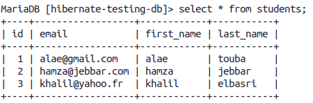


* create a class named: **ReadStudentDemo**

    here we will see how to get an entity with primary key.
    
    ```java
    package org.example;
    
    import org.hibernate.Session;
    import org.hibernate.SessionFactory;
    import org.hibernate.cfg.Configuration;
    
    public class ReadStudentDemo {
        public static void main(String[] args) {
            // create session factory
            SessionFactory factory = new Configuration()
                    .configure("hibernate.cfg.xml")
                    .addAnnotatedClass(Student.class)
                    .buildSessionFactory();

            // create session
            Session session = factory.getCurrentSession();

            try {
                int id = 1;

                session.beginTransaction();

                // retrieve student based on the id: primary key
                System.out.println("\nGetting student with id: " + id);

                Student student = session.get(Student.class, id);

                System.out.println("Get complete: " + student);

                // commit the transaction
                session.getTransaction().commit();

                System.out.println("Done!");
            }
            finally {
                factory.close();
            }
        }
    }
    ```

    Here is the Output in the console:
    ```
    ....
    Get complete: Student{id=1, firstName='alae', lastName='touba', email='alae@gmail.com'}
    Done!
    ```

* create a class named **QueryStudentsDemo**:
    
    we will see how to use HQL (hibernate query language) to query students.

    ```java
    package org.example;

    import java.util.List;

    import org.hibernate.Session;
    import org.hibernate.SessionFactory;
    import org.hibernate.cfg.Configuration;

    import javax.persistence.TypedQuery;

    public class QueryStudentDemo {

        public static void main(String[] args) {

            // create session factory
            SessionFactory factory = new Configuration()
                    .configure("hibernate.cfg.xml")
                    .addAnnotatedClass(Student.class)
                    .buildSessionFactory();

            // create session
            Session session = factory.getCurrentSession();

            try {

                // start a transaction
                session.beginTransaction();

                // query students
                TypedQuery<Student> typedQuery = session.createQuery("from Student",
                                                            Student.class);

                List<Student> students = typedQuery.getResultList();

                // display the students
                System.out.println("all students in DB");
                displayStudents(students);

                // query students: lastName='Doe'
                students = session
                                .createQuery("from Student s where s.lastName='touba'",
                                        Student.class)
                                .getResultList();

                // display the students
                System.out.println("\n\nStudents who have last name of touba");
                displayStudents(students);

                // query students: lastName='touba' OR firstName='hamza'
                students = session
                                .createQuery("from Student s where"
                                    + " s.lastName='touba' OR s.firstName='hamza'",
                                        Student.class)
                                .getResultList();

                System.out.println("\n\nStudents who have lastname of touba OR firstname of hamza");
                displayStudents(students);

                // query students where email LIKE '%gmail.com'
                students = session
                                .createQuery("from Student s where"
                                        + " s.email LIKE '%gmail.com'", Student.class)
                                .getResultList();

                System.out.println("\n\nStudents whose email ends with gmail.com");
                displayStudents(students);

                // commit transaction
                session.getTransaction().commit();

                System.out.println("Done!");
            }
            finally {
                factory.close();
            }
        }

        private static void displayStudents(List<Student> students) {
            for (Student tempStudent : students) {
                System.out.println(tempStudent);
            }
        }
    }
    ``` 

    Here is the ouput in the console:
    
    ```bash
    all students in DB
    Student{id=1, firstName='alae', lastName='touba', email='alae@gmail.com'}
    Student{id=2, firstName='hamza', lastName='jebbar', email='hamza@jebbar.com'}
    Student{id=3, firstName='khalil', lastName='elbasri', email='khalil@yahoo.fr'}
    ...

    Students who have last name of touba
    Student{id=1, firstName='alae', lastName='touba', email='alae@gmail.com'}
    ...

    Students who have lastname of touba OR firstname of hamza
    Student{id=1, firstName='alae', lastName='touba', email='alae@gmail.com'}
    Student{id=2, firstName='hamza', lastName='jebbar', email='hamza@jebbar.com'}
     ...

    Students whose email ends with gmail.com
    Student{id=1, firstName='alae', lastName='touba', email='alae@gmail.com'}
    ```

* create a class named **DeleteStudentDemo**:
    
    we will see how to delete an entity using primary key and using a query (HQL)

    ```java
    package org.example;

    import org.hibernate.Session;
    import org.hibernate.SessionFactory;
    import org.hibernate.cfg.Configuration;
    public class DeleteStudentDemo {

        public static void main(String[] args) {

            // create session factory
            SessionFactory factory = new Configuration()
                    .configure("hibernate.cfg.xml")
                    .addAnnotatedClass(Student.class)
                    .buildSessionFactory();

            // create session
            Session session = factory.getCurrentSession();

            try {
                int id = 1;

                session.beginTransaction();

                // retrieve student based on the id: primary key
                System.out.println("\nGetting student with id: " + id);

                Student myStudent = session.get(Student.class, id);

                // delete the student
                System.out.println("Deleting student: " + myStudent);
                session.delete(myStudent);

                session.getTransaction().commit();

                // delete student id=2
                System.out.println("Deleting student id=2");
                id = 2;

                session = factory.getCurrentSession();
                session.beginTransaction();
                session.createQuery("delete from Student where id=2").executeUpdate();

                // commit the transaction
                session.getTransaction().commit();

                System.out.println("Done!");
            }
            finally {
                factory.close();
            }
        }
    }
    ```

    here is the console's output:
    
    ```bash
    Getting student with id: 1
    ...
    Deleting student: Student{id=1, firstName='alae', lastName='touba', email='alae@gmail.com'}
    ...
    Deleting student id=2
    ...
    Done!
    ```

    now if we go and see the content of the database we will see that the users with id 1 and 2 are gone.

* create a class named **UpdateStudentDemo**
    we will see how easy to get an entity with its primary key and update it and also how to use HQL to update multiple entities.


    ```java
    package org.example;

    import org.hibernate.Session;
    import org.hibernate.SessionFactory;
    import org.hibernate.cfg.Configuration;

    public class UpdateStudentDemo {

        public static void main(String[] args) {

            // create session factory
            SessionFactory factory = new Configuration()
                    .configure("hibernate.cfg.xml")
                    .addAnnotatedClass(Student.class)
                    .buildSessionFactory();

            // create session
            Session session = factory.getCurrentSession();

            try {
                int id = 1;

                session.beginTransaction();

                // retrieve student based on the id: primary key
                System.out.println("\nGetting student with id: " + id);

                Student myStudent = session.get(Student.class, id);

                System.out.println("Updating student...");
                myStudent.setFirstName("Scooby");

                // commit the transaction
                session.getTransaction().commit();

                // NEW CODE
                session = factory.getCurrentSession();
                session.beginTransaction();

                // update email for all students
                System.out.println("Update email for all students");

                session.createQuery("update Student set email='foo@gmail.com'")
                        .executeUpdate();

                // commit the transaction
                session.getTransaction().commit();

                System.out.println("Done!");
            }
            finally {
                factory.close();
            }
        }
    }
    ```

    here is how the db looks like now

    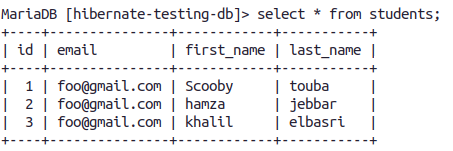

## hibernate OneToOne mapping (unidirictional)

This is a full example of OneToOne.

We will have two tables, the schema of the tables will be as follow in the DB:\
**instructors** (id, first_name, last_name, email, instructor_detail_id) \
**instructors_details**(id, youtube_channel, hobby)
		
a constructor has a constructor detail and each instructor detail belongs to only one instructor => OneToOne.

instructor_detail_id is a foreign key that references the instructor's detail in the instructor_detail table (**instructor_detail_id** is a **foreign key** that **references** the the **id** column that is the **primary key** in the instructors_details table)
	
This a unidirectional OneToOne, meaning that we only can go from instructor to instructor's detail

* create a maven quick start project

* add dependencies to: mysql connector, hibernate orm

* create a database named: **hibernate-testing-db** (tables will be gererated automatically)

* create the hibernate configuration file: **hibernate.cfg.xml** inside **src/main/resources** (or inside any folder that is in the classpath)

    ```xml
    <!DOCTYPE hibernate-configuration PUBLIC
        "-//Hibernate/Hibernate Configuration DTD 3.0//EN"
        "http://www.hibernate.org/dtd/hibernate-configuration-3.0.dtd">

    <hibernate-configuration>

        <session-factory>

            <!-- JDBC Database connection settings -->
            <property name="connection.driver_class">com.mysql.cj.jdbc.Driver</property>
            <property name="connection.url">jdbc:mysql://localhost:3306/hibernate-testing-db</property>
            <property name="connection.username">root</property>
            <property name="connection.password"></property>

            <!-- I dont really understand this -->
            <!-- the most used value is 1-->
            <property name="connection.pool_size">100</property>

            <!-- Select our SQL dialect -->
            <property name="hibernate.dialect">org.hibernate.dialect.MySQL5Dialect</property>

            <!-- Echo the SQL to stdout -->
            <property name="show_sql">true</property>

            <!-- Set the current session context -->
            <property name="current_session_context_class">thread</property>

            <!-- create tables if they dont exist (automatically), otherwise update-->
            <property name="hbm2ddl.auto">update</property>
        </session-factory>

    </hibernate-configuration>
    ```

* create a class named **Instructor**

    ```java
    package org.example;

    import javax.persistence.*;

    @Entity
    @Table(name = "instructors")
    public class Instructor {

        @Id
        @GeneratedValue(strategy = GenerationType.AUTO)
        @Column(name = "id")
        private int id;

        @Column(name = "first_name")
        private String firstName;

        @Column(name = "last_name")
        private String lastName;

        @Column(name = "email")
        private  String email;

        @OneToOne(cascade = CascadeType.ALL)
        @JoinColumn(name = "instructor_detail_id")
        private InstructorDetail instructorDetail;

        public Instructor(){}

        public Instructor(String firstName, String lastName, String email){
            this.firstName = firstName;
            this.lastName = lastName;
            this.email = email;
        }

        public int getId() {
            return id;
        }

        public String getFirstName() {
            return firstName;
        }

        public String getLastName() {
            return lastName;
        }

        public String getEmail() {
            return email;
        }

        public InstructorDetail getInstructorDetail() {
            return instructorDetail;
        }

        public void setId(int id) {
            this.id = id;
        }

        public void setFirstName(String firstName) {
            this.firstName = firstName;
        }

        public void setLastName(String lastName) {
            this.lastName = lastName;
        }

        public void setEmail(String email) {
            this.email = email;
        }

        public void setInstructorDetail(InstructorDetail instructorDetail) {
            this.instructorDetail = instructorDetail;
        }

        @Override
        public String toString() {
            return "Instructor{" +
                    "id=" + id +
                    ", firstName='" + firstName + '\'' +
                    ", lastName='" + lastName + '\'' +
                    ", email='" + email + '\'' +
                    '}';
        }
    }
    ```

* create a class named **InstrucotorDetail**
  
    ```java
    package org.example;


    import javax.persistence.*;

    @Entity
    @Table(name = "instructors_details")

    public class InstructorDetail {

        @Id
        @Column(name = "id")
        @GeneratedValue(strategy = GenerationType.AUTO)
        private int id;

        @Column(name = "youtube_channel")
        private String youtubeChannel;

        @Column(name = "hobby")
        private String hobby;

        public InstructorDetail(){}

        public InstructorDetail(String youtubeChannel, String hobby){
            this.youtubeChannel = youtubeChannel;
            this.hobby = hobby;
        }

        public int getId() {
            return id;
        }

        public String getYoutubeChannel() {
            return youtubeChannel;
        }

        public String getHobby() {
            return hobby;
        }

        public void setId(int id) {
            this.id = id;
        }

        public void setYoutubeChannel(String youtubeChannel) {
            this.youtubeChannel = youtubeChannel;
        }

        public void setHobby(String hobby) {
            this.hobby = hobby;
        }

        @Override
        public String toString() {
            return "InstructorDetail{" +
                    "id=" + id +
                    ", youtubeChannel='" + youtubeChannel + '\'' +
                    ", hobby='" + hobby + '\'' +
                    '}';
        }
    }
    ```

* (creating an instructor with its instructor detail) create a Main class:

    ```java
    package org.example;

    import org.hibernate.Session;
    import org.hibernate.SessionFactory;
    import org.hibernate.cfg.Configuration;

    public class Main {
        public static void main(String[] args) {

            SessionFactory factory = new Configuration()
                    .configure("hibernate.cfg.xml")
                    .addAnnotatedClass(Instructor.class)
                    .addAnnotatedClass(InstructorDetail.class)
                    .buildSessionFactory();

            Session session = factory.getCurrentSession();

            try{
                //create instuctor
                Instructor instructor = new Instructor("alae", "touba", "alae@gmail.com");

                //create instructor's detail
                InstructorDetail instructorDetail = new InstructorDetail("www.youtube.com/channel",
                        "programming");

                //link them
                instructor.setInstructorDetail(instructorDetail);

                session.beginTransaction();

                //save the instructor object in the instructors table
                //=> this will save also the instuctorDetail object in instructors_details table
                // because of CASCADING
                session.save(instructor);

                session.getTransaction().commit();
            }finally {
                factory.close();
            }
        }
    }
    ```

    we created an instance of the **Instructor** class and an instance of the **InstructorDetail** class and then we linked them togeter and we save the **Instructor** instance. After executing the code both instances will be saved saved to the DB into 2 different tables (instructors and instructors_details).

    Here is the content of the DB:

    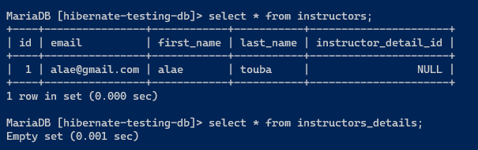   


* creating only an instructor
    
    ```java
    session.beginTransaction();
    Instructor instructor = new Instructor("yassine", "capitos", "yassine@gmail.com");
	session.save(instructor);
    session.getTransaction().commit();
    ```
    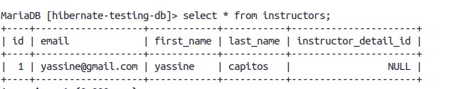
    
    notice the column **instructor_detaill_id** is NULL.

* creating a instructor detail and linking it to an existing instructor in the db
    
    we will link this instructor detail to the previous instructor (yassine)

    ```java
    session.beginTransaction();
    
    InstructorDetail instructorDetail = new InstructorDetail("youtube", "video games");
    Instructor instructor = session.get(Instructor.class, 1);
    instructor.setInstructorDetail(instructorDetail);
    
    session.getTransaction().commit();
    ```

    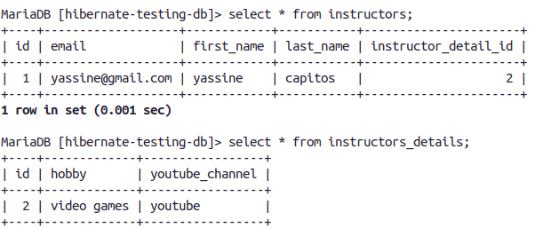

* deleting an instructor:

    ```java
    session.beginTransaction();
    Instructor instructor = session.get(Instructor.class, 1);

    //test if instructor with id 1 exists in the DB because get returns null if it founds nothing
    if(instructor != null){
        // delete the instructor with id 1 from the instructors table
        // => this will also delete the instructor detail associated with this instructor
        // from the instructors_details table because of cascading deletes
        session.delete(instructor);
    }

    session.getTransaction().commit();
    ```    

    we got the instructor with id 1 and we deleted it from **instructors** table, this will also delete its associated detail from **instructors_details** table.

    


* deleting an instructor's details

    ```java
    session.beginTransaction();

    //getting the instructor
    Instructor instructor = session.get(Instructor.class, instructorId);   

    //getting the instructor's detail
    InstructorDetail instructorDetail = instructor.getInstructorDetail();  

    //breaking the link
    instructor.setInstructorDetail(null); 

    //deleting the instructor's detail
    session.delete(instructorDetail); 	

    session.getTransaction().commit();
    ```

* updating an instructor
    
    ```java
    session.beginTransaction();

    Instructor instructor = session.get(Instructor.class, instructorId);
    instructor.setFirstName("alex");

    session.getTransaction().commit();
    ```
    
    
* updating an instructor detail
	
	* method1: directly by its id (<=>instructor's detail id):
    
        ```java
		session.beginTransaction();

		InstructorDetail instructorDetail = session.get(InstructorDetail.class, instructorDetailId);
		instructorDetail.setYoutubeChannel("youtube/channel01");

		session.getTransaction().commit();
        ```

	* method2: by the instructor:

        ```java
        session.beginTransaction();

        //getting the instructor
        Instructor instructor = session.get(Instructor.class, instructorId);	

        //getting its instructor detail and modifyng it
        instructor.getInstructorDetail().setYoutubeChannel("youtube");	

        session.getTransaction().commit();
        ```
        

## hiberanate OneToOne mapping (bidirictional)

We will have two tables in the db:\
**instructors** (id, first_name, last_name, email, instructor_detail_id) \
**instructors_details**(id, youtube_channel, hobby)
		
a constructor has a constructor detail and each instructor detail belongs to only one instructor => OneToOne.

instructor_detail_id is a foreign key that references the instructor's detail in the instructor_detail table


This relationship will be bidirictioanl which means we can go from an instructor to its instructors details and vice versa.

* create a maven quick start project

* add dependencies to: mysql connector, hibernate orm

* create a database named: **hibernate-testing-db** (tables will be gererated automatically)

* create the hibernate configuration file: **hibernate.cfg.xml** inside **src/main/resources** (or inside any folder that is in the classpath)

    ```xml
    <!DOCTYPE hibernate-configuration PUBLIC
        "-//Hibernate/Hibernate Configuration DTD 3.0//EN"
        "http://www.hibernate.org/dtd/hibernate-configuration-3.0.dtd">

    <hibernate-configuration>

        <session-factory>

            <!-- JDBC Database connection settings -->
            <property name="connection.driver_class">com.mysql.cj.jdbc.Driver</property>
            <property name="connection.url">jdbc:mysql://localhost:3306/hibernate-testing-db</property>
            <property name="connection.username">root</property>
            <property name="connection.password"></property>

            <!-- I dont really understand this -->
            <!-- the most used value is 1-->
            <property name="connection.pool_size">100</property>

            <!-- Select our SQL dialect -->
            <property name="hibernate.dialect">org.hibernate.dialect.MySQL5Dialect</property>

            <!-- Echo the SQL to stdout -->
            <property name="show_sql">true</property>

            <!-- Set the current session context -->
            <property name="current_session_context_class">thread</property>

            <!-- create tables if they dont exist (automatically), otherwise update-->
            <property name="hbm2ddl.auto">update</property>
        </session-factory>

    </hibernate-configuration>
    ```

* create a class named **Instructor**

    ```java
    package org.example;

    import javax.persistence.*;

    @Entity
    @Table(name = "instructors")
    public class Instructor {

        @Id
        @GeneratedValue(strategy = GenerationType.AUTO)
        @Column(name = "id")
        private int id;

        @Column(name = "first_name")
        private String firstName;

        @Column(name = "last_name")
        private String lastName;

        @Column(name = "email")
        private  String email;

        @OneToOne(cascade = CascadeType.ALL)
        @JoinColumn(name = "instructor_detail_id")
        private InstructorDetail instructorDetail;

        public Instructor(){}

        public Instructor(String firstName, String lastName, String email){
            this.firstName = firstName;
            this.lastName = lastName;
            this.email = email;
        }

        public int getId() {
            return id;
        }

        public String getFirstName() {
            return firstName;
        }

        public String getLastName() {
            return lastName;
        }

        public String getEmail() {
            return email;
        }

        public InstructorDetail getInstructorDetail() {
            return instructorDetail;
        }

        public void setId(int id) {
            this.id = id;
        }

        public void setFirstName(String firstName) {
            this.firstName = firstName;
        }

        public void setLastName(String lastName) {
            this.lastName = lastName;
        }

        public void setEmail(String email) {
            this.email = email;
        }

        public void setInstructorDetail(InstructorDetail instructorDetail) {
            this.instructorDetail = instructorDetail;
        }

        @Override
        public String toString() {
            return "Instructor{" +
                    "id=" + id +
                    ", firstName='" + firstName + '\'' +
                    ", lastName='" + lastName + '\'' +
                    ", email='" + email + '\'' +
                    '}';
        }
    }
    ```

* create a class named **InstrucotorDetail**
  
    ```java
    package org.example;


    import javax.persistence.*;

    @Entity
    @Table(name = "instructors_details")

    public class InstructorDetail {

        @Id
        @Column(name = "id")
        @GeneratedValue(strategy = GenerationType.AUTO)
        private int id;

        @Column(name = "youtube_channel")
        private String youtubeChannel;

        @Column(name = "hobby")
        private String hobby;

        @OneToOne(mappedBy = "instructorDetail", cascade = CascadeType.ALL)
        private Instructor instructor;

        public InstructorDetail(){}

        public InstructorDetail(String youtubeChannel, String hobby){
            this.youtubeChannel = youtubeChannel;
            this.hobby = hobby;
        }

        public int getId() {
            return id;
        }

        public String getYoutubeChannel() {
            return youtubeChannel;
        }

        public String getHobby() {
            return hobby;
        }

        public void setId(int id) {
            this.id = id;
        }

        public void setYoutubeChannel(String youtubeChannel) {
            this.youtubeChannel = youtubeChannel;
        }

        public void setHobby(String hobby) {
            this.hobby = hobby;
        }

        public Instructor getInstructor() {
            return instructor;
        }

        public void setInstructor(Instructor instructor) {
            this.instructor = instructor;
        }

        @Override
        public String toString() {
            return "InstructorDetail{" +
                    "id=" + id +
                    ", youtubeChannel='" + youtubeChannel + '\'' +
                    ", hobby='" + hobby + '\'' +
                    '}';
        }
    }
    ```

    whats the use of mappedBy? to tell hibernate not to create a column for instructor field in the courses table, because this collumn is mapped by the instructorDetail field (which means the instructor_detail_id column in instructors table) of the Instructor class.

* creating instructor and its instructor detail
  
	```java
    //create instuctor
    Instructor instructor = new Instructor("alae", "touba", "alae@gmail.com");

    //create instructor's detail
    InstructorDetail instructorDetail = new InstructorDetail("www.youtube.com/channel",
            "programming");

    //link them
    instructor.setInstructorDetail(instructorDetail);

    session.beginTransaction();

    //save the instructor object in the instructors table
    //=> this will save also the instuctorDetail object in instructors_details table
    // because of CASCADING
    session.save(instructor);

    session.getTransaction().commit();
    ```
* creating an instructor

    ```java
    session.beginTransaction();
    Instructor instructor = new Instructor("yassine", "capitos", "yassine@gmail.com");
	session.save(instructor);
    session.getTransaction().commit();
    ```
* creating an instructor detail and linking it to an existing instructor in the db
    
    ```java
     session.beginTransaction();
    
    InstructorDetail instructorDetail = new InstructorDetail("youtube", "video games");
    Instructor instructor = session.get(Instructor.class, 1);
    instructor.setInstructorDetail(instructorDetail);
    
    session.getTransaction().commit();
    ```
* updating an instructor

    ```java
    session.beginTransaction();

    Instructor instructor = session.get(Instructor.class, instructorId);
    instructor.setFirstName("alex");

    session.getTransaction().commit();    
    ```
* updating an instructor detail
	
    * method1: directly by its id (<=>instructor's detail id):
    
        ```java
		session.beginTransaction();

		InstructorDetail instructorDetail = session.get(InstructorDetail.class, instructorDetailId);
		instructorDetail.setYoutubeChannel("youtube/channel01");

		session.getTransaction().commit();
        ```

	* method2: by the instructor:

        ```java
        session.beginTransaction();

        //getting the instructor
        Instructor instructor = session.get(Instructor.class, instructorId);	

        //getting its instructor detail and modifyng it
        instructor.getInstructorDetail().setYoutubeChannel("youtube");	

        session.getTransaction().commit();
        ```

* get the instructor from the instructor detail object

    here is what we have in the db now:

    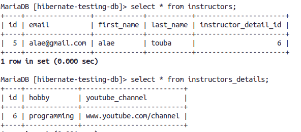

    ```java
    int instructorDetailId = 6;

    session.beginTransaction();

    //get the instructor's detail from table (instructors_details)
    InstructorDetail instructorDetail = session.get(InstructorDetail.class, instructorDetailId);

    if(instructorDetail != null){
        // get the instructor
        Instructor instructor = instructorDetail.getInstructor();

        System.out.println(instructorDetail);
        System.out.println(instructor);
    }


    session.getTransaction().commit();
    ```

    here is the output in the console:

    ```bash
    ...
    InstructorDetail{id=6, youtubeChannel='www.youtube.com/channel', hobby='programming'}
    Instructor{id=5, firstName='alae', lastName='touba', email='alae@gmail.com'}
    ```

* deleting instructor's detail (will delete instructor also)

    ```java
    int instructorDetailId = 6;

    session.beginTransaction();

    InstructorDetail instructorDetail = session.get(InstructorDetail.class, instructorDetailId);
    if(instructorDetail != null){
        // delete the instructor's detail from the instructors_details table
        // =>will also delete the instructor from the instructors table
        // because of cascade ALL that we have in the InstructorDetail class
        session.delete(instructorDetail);
    }

    session.getTransaction().commit();
    ```

* deleteing the instructor's detail without deleting the instructor
	
    we dont want cascading delete in the InstructorDetail.java entity\
	so we will change its code to look like this
	
    ```java
    @OneToOne(mappedBy = "instructorDetail", cascade = {
            CascadeType.DETACH, CascadeType.MERGE, CascadeType.PERSIST, CascadeType.REFRESH
    })
    private Instructor instructor;
    ```

    now here is the code to delete the instrcutor's details (from instructors_details table) without deleting the instructor (from instructors table)

    ```java
    int instructorDetailId = 8;

    session.beginTransaction();

    InstructorDetail instructorDetail = session.get(InstructorDetail.class, instructorDetailId);

    if(instructorDetail != null){
        // remove the associated object reference
        // break bidirectional link
        instructorDetail.getInstructor().setInstructorDetail(null);

        // delete instructor detail from "instructors_details" table
        session.delete(instructorDetail);
    }

    session.getTransaction().commit();
    ```

## hibernate OneToMany mapping (bidirectional)


We will have 3 entities: Instructor, InstructorDetail, Course .

an instrcutor has one instrcutor detail and an instrcutor detail belongs to an instrcutor => one to one.

an instructor has many courses & a course belongs to only one instrucor => ManyToMany.


* create a maven quick start project

* add dependencies to: mysql connector, hibernate orm

* create a database named: **hibernate-testing-db** (tables will be generated )

* create the hibernate configuration file: **hibernate.cfg.xml** inside **src/main/resources** (or inside any folder that is in the classpath)

    ```xml
    <!DOCTYPE hibernate-configuration PUBLIC
        "-//Hibernate/Hibernate Configuration DTD 3.0//EN"
        "http://www.hibernate.org/dtd/hibernate-configuration-3.0.dtd">

    <hibernate-configuration>

        <session-factory>

            <!-- JDBC Database connection settings -->
            <property name="connection.driver_class">com.mysql.cj.jdbc.Driver</property>
            <property name="connection.url">jdbc:mysql://localhost:3306/hibernate-testing-db</property>
            <property name="connection.username">root</property>
            <property name="connection.password"></property>

            <!-- I dont really understand this -->
            <!-- the most used value is 1-->
            <property name="connection.pool_size">100</property>

            <!-- Select our SQL dialect -->
            <property name="hibernate.dialect">org.hibernate.dialect.MySQL5Dialect</property>

            <!-- Echo the SQL to stdout -->
            <property name="show_sql">true</property>

            <!-- Set the current session context -->
            <property name="current_session_context_class">thread</property>

            <!-- create tables if they dont exist (automatically), otherwise update-->
            <property name="hbm2ddl.auto">update</property>
        </session-factory>

    </hibernate-configuration>
    ```
* create the **Instructor** entity

    ```java
    package org.example;

    import javax.persistence.*;
    import java.util.*;

    @Entity
    @Table(name = "instructors")
    public class Instructor {

        @Id
        @GeneratedValue(strategy = GenerationType.AUTO)
        @Column(name = "id")
        private int id;

        @Column(name = "first_name")
        private String firstName;

        @Column(name = "last_name")
        private String lastName;

        @Column(name = "email")
        private  String email;

        @OneToOne(cascade = CascadeType.ALL)
        @JoinColumn(name = "instructor_detail_id")
        private InstructorDetail instructorDetail;

        @OneToMany(mappedBy = "instructor", cascade = {
                CascadeType.DETACH, CascadeType.MERGE, CascadeType.PERSIST, CascadeType.REFRESH
        })
        private List<Course> courses;

        public Instructor(){}

        public Instructor(String firstName, String lastName, String email){
            this.firstName = firstName;
            this.lastName = lastName;
            this.email = email;
        }

        public int getId() {
            return id;
        }

        public String getFirstName() {
            return firstName;
        }

        public String getLastName() {
            return lastName;
        }

        public String getEmail() {
            return email;
        }


        public void setId(int id) {
            this.id = id;
        }

        public void setFirstName(String firstName) {
            this.firstName = firstName;
        }

        public void setLastName(String lastName) {
            this.lastName = lastName;
        }

        public void setEmail(String email) {
            this.email = email;
        }

        public InstructorDetail getInstructorDetail() {
            return instructorDetail;
        }

        public void setInstructorDetail(InstructorDetail instructorDetail) {
            this.instructorDetail = instructorDetail;
        }


        public List<Course> getCourses() {
            return courses;
        }

        public void setCourses(List<Course> courses) {
            this.courses = courses;
        }

        //convenience method
        /*
        public void addCourse(Course course){
            if(courses == null){
                courses = new ArrayList<>();
            }

            courses.add(course);
        }
        */


        @Override
        public String toString() {
            return "Instructor{" +
                    "id=" + id +
                    ", firstName='" + firstName + '\'' +
                    ", lastName='" + lastName + '\'' +
                    ", email='" + email + '\'' +
                    '}';
        }
    }
    ```

* create the **InstructorDetail** entity

    ```java
    package org.example;


    import javax.persistence.*;

    @Entity
    @Table(name = "instructors_details")

    public class InstructorDetail {

        @Id
        @Column(name = "id")
        @GeneratedValue(strategy = GenerationType.AUTO)
        private int id;

        @Column(name = "youtube_channel")
        private String youtubeChannel;

        @Column(name = "hobby")
        private String hobby;

        @OneToOne(mappedBy = "instructorDetail", cascade = {
                CascadeType.DETACH, CascadeType.MERGE, CascadeType.PERSIST, CascadeType.REFRESH
        })
        private Instructor instructor;


        public InstructorDetail(){}

        public InstructorDetail(String youtubeChannel, String hobby){
            this.youtubeChannel = youtubeChannel;
            this.hobby = hobby;
        }

        public int getId() {
            return id;
        }

        public String getYoutubeChannel() {
            return youtubeChannel;
        }

        public String getHobby() {
            return hobby;
        }

        public void setId(int id) {
            this.id = id;
        }

        public void setYoutubeChannel(String youtubeChannel) {
            this.youtubeChannel = youtubeChannel;
        }

        public void setHobby(String hobby) {
            this.hobby = hobby;
        }

        @Override
        public String toString() {
            return "InstructorDetail{" +
                    "id=" + id +
                    ", youtubeChannel='" + youtubeChannel + '\'' +
                    ", hobby='" + hobby + '\'' +
                    '}';
        }

        public Instructor getInstructor() {
            return instructor;
        }

        public void setInstructor(Instructor instructor) {
            this.instructor = instructor;
        }
    }
    ```

* create the **Course** entity

    ```java
    package org.example;


    import javax.persistence.*;

    @Entity
    @Table(name = "courses")
    public class Course {

        @Id
        @GeneratedValue(strategy = GenerationType.AUTO)
        @Column(name = "id")
        private int id;

        @Column(name = "title")
        private String title;

        @ManyToOne(cascade = {
                CascadeType.DETACH, CascadeType.MERGE, CascadeType.PERSIST, CascadeType.REFRESH
        })
        @JoinColumn(name = "instructor_id")
        private Instructor instructor;

        public Course(String title){
            this.title = title;
        }

        public Course(){}

        public Course(String title, Instructor instructor) {
            this.title = title;
            this.instructor = instructor;
        }

        public int getId() {
            return id;
        }

        public String getTitle() {
            return title;
        }

        public void setId(int id) {
            this.id = id;
        }

        public void setTitle(String title) {
            this.title = title;
        }

        public void setInstructor(Instructor instructor) {
            this.instructor = instructor;
        }

        public Instructor getInstructor() {
            return instructor;
        }

        @Override
        public String toString() {
            return "Course{" +
                    "id=" + id +
                    ", title='" + title + '\'' +
                    '}';
        }
    }
    ```

* create an instructor and associate an instructor details to it, and also associat some courses to it

    ```java
    package org.example;

    import org.hibernate.Session;
    import org.hibernate.SessionFactory;
    import org.hibernate.cfg.Configuration;

    public class Main {
        public static void main(String[] args) {

            SessionFactory factory = new Configuration()
                    .configure("hibernate.cfg.xml")
                    .addAnnotatedClass(Instructor.class)
                    .addAnnotatedClass(InstructorDetail.class)
                    .addAnnotatedClass(Course.class)
                    .buildSessionFactory();

            Session session = factory.getCurrentSession();

            try{

                session.beginTransaction();

                Instructor instructor = new Instructor("yassine", "capi", "yassine gmail");

                InstructorDetail instructorDetail = new InstructorDetail("youtube", "video games");
                instructor.setInstructorDetail(instructorDetail);

                Course course1 = new Course("course1");
                Course course2 = new Course("course2");

                course1.setInstructor(instructor);
                course2.setInstructor(instructor);

                session.save(instructor);

                session.save(course1);
                session.save(course2);

                session.getTransaction().commit();
            }finally {
                factory.close();
            }
        }
    }
    ```

    here is what the DB looks like after executing this code:

    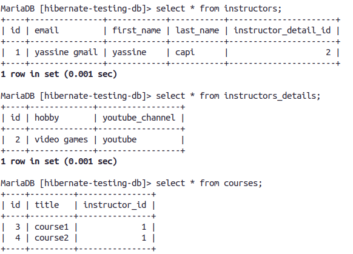

* create courses for an instructor (we have the instructor stored in the DB)

    ```java
    session.beginTransaction();

    Course course = new Course("course title");
    Instructor instructor = session.get(Instructor.class, 9);
    course.setInstructor(instructor);
    session.save(course);

    session.getTransaction().commit();
    ```

* linking an existing instructor with an existing course (we have the instructor and the course both already in the DB, we just have to link them)

    * lets create first an instructor and a course (unrelated) in the DB.

    ```java
    package org.example;

    import org.hibernate.Session;
    import org.hibernate.SessionFactory;
    import org.hibernate.cfg.Configuration;

    public class Main {
        public static void main(String[] args) {

            SessionFactory factory = new Configuration()
                    .configure("hibernate.cfg.xml")
                    .addAnnotatedClass(Instructor.class)
                    .addAnnotatedClass(InstructorDetail.class)
                    .addAnnotatedClass(Course.class)
                    .buildSessionFactory();

            Session session = factory.getCurrentSession();

            try{
                // create an instructor
                session.beginTransaction();
                Instructor yassine = new Instructor("yassine", "capitos", "yassine@gmail.com");
                session.save(yassine);
                session.getTransaction().commit();

                // create a course
                Course course = new Course("course title");
                session = factory.getCurrentSession();
                session.beginTransaction();
                session.save(course);
                session.getTransaction().commit();

                
            }finally {
                factory.close();
            }
        }
    }
    ```

    here is how the DB looks like after executing this code:

    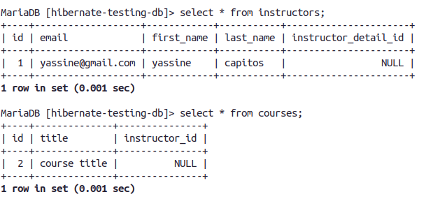

    * lets write the code that to the association between the 2 entities

    ```java
    session.beginTransaction();

    // get the instructor
    Instructor instructor = session.get(Instructor.class, 1);

    //get the course
    Course course = session.get(Course.class, 2);

    // associate/link them
    course.setInstructor(instructor);

    session.getTransaction().commit();
    ```

    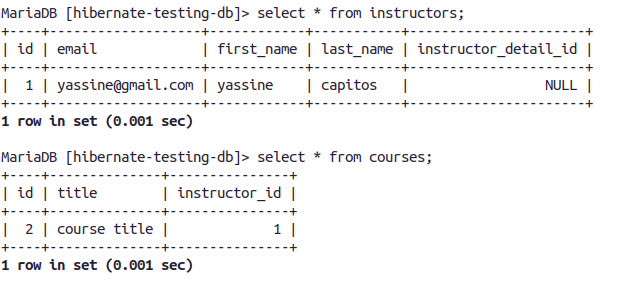

    we see in the **courses** table that that the value of the column **instructor_id** is now 1 pointing to the instructor (with id 1) in the **instructors**    


* getting all the instructor's courses

    
    ```java
    session.beginTransaction();

    int instructorId = 1;
    Instructor inst = session.get(Instructor.class, instructorId);
    List<Course> courses = inst.getCourses();
    
    session.getTransaction().commit();
    ```

* get the course's instructor:

    ```java

    session.beginTransaction();
    int courseId = 2;
    Instructor instructor = session.get(Course.class, courseId).getInstructor();
    session.getTransaction().commit();
    ```

* updating an instructor by primary key

    ```java
    session.beginTransaction();

    int instructorId = 1;
    session.get(Instructor.class, instructorId).setFirstName("new first name");

    session.getTransaction().commit();
    ```
 
* updating a course by PK:
    
    ```java
    session.beginTransaction();

    int courseId = 2;
    session.get(Course.class, courseId).setTitle("new title");

    session.getTransaction().commit();
    ```

* updating an instructor from some of its courses

    ```java
    session.beginTransaction();

    Course course = session.get(Course.class, 2);
    course.getInstructor().setFirstName("alae");

    session.getTransaction().commit();
    ```

* updating a course from its instructor

    ```java
    session.beginTransaction();

    Instructor instructor = session.get(Instructor.class, 1);

    //updating the first course
    // in the list of instructor's courses
    instructor.getCourses().get(0).setTitle("title changed");
    session.getTransaction().commit();
    ```

* delete a course (this wont delete the instructor becuase we dont have cascading delete)

    ```java
    int courseId = 2;

    session.beginTransaction();

    Course course = session.get(Course.class, courseId);

    if (course != null){
        session.delete(course);
    }

    session.getTransaction().commit();
    ```


* delete an instructor without deleting its courses (because we dont have a cascade delete in instructor's courses)

    ```java
    session.beginTransaction();

    Instructor instructor = session.get(Instructor.class, 1);

    // breaking the links between courses and their instructor
    instructor.getCourses().forEach((course) -> course.setInstructor(null));

    session.delete( instructor );

    session.getTransaction().commit();
    ```

* delete an instructor and all its courses 
	* we must have cascading delete, so change the Instructor entity like this

        ```java
		@OneToMany(mappedBy = "instructor", cascade = CascadeType.ALL)
		private List<Course> courses;
        ```
	
	* code:

        ```java
        session.beginTransaction();
        int intstructorId = 10;
        session.delete( session.get(Instructor.class, instructorId) );
        session.getTransaction().commit();
        ```

## EAGER vs LAZY loading

Suppose we have 3 entities: Instructor, InstructorDeatil & Course.
Instructor has one INstructorDetail and vice versa => one to one.
INstructor has many courses and a course belongs to one intstructor => ont to many.

* what is EAGER and LAZY loading?
	
    suppose we query the databse for the instructor with id 5, do we want to retrieve also all its courses at the same time? or we want to retrieve just the instructor and get the courses after and on demand?
	
    If we are usign EAGER mode, when we retrieve the instructor, a query to course table will be made also and we'll have all the instructor's courses available.
	
    If we are using LAZY mode, when we retrieve the instructor, we'll retrieve just the instructor not its courses also :) the courses will be loaded when we need them :)

* default fetch types
  
    * OneToOne: FetchType.EAGER
    * OneToMany: FetchType.LAZY
    * ManyToOne: FetchType.EAGER
    * ManyToMany: FetchType.LAZY
		
		
* EAGER loading demo:
    
    Here is what we should put in the Instructor entity if we want to fetch courses in EAGER mode:
    
    ```java
    @OneToMany(fetch = FetchType.EAGER ,mappedBy = "instructor", cascade = {
            CascadeType.DETACH, CascadeType.MERGE, CascadeType.PERSIST, CascadeType.REFRESH
    })
    private List<Course> courses;
    ```    
    
    So now if we do:
    ```java
    Instructor instructor = session.get(Instructor.class, instructorId);
    ```

    All the instructor's courses will be also retrieved from the course table

* LAZY loading demo:

    When we have lazy loading on instructor's courses and we do:
    ```java
    Instructor instructor = session.get(Instructor.class, instructorId);
    ```

    The instrucor's courses will not be retrieved from the DB.\
    They'll be retrieved when we do something like: instructor.getCourses() 

## HIbernate OneToMany (unidirectional)

we will have a one to many relationship between two entities: Course and Review (a course has many reviews)

* create a maven quick start project

* add dependencies to: mysql connector, hibernate orm

* create a database named: **hibernate-testing-db** (tables will be generacted automatically, how good is that :) ?)

* create the hibernate configuration file: **hibernate.cfg.xml** inside **src/main/resources** (or inside any folder that is in the classpath)

    ```xml
    <!DOCTYPE hibernate-configuration PUBLIC
        "-//Hibernate/Hibernate Configuration DTD 3.0//EN"
        "http://www.hibernate.org/dtd/hibernate-configuration-3.0.dtd">

    <hibernate-configuration>

        <session-factory>

            <!-- JDBC Database connection settings -->
            <property name="connection.driver_class">com.mysql.cj.jdbc.Driver</property>
            <property name="connection.url">jdbc:mysql://localhost:3306/hibernate-testing-db</property>
            <property name="connection.username">root</property>
            <property name="connection.password"></property>

            <!-- I dont really understand this -->
            <!-- the most used value is 1-->
            <property name="connection.pool_size">100</property>

            <!-- Select our SQL dialect -->
            <property name="hibernate.dialect">org.hibernate.dialect.MySQL5Dialect</property>

            <!-- Echo the SQL to stdout -->
            <property name="show_sql">true</property>

            <!-- Set the current session context -->
            <property name="current_session_context_class">thread</property>

            <!-- create tables if they dont exist (automatically), otherwise update-->
            <property name="hbm2ddl.auto">update</property>
        </session-factory>

    </hibernate-configuration>
    ```

* create the **Course** entity:

    ```java
    package org.example;


    import javax.persistence.*;
    import java.util.*;

    @Entity
    @Table(name = "courses")
    public class Course {

        @Id
        @GeneratedValue(strategy = GenerationType.AUTO)
        @Column(name = "id")
        private int id;

        @Column(name = "title")
        private String title;

        public Course(String title){
            this.title = title;
        }

        public Course(){}


        public int getId() {
            return id;
        }

        public String getTitle() {
            return title;
        }

        public void setId(int id) {
            this.id = id;
        }

        public void setTitle(String title) {
            this.title = title;
        }

        @OneToMany(fetch = FetchType.LAZY, cascade = CascadeType.ALL)
        @JoinColumn(name = "course_id")
        private List<Review> reviews;

        public void addReview(Review review){
            if(reviews == null){
                reviews = new ArrayList<>();
            }

            reviews.add(review);
        }

        public List<Review> getReviews() {
            return reviews;
        }

        public void setReviews(List<Review> reviews) {
            this.reviews = reviews;
        }

        @Override
        public String toString() {
            return "Course{" +
                    "id=" + id +
                    ", title='" + title + '\'' +
                    '}';
        }
    }
    ```

* create the **Review** entity:

    ```java
    package org.example;

    import javax.persistence.*;

    @Entity
    @Table(name = "reviews")
    public class Review {

        @Id
        @GeneratedValue(strategy = GenerationType.AUTO)
        private int id;

        @Column(name = "comment")
        private String comment;

        public Review(){}

        public Review(String comment){
            this.comment = comment;
        }

        public int getId() {
            return id;
        }

        public void setId(int id) {
            this.id = id;
        }

        public String getComment() {
            return comment;
        }

        public void setComment(String comment) {
            this.comment = comment;
        }

        @Override
        public String toString() {
            return "Review{" +
                    "id=" + id +
                    ", comment='" + comment + '\'' +
                    '}';
        }
    }
    ```

* insert a course with its reviews 

    ```java
    package org.example;

    import org.hibernate.Session;
    import org.hibernate.SessionFactory;
    import org.hibernate.cfg.Configuration;

    import java.util.List;

    public class Main {
        public static void main(String[] args) {

            SessionFactory factory = new Configuration()
                    .configure("hibernate.cfg.xml")
                    .addAnnotatedClass(Course.class)
                    .addAnnotatedClass(Review.class)
                    .buildSessionFactory();

            Session session = factory.getCurrentSession();

            try{

                session.beginTransaction();

                Course course = new Course("course1");

                Review review1 = new Review("comment on course1");
                Review review2 = new Review("commen2 on course1");

                course.addReview(review1);
                course.addReview(review2);

                session.save(course);

                session.getTransaction().commit();


            }finally {
                session.close();
                factory.close();
            }
        }
    }
    ```

    we just needed to add the reviews to the course's reviews list and save the course (without saving the reviews).

    here is what the db looks like afetr this operation:

    

* add reviews to an existing course:

    ```java
    session.beginTransaction();

    int courseId = 1;
    Course course = session.get(Course.class, courseId);
    course.addReview(new Review("review"));
    session.getTransaction().commit();

    ```

* getting the course reviews

    ```java
    session.beginTransaction();

    int courseId = 1;
    Course course = session.get(Course.class, courseId);
    List<Review> reviews = course.getReviews();
    System.out.println(reviews);

    session.getTransaction().commit();
    ```

* deleting a course (will also delete its reviews due to cascading delete)

    ```java
    session.beginTransaction();

    int courseId = 1;
    Course course = session.get(Course.class, courseId);
    session.delete(course);
    session.getTransaction().commit();
    ```

## ManyToMany mapping (bidirectional)


We will work with two entities: Student.java & Course.java 

Each student has many courses and each course has many students => ManyToMany

We will have 3 tables in the db:
* **courses**(id, title) for courses
* **students**(id, first_name, last_name, email) for students
* **course_student**(course_id, student_id) for the associations 


Lets see the steps to create a project:
* create a maven quick start project
* add dependencies to: mysql connector, hibernate orm
* create a database named: **hibernate-testing-db** (tables will be generated )
* create the hibernate configuration file: **hibernate.cfg.xml** inside **src/main/resources** (or inside any folder that is in the classpath)

    ```xml
    <!DOCTYPE hibernate-configuration PUBLIC
        "-//Hibernate/Hibernate Configuration DTD 3.0//EN"
        "http://www.hibernate.org/dtd/hibernate-configuration-3.0.dtd">

    <hibernate-configuration>

        <session-factory>

            <!-- JDBC Database connection settings -->
            <property name="connection.driver_class">com.mysql.cj.jdbc.Driver</property>
            <property name="connection.url">jdbc:mysql://localhost:3306/hibernate-testing-db</property>
            <property name="connection.username">root</property>
            <property name="connection.password"></property>

            <!-- I dont really understand this -->
            <!-- the most used value is 1-->
            <property name="connection.pool_size">100</property>

            <!-- Select our SQL dialect -->
            <property name="hibernate.dialect">org.hibernate.dialect.MySQL5Dialect</property>

            <!-- Echo the SQL to stdout -->
            <property name="show_sql">true</property>

            <!-- Set the current session context -->
            <property name="current_session_context_class">thread</property>

            <!-- create tables if they dont exist (automatically), otherwise update-->
            <property name="hbm2ddl.auto">update</property>
        </session-factory>

    </hibernate-configuration>
    ```
* create the **Course** entity

    ```java
    package org.example;

    import javax.persistence.*;
    import java.util.ArrayList;
    import java.util.List;

    @Entity
    @Table(name = "courses")
    public class Course {

        @Id
        @GeneratedValue(strategy = GenerationType.AUTO)
        @Column(name = "id")
        private int id;

        @Column(name = "title")
        private String title;

        @ManyToMany(fetch = FetchType.LAZY, cascade =
                {CascadeType.DETACH, CascadeType.MERGE, CascadeType.PERSIST, CascadeType.REFRESH})
        @JoinTable(
                name = "course_student",
                joinColumns = @JoinColumn(name = "course_id"),
                inverseJoinColumns = @JoinColumn(name = "student_id")
        )
        private List<Student> students;

        public Course(){

        }
        public Course(String title){
            this.title = title;
        }

        public void addStudent(Student student){
            if(students == null){
                students = new ArrayList<>();
            }

            students.add(student);
        }


        public int getId() {
            return id;
        }

        public void setId(int id) {
            this.id = id;
        }

        public String getTitle() {
            return title;
        }

        public void setTitle(String title) {
            this.title = title;
        }

        public List<Student> getStudents() {
            return students;
        }

        public void setStudents(List<Student> students) {
            this.students = students;
        }

        @Override
        public String toString() {
            return "Course{" +
                    "id=" + id +
                    ", title='" + title;
        }
    }
    ```

* create the **Student** entity:

    ```java
    package org.example;

    import javax.persistence.*;
    import java.util.List;


    @Entity
    @Table(name = "students")
    public class Student {

        @Id
        @GeneratedValue(strategy = GenerationType.AUTO)
        @Column(name = "id")
        private int id;

        @Column(name = "first_name")
        private String firstName;

        @Column(name = "last_name")
        private String lastName;

        @Column(name = "email")
        private String email;

        @ManyToMany(fetch = FetchType.LAZY, cascade =
                {CascadeType.DETACH, CascadeType.MERGE, CascadeType.PERSIST, CascadeType.REFRESH})
        @JoinTable(
                name = "course_student",
                joinColumns = @JoinColumn(name = "student_id"),
                inverseJoinColumns = @JoinColumn(name = "course_id")
        )
        private List<Course> courses;

        public Student(){}

        public Student(String firstName, String lastName, String email){
            this.firstName = firstName;
            this.lastName = lastName;
            this.email = email;
        }

        public int getId() {
            return id;
        }

        public void setId(int id) {
            this.id = id;
        }

        public String getFirstName() {
            return firstName;
        }

        public void setFirstName(String firstName) {
            this.firstName = firstName;
        }

        public String getLastName() {
            return lastName;
        }

        public void setLastName(String lastName) {
            this.lastName = lastName;
        }

        public String getEmail() {
            return email;
        }

        public void setEmail(String email) {
            this.email = email;
        }

        public List<Course> getCourses() {
            return courses;
        }

        public void setCourses(List<Course> courses) {
            this.courses = courses;
        }

        @Override
        public String toString() {
            return "Student{" +
                    "id=" + id +
                    ", firstName='" + firstName + '\'' +
                    ", lastName='" + lastName + '\'' +
                    ", email='" + email + '\'' +
                    '}';
        }
    }
    ```

* create a course and add some students to it

    ```java
    package org.example;

    import org.hibernate.Session;
    import org.hibernate.SessionFactory;
    import org.hibernate.cfg.Configuration;

    import java.util.List;

    public class Main {
        public static void main(String[] args) {

            SessionFactory factory = new Configuration()
                    .configure("hibernate.cfg.xml")
                    .addAnnotatedClass(Course.class)
                    .addAnnotatedClass(Student.class)
                    .buildSessionFactory();

            Session session = factory.getCurrentSession();

            try{
                session.beginTransaction();

                //create course
                Course course = new Course("course1");

                //create students to course
                Student student1 = new Student("alae", "touba", "alae@gmail.com");
                Student student2 = new Student("yassine", "capitos", "yassine@gmail.com");

                //link them
                course.addStudent(student1);
                course.addStudent(student2);

                //Save all
                session.save(course);
                session.save(student1);
                session.save(student2);

                //commit
                session.getTransaction().commit();
            }finally {
                session.close();
                factory.close();
            }
        }
    }
    ```
    DB content:

    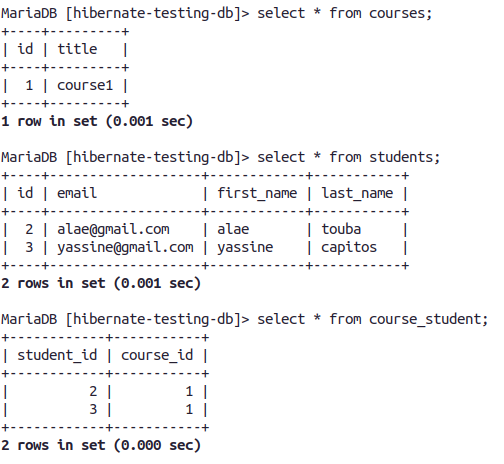

* add a student to an exiting course (we already have the course in the db)

    ```java
    session.beginTransaction();

    int courseId = 1;
    Course course = session.get(Course.class, courseId);

    Student student1 = new Student("stud1", "stud1", "stude@gmail.com");
    course.addStudent(student1);

    session.save(student1);

    session.getTransaction().commit();
    ```

* linking an existing course with an existing student (we have the course and the student both already in the DB, we just have to link them (add student to course))

    * lets create a course  

        ```java
        session.beginTransaction();

        Course course = new Course("course title");
        session.save(course);

        session.getTransaction().commit();
        ```

    * lets create a student 

        ```java
        session.beginTransaction();

        Student student = new Student("alae", "touba", "alae2ba@gmail.com");
        session.save(student);

        session.getTransaction().commit();
        ```

    * here is how the DB looks like now (notice that association table (course_student) is empty)

        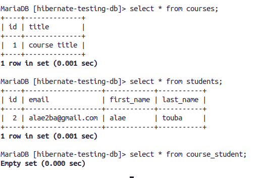

    * lets link the course to the student

        ```java
        session.beginTransaction();

        int courseId = 1;
        int studentId = 2;

        Course course = session.get(Course.class, courseId);
        Student student = session.get(Student.class, studentId);

        course.addStudent(student);

        session.getTransaction().commit();
        ```
        here is how the DB looks like now:

        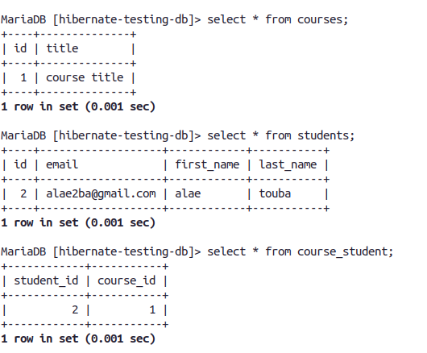


* getting student's courses
    
    ```java
    List<Course> courses = session.get(Student.class, 1).getCourses();
    ```

* getting course's students
    
    ```java
    List<Student> students = session.get(Course.class, 11).getStudents();
    ```
    

* updating a course by primary key
    
    ```java
    session.get(Course.class, 13 ).setTitle("new title for course");
    ```


* updating a student by primary key

    ```java
    session.get(Student.class, 1 ).setFirstName("new name");
    ```

* adding courses to an existing student (we already have the student in the DB)

    ```java
    Student student = session.get(Student.class, 1);

    Course course1 = new Course("c1");
    Course course2 = new Course("c2");

    course1.addStudent(student);
    course2.addStudent(student);

    session.save(course1);
    session.save(course2);
    ```
    
* delete a course (wont delete its students because we dont have cascading delete)
    
    ```java
    session.delete( session.get(Course.class, 15) );
    ```
    
* delete a student (wont delete its courses because we dont have cascading delete)
    
    ```java
    session.delete( session.get(Stduent.class, 1) );    
    ```
## How To View Hibernate SQL Parameter Values in the console:

* add the log4j dependency to pom.xml

    ```
    <dependency>
    <groupId>log4j</groupId>
    <artifactId>log4j</artifactId>
    <version>1.2.17</version>
    </dependency>
    ```
* create a log4j.properties file inside src/main/resources

* append this content to it:

    ```properties
    # Root logger option
    log4j.rootLogger=DEBUG, stdout

    # Redirect log messages to console
    log4j.appender.stdout=org.apache.log4j.ConsoleAppender
    log4j.appender.stdout.Target=System.out
    log4j.appender.stdout.layout=org.apache.log4j.PatternLayout	
    log4j.appender.stdout.layout.ConversionPattern=%d{yyyy-MM-dd HH:mm:ss} %-5p %c{1}:%L - %m%n

    log4j.logger.org.hibernate=TRACE  
    ````

# Hibernate advanced developpement techniques (chad darby, udemy course)

## mapping a collection (**Set**)  

We are going to have a one to many relationship between a **student** and its **images**.

The structure of the tables in the databases in the end will look smt like this:\
**students** (id, first_name, last_name, email)\
**students_images** (student_id, image_name)

We are not going to use the **@OneToMany** annotation (we are going to see later the difference between @OneToMany and what we are going to use here)

Here are the **SQL** scripts if you were to create the tables manually (we re going to rely on hibernate to this automatically based on the entities definitions)
* the **students** table

    ```sql
    create table stundents(
        id int(11) not null auto_increment,
        first_name varchar(45) default null,
        last_name varchar(45) default null,
        email varchar(45) default null,

        primary key(id) 
    );
    ```

* the **students_images** table

    ```sql
    create table students_images(
        student_id int(11) not null,
        image_name varchar(45) default null
    );
    ```


Here is the dev process:
* create a maven quick start project

* add dependencies to: mysql connector, hibernate orm

* if you are using a java version >8, make sure you include theses dependecies

    ```
    <!-- Support for Java 9/10/11 -->
    <!-- API, java.xml.bind module -->
    <dependency>
        <groupId>jakarta.xml.bind</groupId>
        <artifactId>jakarta.xml.bind-api</artifactId>
        <version>2.3.2</version>
    </dependency>

    <!-- Runtime, com.sun.xml.bind module -->
    <dependency>
        <groupId>org.glassfish.jaxb</groupId>
        <artifactId>jaxb-runtime</artifactId>
        <version>2.3.2</version>
    </dependency>
    ```

* create a database named: **hibernate-testing-db**

* create the hibernate configuration file: **hibernate.cfg.xml** inside **src/main/resources** (or inside any folder that is in the classpath)

    ```xml
    <!DOCTYPE hibernate-configuration PUBLIC
        "-//Hibernate/Hibernate Configuration DTD 3.0//EN"
        "http://www.hibernate.org/dtd/hibernate-configuration-3.0.dtd">

    <hibernate-configuration>

        <session-factory>

            <!-- JDBC Database connection settings -->
            <property name="connection.driver_class">com.mysql.cj.jdbc.Driver</property>
            <property name="connection.url">jdbc:mysql://localhost:3306/hibernate-testing-db</property>
            <property name="connection.username">root</property>
            <property name="connection.password"></property>

            <!-- I dont really understand this -->
            <!-- the most used value is 1-->
            <property name="connection.pool_size">100</property>

            <!-- Select our SQL dialect -->
            <property name="hibernate.dialect">org.hibernate.dialect.MySQL5Dialect</property>

            <!-- Echo the SQL to stdout -->
            <property name="show_sql">true</property>

            <!-- Set the current session context -->
            <property name="current_session_context_class">thread</property>

            <!-- create tables if they dont exist (automatically), otherwise update-->
            <property name="hbm2ddl.auto">update</property>
        </session-factory>

    </hibernate-configuration>
    ```

* create an entity named **Student**

    ```java
    package org.example;

    import javax.persistence.*;
    import java.util.HashSet;
    import java.util.Set;

    @Entity
    @Table(name = "students")
    public class Student {

        @Id
        @GeneratedValue(strategy = GenerationType.AUTO)
        private int id;

        @Column(name = "first_name")
        private String firstName;

        @Column(name = "last_name")
        private String lastName;

        @Column(name = "email")
        private String email;

        @ElementCollection
        @CollectionTable(name = "students_images", joinColumns = @JoinColumn(name = "student_id"))
        @Column(name = "image_name")
        private Set<String> images = new HashSet<>();

        public Student(){}

        public Student(String firstName, String lastName, String email) {
            this.firstName = firstName;
            this.lastName = lastName;
            this.email = email;
        }

        public int getId() {
            return id;
        }

        public void setId(int id) {
            this.id = id;
        }

        public String getFirstName() {
            return firstName;
        }

        public void setFirstName(String firstName) {
            this.firstName = firstName;
        }

        public String getLastName() {
            return lastName;
        }

        public void setLastName(String lastName) {
            this.lastName = lastName;
        }

        public String getEmail() {
            return email;
        }

        public void setEmail(String email) {
            this.email = email;
        }

        public Set<String> getImages() {
            return images;
        }

        public void setImages(Set<String> images) {
            this.images = images;
        }

        @Override
        public String toString() {
            return "Student{" +
                    "id=" + id +
                    ", firstName='" + firstName + '\'' +
                    ", lastName='" + lastName + '\'' +
                    ", email='" + email + '\'' +
                    '}';
        }
    }

    ```

    * annotations explinations:

        * @ElementCollection:   

            Declares an element collection mapping. The data for the collection is stored in a separate table (**students_images**).

        * CollectionTable:

            Specifies the name of table (**students_images**) that will hold the collection. Also provides the join column (**student_id**) to refer to primary table. (studnet_id in stundents_images refers to id in students table)

        * Column:

            The name of the column to map in the collection table.

    * whats the difference between this and **@OneToMany**?

        we wont have a separate entity named **Image**.

    * So **@ElementCollection** can be used to define a one to many relationship to a **Basic** object such as: int, Integer, Double, String, Date..

    * another difference between **@ElementCollection** and **OneToMany** is that with the first one we will not have **Cascading** options and the target objects (in our case the images) will always be persisted, merged, removed with their parent object (in our case student)

* create the main app

    ```java
    package org.example;


    import org.hibernate.Session;
    import org.hibernate.SessionFactory;
    import org.hibernate.cfg.Configuration;

    import java.util.Set;

    public class App
    {
        public static void main( String[] args ) {

            // create session factory
            SessionFactory factory = new Configuration()
                    .configure("hibernate.cfg.xml")
                    .addAnnotatedClass(Student.class)
                    .buildSessionFactory();


            // create session
            Session session = factory.getCurrentSession();

            try{
                Student student = new Student("alae", "touba", "alae@gmail.com");
                Set<String> images = student.getImages();

                images.add("photo1.jpg");
                images.add("photo2.jpg");
                images.add("photo3.jpg");

                session.beginTransaction();
                session.save(student);
                session.getTransaction().commit();
            }finally {
                session.close();
                factory.close();
            }

        }
    }
    ```

    Here is what the DB looks like now: 
    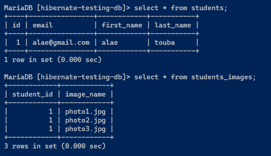