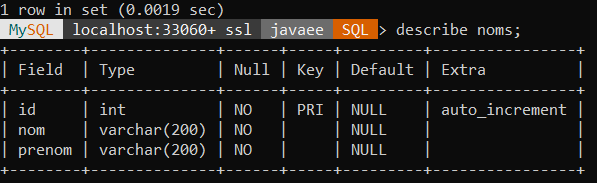
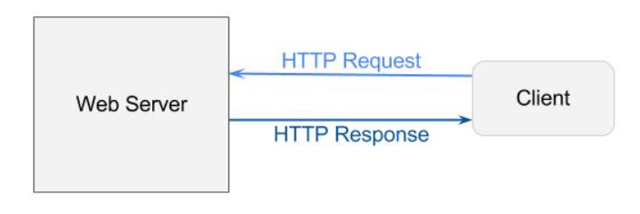
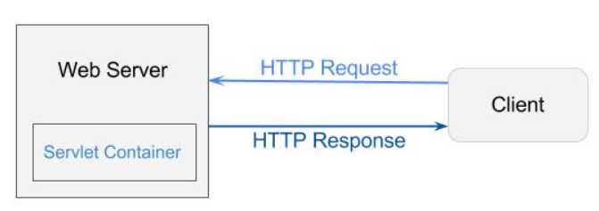

- [Les balises de la techno jsp](#les-balises-de-la-techno-jsp)
- [JSP: les directives](#jsp-les-directives)
- [<jsp:useBean>, <jsp:getProperty>, <jsp:setProperty>](#jspusebean-jspgetproperty-jspsetproperty)
- [<jsp:forward>](#jspforward)
- [La portéé des objets (=visibilité, scope):](#la-portéé-des-objets-visibilité-scope)
- [EL (expression langauge):](#el-expression-langauge)
- [Les objets implicites met à notre disoisition à travers la téchnologie jsp:](#les-objets-implicites-met-à-notre-disoisition-à-travers-la-téchnologie-jsp)
- [Les objets implicites met a notre dispostion a travers la téchnologie EL](#les-objets-implicites-met-a-notre-dispostion-a-travers-la-téchnologie-el)
- [JSTL core: affichage d'une expression, la balise out:](#jstl-core-affichage-dune-expression-la-balise-out)
- [JSTL core: gestion d'un variable](#jstl-core-gestion-dun-variable)
- [JSTL core: les condition simples (if):](#jstl-core-les-condition-simples-if)
- [JSTL core: les conditions multiples (choose/when):](#jstl-core-les-conditions-multiples-choosewhen)
- [JSTL core: itération sur une collection](#jstl-core-itération-sur-une-collection)
- [JSTL core: itération sur une chaine de caracteres:](#jstl-core-itération-sur-une-chaine-de-caracteres)
- [JSTL core: les urls](#jstl-core-les-urls)
- [JSTL core: redirection de l'utilisateur (redirect):](#jstl-core-redirection-de-lutilisateur-redirect)
- [Différence entre la redirection et le forwarding:](#différence-entre-la-redirection-et-le-forwarding)
- [Inclure automatiquement JSTL core a toutes les pages JSP:](#inclure-automatiquement-jstl-core-a-toutes-les-pages-jsp)
- [Où mettre les fichiers dont le contenue est statique (css/js/images ..etc)?](#où-mettre-les-fichiers-dont-le-contenue-est-statique-cssjsimages-etc)
- [Comment lier les fichiers jsp avec leurs feuilles de style css?](#comment-lier-les-fichiers-jsp-avec-leurs-feuilles-de-style-css)
- [Comment specifier où ils seront envoyer les données(pour etre traiter) d'une formulaire (attribut action dans la balise form) ?](#comment-specifier-où-ils-seront-envoyer-les-donnéespour-etre-traiter-dune-formulaire-attribut-action-dans-la-balise-form-)
- [Faire une redirection depuis une servlet](#faire-une-redirection-depuis-une-servlet)
- [Les sessions](#les-sessions)
- [Travailler avec une base de donné mysql:](#travailler-avec-une-base-de-donné-mysql)
- [Three rules/properties that define a JavaBean](#three-rulesproperties-that-define-a-javabean)
- [netbeans/eclipse how forward a request from a servlet to a jsp page](#netbeanseclipse-how-forward-a-request-from-a-servlet-to-a-jsp-page)
- [Map http requests to servlets](#map-http-requests-to-servlets)
- [How to set initialization parameters](#how-to-set-initialization-parameters)
- [How to get initialization parameters (this code must be inside a servlet :) )](#how-to-get-initialization-parameters-this-code-must-be-inside-a-servlet--)
- [Implement custom error handling == respond to errors with custum error pages:](#implement-custom-error-handling--respond-to-errors-with-custum-error-pages)
- [Include a file in a jsp file at compile time:](#include-a-file-in-a-jsp-file-at-compile-time)
- [Sessions (HttpSession java object)](#sessions-httpsession-java-object)
- [Cookies:](#cookies)
- [JPA implementation using hibernate (eclipse web app project with maven):](#jpa-implementation-using-hibernate-eclipse-web-app-project-with-maven)
- [Create a Maven Java EE project inside Eclipse EE (2022):](#create-a-maven-java-ee-project-inside-eclipse-ee-2022)
- [JPA docs:](#jpa-docs)
- [Describe the phases of the servlet lifecycle?](#describe-the-phases-of-the-servlet-lifecycle)
- [What are the different types of JSP tags?](#what-are-the-different-types-of-jsp-tags)
- [Create a maven java ee web app that will work with hibernate inside eclipse ee (2022)](#create-a-maven-java-ee-web-app-that-will-work-with-hibernate-inside-eclipse-ee-2022)
- [What is a servlet container?](#what-is-a-servlet-container)
- [Difference between web server & web/servlet container](#difference-between-web-server--webservlet-container)
- [Describe the steps in the HTTP Request and Response flow from a Servlet?](#describe-the-steps-in-the-http-request-and-response-flow-from-a-servlet)
- [What are the handler methods defined in the HttpServlet class?](#what-are-the-handler-methods-defined-in-the-httpservlet-class)
- [What is the difference between Request attributes and Request parameters?](#what-is-the-difference-between-request-attributes-and-request-parameters)

## Les balises de la techno jsp
* commentaires
    
    ```jsp
    <%-- et --%>
    ```    

* Balises de déclaration: déclarer des variable/méthodes à l'intérieur d'une JSP
    
    ```jsp
    <%! String chaine = "Salut les zéros.";  %>
    <%! 
        String test = null;
        public boolean jeSuisUnZero() {
            return true;
        }
    %>
    ```

* Balises de scriptlet: code java

    ```jsp
    <%
        for(int i = 1; i < 3; i++){
            out.println("Numéro " + i);
        }
    %>
    ```

* Balises d'expression	//elle retourne simplement le contenue de la chaine

    ```jsp
    <%= "Bip bip !" %>      //<=> <% out.println("Bip bip !"); %>
    ```

## JSP: les directives

* Les directives JSP permettent:
  
    * d'importer un package ;
    * d'inclure d'autres pages JSP ;
    * d'inclure des bibliothèques de balises
    * de définir des propriétés et informations relatives à une page JSP.

    Pour généraliser, elles contrôlent comment le conteneur de servlets va gérer votre JSP. Il en existe trois : taglib, page et include. 
    Elles sont toujours comprises entre les balises <%@ et %>, et hormis la directive d'inclusion de page qui peut être placée n'importe où, elles sont à placer en tête de page JSP.

* directive **taglib**:
  
    ```jsp
    <%@ taglib uri="maTagLib.tld" prefix="tagExemple" %>
    ```    

* directive **page**:
  
    définit des informations relatives à la page JSP.

    * exemple:
        ```jsp
        <%@ page import="java.util.List, java.util.Date"  %>        
        ```
        
        pour importer des packages si nous allons les utiliser dans la page jsp.

    * voila tous les infos qui peuvent etre dans cette directive:

        ```jsp
        <%@ page 
            language="..."      //java
            extends="..." 
            import="..."        //importer des package
            session="true | false" 
            buffer="none | 8kb | sizekb" 
            autoFlush="true | false" 
            isThreadSafe="true | false" 
            isELIgnored ="true | false"
            info="..." 
            errorPage="..."         //indication d'un nom d'une page d'erreur a la quelle nous allons se rederiger si qlq une exception/erreur se produit ici
            contentType="..."       
            pageEncoding="..."      //utf-8 par ex
            isErrorPage="true | false"  //est ce que c'est une page d'erreur. 
        %> 
        ```

* directive **include**: 
    
    inclure un fichier jsp dans un autre
    
    ```jsp
    <%@ include file="uneAutreJSP.jsp" %>   
    ```

    copier coller de uneAutreJSP.jsp vers la page jsp courante.


## <jsp:useBean>, <jsp:getProperty>, <jsp:setProperty>

* pour créer et utiliser de objets java beans dans les pages jsp:

* ex (ceci ce fait a l'interieure d'une page jsp):

    ```jsp
    <%-- L'action suivante récupère un bean de type Coyote et nommé "coyote" dans la portée requête
    s'il existe, ou en crée un sinon. --%>
    <jsp:useBean id="coyote" class="com.sdzee.beans.Coyote" scope="request" />
    
    <%-- L'action suivante affiche le contenu de la propriété 'prenom' du bean 'coyote' : --%>
    <jsp:getProperty name="coyote" property="prenom" />
    
    <%-- L'action suivante associe une valeur à la propriété 'prenom' du bean 'coyote' : --%>
    <jsp:setProperty name="coyote" property="prenom" value="Wile E." />
    
    <%-- L'action suivante associe directement la valeur récupérée depuis le paramètre de la requête 
    nommé ici 'prenomCoyote' à la propriété 'prenom' : --%>
    <jsp:setProperty name="coyote" property="prenom" param="prenomCoyote"/>
    ```

## <jsp:forward>

* permet d'effectuer une redirection vers une autre page. Comme toutes les actions standard, elle s'effectue côté serveur et pour cette raison il est impossible via cette balise de rediriger vers une page extérieure à l'application (par exemple vers https://www.google.com). L'action de forwarding est ainsi limitée aux pages présentes dans le contexte de la servlet ou de la JSP utilisée :

* ex (ceci se fait dans une page jsp)
    
    ```jsp
    <%-- Le forwarding vers une page de l'application fonctionne par URL relative : --%>
    <jsp:forward page="/page.jsp" />
    
    <%-- Son équivalent en code Java  est : --%>
    <% request.getRequestDispatcher( "/page.jsp" ).forward( request, response ); %>
    ```


## La portéé des objets (=visibilité, scope):

* __page__ (JSP seulement) : les objets dans cette portée sont uniquement accessibles dans la page JSP en question ;
* __requête__ : les objets dans cette portée sont uniquement accessibles durant l'existence de la requête en cours ;
* __session__ : les objets dans cette portée sont accessibles durant l'existence de la session en cours ;
* __application__ : les objets dans cette portée sont accessibles durant toute l'existence de l'application.


> les attributes de requêtes (request.setAttribute(,)) sont de porté requête


## EL (expression langauge):
* syntaxe:

    ```jsp 
    ${ expression }
    ```
    ce qui est situé entre l'accolades va etre interpretés.

* la realisation des testes:
    
    * opérateurs arithmétique: +, -, *, /, %
    * opérateurs logique: &&, ||, !
    * opérateur basé sur equals() et compareTo(): ==, !=, <, >, <=, >=
    (attention pour les types non standards il faut implementer comparable afin d'utiliser <, >= ..etc)
    * les conditions ternaires: test ? si vrai: sinon;
    * les vérifications si vide ou null grace a l'opérateur empty:

    * exemples:
  
        __Logiques sur des booléens__ 
        
        ```jsp
        ${ true && true }  <!-- Affiche true -->
        ${ true && false }  <!-- Affiche false -->
        ${ !true || false }  <!-- Affiche false -->
        ```
    
        __Calculs arithmétiques__
        
        ```jsp
        ${ 10 / 4 }  <!-- Affiche 2.5 -->
        ${ 10 mod 4 }  <!-- Affiche le reste de la division entière, soit 2 -->
        ${ 10 % 4 }  <!-- Affiche le reste de la division entière, soit 2 -->
        ${ 6 * 7 }  <!-- Affiche 42 -->
        ${ 63 - 8 }  <!-- Affiche 55 -->
        ${ 12 / -8 }  <!-- Affiche -1.5 -->
        ${ 7 / 0 }  <!-- Affiche Infinity -->
        ```

        __Compare les caractères 'a' et 'b'. Le caractère 'a' étant bien situé avant le caractère 'b' dans l'alphabet ASCII, cette EL affiche true__

        ```jsp
        ${ 'a' < 'b' }
        ```
        
        __Compare les chaînes 'hip' et 'hit'. Puisque 'p' < 't', cette EL affiche false.__

        ```jsp    
        ${ 'hip' gt 'hit' } 
        ```
        
        __Compare les caractères 'a' et 'b', puis les chaînes 'hip' et 'hit'. Puisque le premier test renvoie true et le second false, le résultat est false.__
        ```jsp
        ${ 'a' < 'b' && 'hip' gt 'hit' } 
        ```

        __Compare le résultat d'un calcul à une valeur fixe. Ici, 6 x 7 vaut 42 et non pas 48, le résultat est false__

        ```jsp
        ${ 6 * 7 == 48 } 
        ```

        __les conditions ternaires__

        ```jsp
        ${ 'a' > 'b' ? 'oui'  : 'non' } <!-- non -->
        ```

        __vérifications si vide ou null__
        ```jsp
        ${ empty 'test' } <!-- La chaîne testée n'est pas vide, le résultat est false -->
        ${ empty '' } <!-- La chaîne testée est vide, le résultat est true -->
        ${ !empty '' } <!-- La chaîne testée est vide, le résultat est false -->
        ```

* manipulation des JavaBean:

    ```jsp
    ${ monBean.property } au lieu de ${ monBean.getProperty() } 
    ```
    
* la manipulation des listes:
    
    ```jsp
    List<String> names = Arrays.asList("alae", "alae2", "alae3");
    ${ names[0] }  <=> ${ names.get(0) }
    ```

* la manipulation des objet de type Map (ex: HashMap):
    ```jsp
    HashMap<String, Integer> map = new HashMap()<>{{
        put("alae", 21);
        put("jalal", 30);
    }};
    ```

    les quatres syntaxes suivant retournent la valeur associé a la clé "alae"

    ```jsp
    ${ map.get("alae") }
    ${ map.alae }
    ${ map['alae'] }
    ${ map["alae"] }
    ```

## Les objets implicites met à notre disoisition à travers la téchnologie jsp:
* __application: ServletContext__
  
    permet depuis une page jsp d'obtenir et de modifier des infos relatives à l'application.
* __session: HttpSession__ 

    représente une session associé à un client. utilisé pour lire/placer des objets dans la session courante.

* __request: HttpServletRequest__
   
    la requete faite par le client. Utilisé pour acceder au attributes/param/entêtes de la requête.

* __response: HttpServletResponse__ 

    la réponse qui va etre envoye au client. Généralement utilisé pour définit le Content-type, lui ajouter des entêtes ou rederiger le client.

* __exception: Throwable__

    uniquement disponible pour les pages d'erreur jsp. Représente l'exception qui a conduit à la page d'erreur en question.

* __out: JspWriter__
    
    Utilisé pour écrire le corps de la réponse à envoyer au client.

* __config: ServletConfig__ 

    permet depuis une page JSP d'obtenir les éventuels paramètres d'initialisation disponibles.

* __page: this__

    équivalent de la référence this et représente la page JSP courante. Il est déconseillé de l'utiliser, pour des raisons de dégradation des performances notamment.


## Les objets implicites met a notre dispostion a travers la téchnologie EL
	
* __pageContext__ 

    Objet contenant des informations sur l'environnement du serveur. 

* __pageScope__ 

    Une Map qui associe les noms et valeurs des attributs ayant pour portée la page.

* __requestScope__ 

    Une Map  qui associe les noms et valeurs des attributs ayant pour portée la requête.

* __sessionScope__

    Une Map  qui associe les noms et valeurs des attributs ayant pour portée la session.

* __applicationScope__

    Une Map  qui associe les noms et valeurs des attributs ayant pour portée l'application.

* __param__ 

    Une Map qui associe les noms et valeurs des paramètres de la requête.

* __paramValues__

    Une Map  qui associe les noms et multiples valeurs ** des paramètres de la requête sous forme de tableaux de String.

* __header__

    Une Map qui associe les noms et valeurs des paramètres des en-têtes HTTP.

* __headerValues__

    Une Map  qui associe les noms et multiples valeurs ** des paramètres des en-têtes HTTP sous forme de tableaux de String.

* __cookie__

    Une Map qui associe les noms et instances des cookies. (ex: ${ cookie.nom_cookie.value })

* __initParm__ 

    Une Map qui associe les données contenues dans les champs <param-name> et <param-value> de la section <init-param> du fichier web.xml.


## JSTL core: affichage d'une expression, la balise out:

* syntaxe
    
    ```jsp
    <c:out value="test"/> //affiche test
    <c:out value="${ 'a' < 'b'}"/> //affiche true
    ```

* cette balise a d'autres parametres optionneles
  
    * __default__="" 
        
        permet de définir une valeur à afficher lorsq le contenue de l'expression à évaluer est vide.

    * __escapeXml__="true/false"
        
        par defaut true, permet d'échapper les caractéres xml/html comme <


## JSTL core: gestion d'un variable
* création:
    
    ```jsp
    <c:set var="message" value="Salut les zéros !" scope="request" />   
    ```

* utilisation:
  
    
    ```jsp
    ${ requestScope.message }
    ```


* modification:


    1.
        ```jsp
        <c:set var="message" value="une autre valeur pour notre variable message" scope="request" /> 
        ```

    1. 
        ```jsp
        <c:set var="message" scope="request">
        valeur pzjd ${ "tes" } qojd <c:out value="${ "hehe" }"/>
        </c:set>
        ```

* suppression

    ```jsp
    <c:remove var="maVariable" scope="session" />
    ```


## JSTL core: les condition simples (if):

* syntaxe:
    ```jsp
    <c:if test="${ 12 > 7 }" var="maVariable" scope="session">
        //executer si le test est vrai
    </c:if>
    ```

    Les deux attributes __var__ et __scope__ sont optionnel (permettent de sauvegarder le résultat du test)


## JSTL core: les conditions multiples (choose/when):
	
* syntaxe:
  
	```jsp
    <c:choose>
	    <c:when test="${expression}"> Action ou texte. </c:when>
	    ...
	    <c:otherwise> Autre action ou texte. </c:otherwise>
	</c:choose>
    ```

## JSTL core: les boucles classiques

```jsp
<c:forEach var="i" begin="0" end="7" step="1">
    //do something
</c:forEach>
```

var n'est pas obligatoire  
step n'est pas obligatoire, par defaut 1


## JSTL core: itération sur une collection

```jsp
<!--suppo que cet objet est dans la requete-->
List<String> names = Arrays.asList("brad", "jhon"); 

<c:forEach var="name" items="${ requestScope.names }">
    <c:out value="${ name }"/>
</c:forEach>
```


## JSTL core: itération sur une chaine de caracteres:

```jsp
<c:forTokens var="sousChaine" items="salut tout le monde" delims=" ">
    ${sousChaine}<br/>
</c:forTokens>
```

va afficher

salut<br>
tout <br>
le<br>
monde<br>


on passe a __delims__ une expression réguliere qui va nous servir comme délimiteur


## JSTL core: les urls

* syntaxe:

    ```jsp
    <a href="<c:url value="chemin_relative" />"> lien </a>
    <a href="<c:url value="/chemin_absolu" />"> lien </a>
    ```

* ce que nous offre cette balise?
    
    1. l'encodage des caracteres spéciaux dans l'url (les parametres et le html :) )
    2. lorsq'on manipule des liens avec des chemins absolue, cette balise s'occupe de spécifier le contexte de l'application(=le nom du projet) pour nous.

    * exemple (accées a un chemin absolue):
  
        suppos q notre projet s'appel pro, et y en un fichier file.html dans la racine de notre projet.

        sans cette balise:

        ```html
        <a href="/pro/file.html"> lien </a>
        ```
        avec cette balise: 
            
        ```html
        <a href="/file.html"> lien </a>
        ```

    * __quel interet__? supposons qu'on a pas utilisé cette balise lorsq nous avons manipulé les lien absolue et aprés on decide de changer le nom du projet :o. En ce qui concerne les chemins relatives? pas d'interet, on peut ne pas l'utiliser


## JSTL core: redirection de l'utilisateur (redirect):
	
utilisée pour envoyer un message de redirection HTTP au navigateur de l'utilisateur.

```jsp
<c:redirect url="/url" /> <!--la balise s'occupe d'ajouter le contexte de l'app (=le nom du projet)-->
```
ou

```jsp
<c:redirect url="https://www.google.com"/>
```

## Différence entre la redirection et le forwarding:
	
le forwarding se fait côté serveur, contrairement à la redirection qui est effectuée par le navigateur. Cela limite par conséquent la portée de l'action de forwarding qui, puisque exécutée côté serveur, est limitée aux pages présentes dans le contexte de la servlet utilisée. La redirection étant exécutée côté client, rien ne vous empêche de rediriger l'utilisateur vers n'importe quelle page web.

Au final, le forwarding est plus performant, ne nécessitant pas d'aller-retour passant par le navigateur de l'utilisateur final, mais il est moins flexible que la redirection. De plus, utiliser le forwarding impose certaines contraintes : concrètement, l'utilisateur final n'est pas au courant que sa requête a été redirigée vers une ou plusieurs servlets ou JSP différentes, puisque l'URL qui est affichée dans son navigateur ne change pas.


## Inclure automatiquement JSTL core a toutes les pages JSP:
	
* ajouter la librairie jstl (.jar) au dossier __WEB-INF/lib__
* creer un fichier nommé taglibs.jsp dans __WEB-INF__
* placer dedans la ligne suivante: 

    ```jsp
    <%@ taglib uri="http://java.sun.com/jsp/jstl/core" prefix="c"%>
    ```

* ajouter ceci à __web.xml__:

    ```xml
    <jsp-config>
        <jsp-property-group>
            <url-pattern>*.jsp</url-pattern>
            <include-prelude>/WEB-INF/taglibs.jsp</include-prelude>
        </jsp-property-group>
    </jsp-config>
    ```

## Où mettre les fichiers dont le contenue est statique (css/js/images ..etc)?

dans un dossier: __WebContent/static__

par exemples les fichiers css vont etre placé dans ce dossier: __WebContent/static/css/__


## Comment lier les fichiers jsp avec leurs feuilles de style css?

dans jsp:

```jsp
<link type="text/css" rel="stylesheet" href="<c:url value="/static/css/file.css"/>" />
```

> __static__ est dossier qui existe dans __WebContent__. Ici lorsq mon fichier va avoir besoin du fichier file.css, le navigateur va faire une requete http GET à: *__/nom_projet/static/css/file.css__* 


## Comment specifier où ils seront envoyer les données(pour etre traiter) d'une formulaire (attribut action dans la balise form) ?

```html
<form method="post" action="<c:url value="/url"/>">  
</form>
```

> la methode __doPost()__ de la servlet associé a l'url __/url__ va être executé aprés l'envoie du formulaire.


## Faire une redirection depuis une servlet

```java	
response.sendRedirect("url") // <=> requête vers /nom_projet/url
```

__response__ est la réponse (objet de type __HttpServletResponse__)


## Les sessions

HTTP est un protocole sans etat: un protocole dit "sans état" : cela signifie que le serveur, une fois qu'il a envoyé une réponse à la requête d'un client, ne conserve pas les données le concernant (d'une autre maniere il termine la connexion). Autrement dit, le serveur traite les clients requête par requête et est absolument incapable de faire un rapprochement entre leur origine : pour lui, chaque nouvelle requête émane d'un nouveau client, puisqu'il oublie le client après l'envoi de chaque réponse.

C'est pour pallier cette lacune que le concept de session a été créé : il permet au serveur de mémoriser des informations relatives au client, d'une requête à l'autre.

* creation/recuperation des session:
    
    ```java
    HttpSession session = request.getSession();
    ```

    si ce code est appelé pour la 1ér fois: la session est crée. Sinon, elle est récupéré

* ajout des infos/attributs a la session

    ```java
    session.setAttribute(String nom, Object valeur);
    ```

* récupération des infos/attributs d'une session:
    
    ```java
    Object getAttribute(String nom); //besoin d'un cast
    ```

* suppression d'une session:

    ```java
    session.invalidate();   //leve une exception si la session est deja detruite
    ```

    getAttribute("#key#") returns null if no object with the key key was stored in the session
    
    suppose you have an array stored in the session and you wanna get it and add an element to it and keep it in the session, here is an example of the code:

    ```java
    HttpSession session = request.getSession();
    ArrayList<String> array = (ArrayList<String>) session.getAttribute("array");
    array.add("salma");
    session.setAttribute("array", array); // (4)
    ```

    the important point here is that we stored it again in line (4)

* ce qui se produit lors de première visite d'un utilisateur sur une page ou servlet contenant un appel à request.getSession():
    1. le navigateur de l'utilisateur envoie une requête au serveur.
    1. la servlet ne trouve aucune session existante lors de l'appel à getSession(), et crée donc un nouvel objet HttpSession qui contient un identifiant unique (on peut la récuperer grace a la methode getId() de HttpSession ) .
    1. le serveur place automatiquement l'identifiant de l'objet session dans la réponse renvoyée au navigateur de l'utilisateur .
    1. le navigateur enregistre l'identifiant que le serveur lui a envoyé.

* ce qui se produit lors des prochaines visites du meme utilisateur:
    1. le navigateur place automatiquement l'identifiant enregistré dans la requête qu'il envoie au serveur.
    1. la servlet retrouve la session associée à l'utilisateur lors de l'appel à getSession(), grâce à l'identifiant unique que le navigateur a placé dans la requête.
    1. le serveur sait que le navigateur du client a déjà enregistré l'identifiant de la session courante, et renvoie donc une réponse classique à l'utilisateur : il sait qu'il n'est pas nécessaire de lui transmettre à nouveau l'identifiant.


## Travailler avec une base de donné mysql:

* imports:

    ```java
    import java.io.IOException;
    import java.sql.Connection;
    import java.sql.DriverManager;
    import java.sql.ResultSet;
    import java.sql.SQLException;
    import java.sql.Statement;
    ```

* les étapes a suivre:
    
    1. inclure la librairie mysql (.jar) dans WEB-INF/lib.
    1. Chargement du driver de mysql.
    1. connexion a la base de donné.
    1. création et execution des requetes SQL.
    1. fermeture des differents ressources mises en jeu.


* Voile le code qui met en jeu tous ces étapes:	

    ```java
    /* Chargement du driver JDBC pour MySQL */
    try {
        Class.forName("com.mysql.jdbc.Driver");
    } catch (ClassNotFoundException e) {
    }
    
    /* Connexion à la base de données */
    String url = "jdbc:mysql://localhost:3306/#name_database#";
    String utilisateur = "#username#";
    String motDePasse = "";
    
    Connection connexion = null;
    Statement statement = null;
    ResultSet resultat = null;
    
    try {
        connexion = DriverManager.getConnection(url, utilisateur, motDePasse);
    
        /* Création de l'objet gérant les requêtes */
        statement = connexion.createStatement();
        
        /* Exécution d'une requête de lecture */
        resultat = statement.executeQuery("requete de selection;");
    
        /* Récupération des données du résultat de la requête de lecture */
        while (resultat.next()) {
            String str = resultat.getString("field_name");
            int i = resultat.getInt("field_name");
            //traitement de ces données
        }
    
    } catch (SQLException e) {
    
    } finally {
        // fermer les connexions
        if (resultat != null) {
            try {
                resultat.close();
            } catch (SQLException ignore) {
            }
        }
    
        if (statement != null) {
            try {
                statement.close();
            } catch (SQLException ignore) {
            }
        }
    
        if (connexion != null) {
            try {
                connexion.close();
            } catch (SQLException ignore) {
            }
        }
    }
    ```
    
    
* exécution d'une requete de lecture:

    ```java
    Statement statement = connexion.createStatement();
    ResultSet resultat = statement.executeQuery("requete de selection;");
    
    while(resultat.next){
        String str = resultat.getString("field_name");
    }
    ```

* execution d'une requete d'écriture (insert/update/delete):

    ```java
    Statement statement = connexion.createStatement();
    int statut = statement.executeUpdate("requete;");
    ```

    le retour de executeUpdate():

    * INSERT : 0 en cas d'echec, 1 en cas de succées
    * UPDATE/DELETE : le nombre de lignes mise a jours/supprimés
    * CREATE/toute requete ne retourne rien: 0
    
    exemple d'insertion: 
    
    ```java
    int statut = statement.executeUpdate("INSERT INTO name_table(string_field1, date_field2) 
    VALUES('value1', NOW() ) ;");
    ```

* les requetes préparés:

    ex d'insertion:

    ```java
    PreparedStatement preparedStatement = connexion.prepareStatement( "INSERT INTO name_table(field1, field2, field3) 
    VALUES('value1', ?, ?);" );

    preparedStatement.setString(1, value_field2);
    preparedStatement.setString(2, value_field3);
    
    int statut = preparedStatement.executeUpdate();
    ```

## Three rules/properties that define a JavaBean
	
1. must have a non-argument constructor (initialisation of properties)
2. must have setters and getters for all properties(=private instance variables)
3. must implement Serializable


## netbeans/eclipse how forward a request from a servlet to a jsp page
	
exemple

```java
this.getServletContext().getRequestDispatcher("/path_fo_file").forward(request, response);
```

> __/__ represents the WebPages folder (WebContent folder in eclipse / webapp in eclipse with maven)

> If the file is inside WEB-INF, then the path is /WEB-INF/file.jsp

## Map http requests to servlets
	
put this above the servlet name

```java
@WebServlet({"/url1", "/url2"})
```

## How to set initialization parameters
	
1. parameters that will be available to the hole application(=all servlets)
	 
	in the web.xml file:
		
    ```xml
    <context-param>
        <param-name>param_name</param-name>
        <param-value>param_value</param-value>
    </context-param>
    ```
   
2. parameters that will be available to just one servlet:
	
	using annotation:
	
    ```java
    @WebServlet(urlPatterns = {"/test1", etc..}, initParams = {
        @WebInitParam(name = "p1", value = "v1"),
        @WebInitParam(name = "p2", value = "v2"), etc..}
    )
    ```

## How to get initialization parameters (this code must be inside a servlet :) )

```java
//getting an initialization parameter that's available to all servlets (the hole app)
String paraValue = this.getServletContext().getInitParameter("param_name"); 

//getting an initialization parameter thats available to the current servlet only:
String paraValue = this.getServletConfig().getInitParameter("param_name"); 
```


## Implement custom error handling == respond to errors with custum error pages:

* syntaxe:
    in the web.xml

    ```xml
    <error-page>
        <error-code>#http_error_code(ex:404)#</error-code>
        <location>/path_jsp_error_file</location>
    </error-page>
    ```

__/__ represents the Web Pages folder (netbeans)

* exemple:

    ```xml
    <error-page>
        <error-code>404</error-code>
        <location>/error_404.jsp</location>
    </error-page>
    ```

    with this whenever we gets a 404 error, the error_404.jsp page (this file is inside Web Pages folder in this case) will be displayed to the user.


## Include a file in a jsp file at compile time:

* relative path for the file:

    ```jsp   
    <!-- other_file.jsp is in the same folder as out jsp -->
    <%@ include file="other_file.jsp" %> 
    ```

* absolute path for the file:
  
    ```jsp
    <!--represents the Web Pages folder in netbeans (WebContent in eclipse) -->
    <%@ include file="/path_for_file" %>
    ```

> this is a simple copy paste from one file to another


## Sessions (HttpSession java object)

* creating/getting a session object:

    ```java
    HttpSession session = request.getSession();
    ```

    if the session does not exist, it is created. Else it is returned

* setting/getting attributes from a session

    ```java
    setAttribute(String name, Object value);
    Object getAttribute(String name); //if no attribut exist for the specified name, null is returned
    ```

* remove an attribut from a session

    ```java
    removeAttribute(String name);
    ```

* getting the names of all the attributes in a session

    ```java
    Enumeration<String> n = session.getAttributeNames();
    while (n.hasMoreElements()) {
        System.out.println( n.nextElement() );      
    }
    ```

* getting the session ID (long string that identifies each session uniquely):

    ```java
    String getId();
    ```

* destroying/invalidating the session:

    1. 
        ```java
        void invalidate();
        ```

        throws IllegalStateException if the session is already invalidated

    1. by default the session is invalidated after 30 mn the client quit the website. We can customize this using: 
        
        ```java
        void setMaxInactiveInterval(int sec);
        ```

        if sec == -1, the session will be invalidates the moment the browser is closed


## Cookies:

* constructor of the Cookie class:

    ```java
    Cookie(String name, String value)
    ```

* methods of the Cookie class:

    * setMaxAge(int maxAgeInSeconds):
   
        How much time the cookie will be in the browser?

        If  == -1, the cookie will be deleted right after the browser is closed
        else if == 0, the cookie will be deleted

    * setPath(String path) //if path == /, the entire app will have access to the cookie
    * getName()
    * getValue()

* a method for the response object:

    ```java
    addCookie(Cookie c) //Add the cookie to the response to be saved in the browser
    ```

* a method of the request object:

    ```java
    getCookies() //getting all the cookies that the client sent with the request, null if no cookie was sent.
    ```

* code(inside a servlet) that delete all cookies

    ```java
    Cookie[] cookies = request.getCookies();
    for(Cookie cookie : cookies){
        cookie.setMaxAge(0);
        response.addCookie(cookie);
    }
    ```


## JPA implementation using hibernate (eclipse web app project with maven):

* create a Maven webapp project (archtype: org.apache.maven.archetypes.maven-archetype-webapp)
* right click on the project -> properties, targeted runtime, tomcat
* create a java folder inside src/main (the folder down the deployed resources folder)
* add dependencies to pom.xml for: mysql connector, lombok, hibernate, jstl
* create a META-INF folder inside Java Resources/src/main/resources
* create persistence.xml insode this META-INF

	paste this code into it:

	```xml
    <?xml version="1.0" encoding="UTF-8"?>
    <persistence xmlns="http://java.sun.com/xml/ns/persistence"
        xmlns:xsi="http://www.w3.org/2001/XMLSchema-instance"
        xsi:schemaLocation="http://java.sun.com/xml/ns/persistence 
                    http://java.sun.com/xml/ns/persistence/persistence_2_0.xsd"
        version="2.0">
        <persistence-unit name="#unit-name#">
            <provider>org.hibernate.jpa.HibernatePersistenceProvider</provider>
            
            <exclude-unlisted-classes>false</exclude-unlisted-classes>
    
            <properties>
                <property name="javax.persistence.jdbc.driver" value="com.mysql.jdbc.Driver" />
                <property name="javax.persistence.jdbc.url" value="jdbc:mysql://localhost:3306/#db-name#" />
                <property name="javax.persistence.jdbc.user" value="#username#" />
                <property name="javax.persistence.jdbc.password" value="#password#" />
                <property name="show_sql" value="true" />
            </properties>
        </persistence-unit>
    </persistence>
	```

* create an Entity

    ```java
    @NoArgsConstructor //this is a requirement for a persistence class
    @AllArgsConstructor
    @Entity
    @Table(name = "users")
    public @Data class User {
        @Id
        @GeneratedValue(strategy = GenerationType.IDENTITY) 
        private int id;
        //other fields
    }
    ```

    > @GeneratedValue(strategy = GenerationType.IDENTITY) //means the id will be auto generated using the auto increment property that we specify when we created the table in the database

    > If we specify nothing it will be IDENTITY by default (not recommended)

* done! whenevern you want to work with the database, just create an entity manager and startign working (look at JPA docs)
    
    ```java
    EntityManagerFactory emf = Persistence.createEntityManagerFactory("#unit-name#");
    EntityManager em = emf.createEntityManager();
    ```


## Create a Maven Java EE project inside Eclipse EE (2022):

* create a Maven webapp project (archtype: org.apache.maven.archetypes.maven-archetype-webapp)
* change the project java version by going to pom.xml and modifying these lines:

    ```xml
    <properties>
        <project.build.sourceEncoding>UTF-8</project.build.sourceEncoding>
        <maven.compiler.source>1.8</maven.compiler.source>
        <maven.compiler.target>1.8</maven.compiler.target>
    </properties>
    ```
    
    right click on the project -> Maven -> Update project

* create a java folder inside src/main
* right click on the project -> properties -> targeted Runtimes -> Apache Tomcat
* you are done, your java files go to Java src/main/java folder.
* right click on the project -> Run as -> Run on server
* head to: http://localhost:8080/ProjectName/

	
ref: http://websystique.com/maven/create-a-maven-web-project-with-eclipse/


## JPA docs:

* difference between fields annotations & getter annotations:
    - __getter annotations__:
     
        use the get and set methods of the class to access the fields.
    - __fields annotations__:
 
        use reflection to access the class fields, even if they are private. As a result, any code in get and set methods does not run when JPA accesses the fields.


> obj is of type Obj, which is the entity we are working with :) 

* insert an entity:
    
    ```java
    EntityManagerFactory emf = Persistence.createEntityManagerFactory("#unit-name#");
    EntityManager em = emf.createEntityManager();
    EntityTransaction trans = em.getTransaction();
    
    try {
        trans.begin();
        em.persist(obj);
        trans.commit();
    } catch (Exception e) {
        trans.rollback();
        e.printStackTrace();
    } finally {
        em.close();
    }
    ```

    > you can test this code inside a servlet :) 

* retrieve an entity by primary key:

    ```java
    EntityManagerFactory emf = Persistence.createEntityManagerFactory("#unit-name#");
    EntityManager em = emf.createEntityManager();

    try {
        Obj obj = em.find(Obj.class, PRIMARY_KEY);
        response.getWriter().append(user.toString());
    } finally {
        em.close();
    }
    ```

* update an entity by primary key:
    
    ```java
    EntityManagerFactory emf = Persistence.createEntityManagerFactory("#unit-name#");
    EntityManager em = emf.createEntityManager();
    EntityTransaction trans = em.getTransaction();
    
    try {
        trans.begin();
        em.merge(obj);
        trans.commit();
    } catch (Exception e) {
        trans.rollback();
        e.printStackTrace();
    } finally {
        em.close();
    }
    ```

* delete an entity by primary key:

    ```java
    EntityManagerFactory emf = Persistence.createEntityManagerFactory("#unit-name#");
    EntityManager em = emf.createEntityManager();
    EntityTransaction trans = em.getTransaction();
    
    try {
        trans.begin();
        Obj obj = em.find(Obj.class, 10);
        em.remove(obj);
        trans.commit();
    } catch (Exception e) {
        trans.rollback();
        e.printStackTrace();
    } finally {
        em.close();
    }
    ```

* retrieve an entity (using any filed):

    ```java
    EntityManagerFactory emf = Persistence.createEntityManagerFactory("#unit-name#");
    EntityManager em = emf.createEntityManager();
    TypedQuery<Obj> tq = em.createQuery("SELECT o FROM Obj o WHERE o.field = :field ", Obj.class);

    tq.setParameter("field", #value#);
    Obj obj = null;
    
    try {
        obj = tq.getSingleResult();
    } catch (NoResultException e) {
        e.printStackTrace();
    } finally {
        em.close();
    }
    ```

* retrieve all entities from database:
    
    ```java
    EntityManagerFactory emf = Persistence.createEntityManagerFactory("#unit-name#");
    EntityManager em = emf.createEntityManager();
    TypedQuery<Obj> tq = em.createQuery("SELECT o FROM Obj o", Obj.class);
    
    List<Obj> objs;
    try {
        objs = tq.getResultList();
    } catch (NoResultException e) {
        e.printStackTrace();
    } finally {
        em.close();
    }
    ```


## Describe the phases of the servlet lifecycle?

* __Classloading phase__ – Web container loads the servlet class file (*.class).
* __Instantiation phase__ – By calling default no-arg constructor, the servlet class gets Instantiated.
* __Initialize phase__ – The method init() called in this phase in only one time of the lifetime of a servlet. Servlet configuration is assigned to the servlet.
* __Request Handling phase__ – the phase where the servlets pass most of the time. The process starts with calling the service() method, which delegates the request to the appropriate method (doGet() or doPost(), etc)
* __Removal phase__ – The destroy() function is called before servlet destruction. Garbage collection occurs later.

> To remember: init() is called only once to set up the servlet and then with each request service() is called (and with service doGet() or doPost(), etc)
	
	
## What are the different types of JSP tags?
* Directives
* comments
* Declarations
* Scriptlets
* Expressions


## Create a maven java ee web app that will work with hibernate inside eclipse ee (2022)
	
for this project I am using Mysql 8 and hibernate 5

* Create a Maven Java EE project inside Eclipse EE (2022):
* create a resources folder inside src/main
* right click on the project -> properties -> java build path -> Sources tab -> add the resources folder (this will add it to the classpath I guess)
* create a META-INF folder inside of it	
* create a persistence.xml file and put inside of it:
    
    ```xml
    <?xml version="1.0" encoding="UTF-8"?>
    <persistence xmlns="http://java.sun.com/xml/ns/persistence"
        xmlns:xsi="http://www.w3.org/2001/XMLSchema-instance"
        xsi:schemaLocation="http://java.sun.com/xml/ns/persistence 
                            http://java.sun.com/xml/ns/persistence/persistence_2_0.xsd"
        version="2.0">
        <persistence-unit name="#unit-name#">
            <provider>org.hibernate.jpa.HibernatePersistenceProvider</provider>
            <exclude-unlisted-classes>false</exclude-unlisted-classes>
            <properties>
                <property name="javax.persistence.jdbc.driver"
                    value="com.mysql.jdbc.Driver" />
    
                <property name="javax.persistence.jdbc.url"
                    value="jdbc:mysql://localhost/javaee?useUnicode=true&amp;
                    useJDBCCompliantTimezoneShift=true&amp;useLegacyDatetimeCode=false&
                    amp;serverTimezone=UTC" />
    
                <property name="javax.persistence.jdbc.user"
                    value="root" />

                <property name="javax.persistence.jdbc.password"
                    value="root" />

                <property name="show_sql" value="true" />
                <property name="hibernate.dialect" value="org.hibernate.dialect.MySQL8Dialect"/>
            </properties>
        </persistence-unit>
    </persistence>
    ```

* create the entity
	```java	
    package com.alae.servlets;
    
    import javax.persistence.Entity;
    import javax.persistence.GeneratedValue;
    import javax.persistence.Id;
    import javax.persistence.Table;
    
    @Entity
    @Table(name = "noms")
    public class User {
        @Id
        @GeneratedValue
        private Integer id;
        
        private String nom;
        
        private String prenom;
        
        
        public User() {
            
        }
        
        //getters & setters
    }
    ```

    


* go to a servelt and start playing:

    ```java	
    @Override
    protected void doGet(HttpServletRequest request, HttpServletResponse response)
            throws ServletException, IOException {
    
        EntityManagerFactory emf = Persistence.createEntityManagerFactory("#unit-name#");
        EntityManager em = emf.createEntityManager();
    
        try {
            //getting the user with id 1
            User user = em.find(User.class, 1);
            System.out.println(user);
            response.getWriter().append(user.toString());
        } finally {
            em.close();
        }
        response.getWriter().append("Served at: ").append(request.getContextPath());
    }
    ```


## What is a servlet container?

to know what is a servlet container, we need to know what is a web server first



the web server receives an http request from a client for a resource on the server (html file, image, txt file, etc => the important thing that this is static content) and the server returns the resource back to the client if it exists.
	
As we can see, the client can only requests static content with this manner, he wont be able to get dynamic content based on his input. Thats where servlets comes into pictures. And the idea is that the servelt container will be the part of the webserver tha deals/interacts with the servlets.



Lets see at a high level how the webserver and the servlet container process a request:
1. The webserver receives an http request
1. The webserver forwards the request to the servelt container.
1. The servlet container needs to do the mapping between the requested resource (say /hello) and a Servlet. It does this by going to web.xml (deployment descriptor file ). When the container finds the servelt, it loads it to memory (if its the first time that this servlet is requested).
1. The container calls the default no arg constructor to instantiate the servlet, and then calls the init() method to indicate that the servlet is being placed into service and can process requests.
1. The container creates two Java Objects, HttpServletRequest & HttpServletResponse and passes them to the servcice() method. This method is responsible of handling the request (it will in fact delegates the request to an appropriate method, based on the HttpServletRequest‘s method attribute, this method determines which of the doXXX methods should be called.. If the http request is GET then doGet() will be called. If its POST, then or doPost(), etc).

    These objects are short-lived. When the client gets the response back, the server marks the request and response objects for garbage collection.

1. When the response is ready, the container formats it (as an HTML output for example), and returns it back to the webserver that will eventually returns it back to the client.


## Difference between web server & web/servlet container

Web Server - A web server processes HTTP Requests from web clients and responds back with Http Responses. A web server can process and respond to HTTP requests for static content, but it cannot process requests for dynamic content by itself.

Apache Http Server and IBM Http Server are examples of commonly used Web Servers.

Web Container - In Java based web applications the dynamic content is processed by servlets that run in a ‘web container’, also called as ‘servlet container’. Web servers utilize web containers to respond to requests for dynamic data.

A web container implements the Java Servlet specification (including JSP and JSTL). The servlet container contains and manages servlets through their lifecycle.

Apache Tomcat and Jetty are example of web/servlet containers.


## Describe the steps in the HTTP Request and Response flow from a Servlet?

The request from a web client to a server for a resource, the processing of that request by the server, and returning of the corresponding response from the server to the web client - goes through a well-defined flow.

Following are the key steps in this flow.

1. A web client accesses a web server via a browser and makes a request for a resource via the HTTP protocol.
1. The web server receives the request, and checks if the resource requested is static (HTML pages, Text files, Images etc.) or dynamic (Servlet, JSP etc.)
1. If the requested resource is static, the web server accesses the resource and returns it to the client as a response via the HTTP protocol. The static resources such as HTML files, Image files, Text files etc. are usually hosted on the web server’s publicly accessible folder system.
1. If the resource requested is dynamic, the web server forwards the request to the servlet container for further processing.
1. The servlet container determines which servlet to invoke based on the servlet mapping defined in the application’s configuration file, and calls the service() method of the servlet. The servlet container passes objects representing the request and response as arguments to the service() method of the servlet.
1. The servlet used the request object to access the parameters sent by web client, performs the program logic, generates the dynamic content and sets it within the response object.
1. After the service() method completes, the web container sends back the response with the dynamic content back to the web server.
1. The web server sends the response with the dynamic content to the client via HTTP protocol.


## What are the handler methods defined in the HttpServlet class?
	
HttpServlet overrides the __service()__ method to handle HTTP requests and dispatch them to one of the __doXXX()__ handler methods depending on the Http request type (GET, POST, PUT, DELETE, HEAD, OPTIONS, TRACE).

Following are the seven doXXX() methods that the request is dispatched to from the service() method.

__doGet()__ – Handles Http GET requests

__doPost()__ – Handles Http POST requests

__doPut()__ – Handles Http PUT requests

__doDelete()__ – Handles Http DELETE requests

__doHead()__ – Handles Http HEAD requests

__doOptions()__ – Handles Http OPTIONS requests

__doTrace()__ – Handles Http TRACE requests


## What is the difference between Request attributes and Request parameters?

Request Parameters are extra information sent from the client to the servlet container as part of its request. For HTTP servlets, request parameters are contained either in the URI query string or POST form data. The servlet container sets these parameter into an HttpServletRequest object and passes this object as an argument to the servlet’s service() method.

Request Attributes are objects associated with a request. Attributes can be set by the servlet container to make custom information available about a request, or can be set programatically by a servlet to communicate information to another servlet.