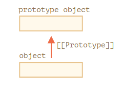
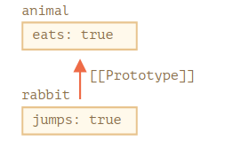
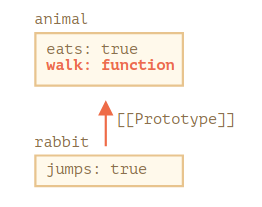
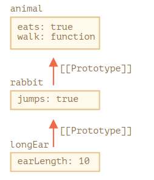
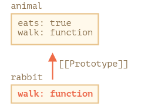
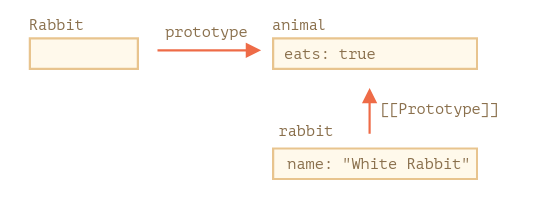
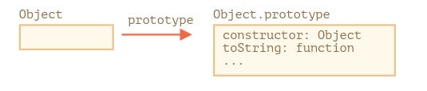
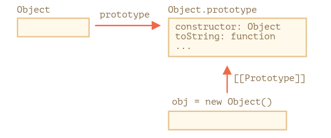
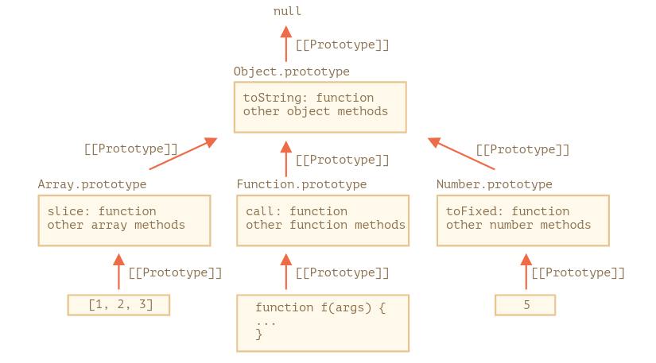

<!-- markdownlint-disable -->

- [Quels sont les différents types de données présents dans javascript?](#quels-sont-les-différents-types-de-données-présents-dans-javascript)
- [Expliquer le *hoisting* en JavaScript](#expliquer-le-hoisting-en-javascript)
- [Difference entre '==' et '==='](#difference-entre--et-)
- [Est ce que Js est un language de typage statique ou language de typage dynamique?](#est-ce-que-js-est-un-language-de-typage-statique-ou-language-de-typage-dynamique)
- [C'est quoi **NaN** en Js?](#cest-quoi-nan-en-js)
- [Expliquer le passage par valeur et le passage par référence dans JavaScript?](#expliquer-le-passage-par-valeur-et-le-passage-par-référence-dans-javascript)
- [Quels sont les fonctions auto invoqué en js (Immediately Invoked Functions)?](#quels-sont-les-fonctions-auto-invoqué-en-js-immediately-invoked-functions)
- [Expliquer 'Higher order functions'](#expliquer-higher-order-functions)
- [Expliquer le mot clé *'this'*](#expliquer-le-mot-clé-this)
- [Expliquer la méthode call()](#expliquer-la-méthode-call)
- [Expliquer la méthode apply()](#expliquer-la-méthode-apply)
- [Expliquer la méthode bind()](#expliquer-la-méthode-bind)
- [Expliquer c'est quoi *currying* in JavaScript](#expliquer-cest-quoi-currying-in-javascript)
- [Citer/expliquer les 3 portées des variables qu'on a dans JavaScript](#citerexpliquer-les-3-portées-des-variables-quon-a-dans-javascript)
- [Expliquer qu'est ce que *scope chain*?](#expliquer-quest-ce-que-scope-chain)
- [Expliquer les *closures*](#expliquer-les-closures)
- [Expliquer la fonction constructeur et l'opérateur *new* (function constructor / *new* operator)](#expliquer-la-fonction-constructeur-et-lopérateur-new-function-constructor--new-operator)
- [Expliquer l'héritage par prototype trouvé dans](#expliquer-lhéritage-par-prototype-trouvé-dans)
- [Expliquer F.prototype (propriété *prototype* d'une fonction constructeur)](#expliquer-fprototype-propriété-prototype-dune-fonction-constructeur)
- [Supposons qu'on une fonction constructeur F, quelle est la valeur par défaut de sa propriété *prototype*?](#supposons-quon-une-fonction-constructeur-f-quelle-est-la-valeur-par-défaut-de-sa-propriété-prototype)
- [Object.prototype (les prototypes natives au JavaScript)](#objectprototype-les-prototypes-natives-au-javascript)
- [Les prototypes natives dans JavaScript (Array, Date, Math, etc)](#les-prototypes-natives-dans-javascript-array-date-math-etc)
- [C'est quoi une fonction de callback?](#cest-quoi-une-fonction-de-callback)
- [Arrow functions n'ont pas **"this"**](#arrow-functions-nont-pas-this)
- [Expliquer le mot clé "var" et citer qlq differences entre lui et "let/const"](#expliquer-le-mot-clé-var-et-citer-qlq-differences-entre-lui-et-letconst)
- [What is a rest parameter](#what-is-a-rest-parameter)
- [C'est quoi l'opérateur spread (spread operator)?](#cest-quoi-lopérateur-spread-spread-operator)
- [Quels sont les 3 syntaxes pour créer des objets?](#quels-sont-les-3-syntaxes-pour-créer-des-objets)
- [Pourquoi **self** est parfois utilisé dans JavaScript au lieu de **this**](#pourquoi-self-est-parfois-utilisé-dans-javascript-au-lieu-de-this)
- [Quels sont les différents moyens pour créer des tableau en JavaScript?](#quels-sont-les-différents-moyens-pour-créer-des-tableau-en-javascript)
- [Quelle est la valeur de retour d'une fonction qui ne retourne rien en JavaScript?](#quelle-est-la-valeur-de-retour-dune-fonction-qui-ne-retourne-rien-en-javascript)
- [Dans quelles situations on ne peut pas utiliser une *arrow function*?](#dans-quelles-situations-on-ne-peut-pas-utiliser-une-arrow-function)
- [La structure de donnée Map](#la-structure-de-donnée-map)
- [Comment vider un tablau en JavaScript?](#comment-vider-un-tablau-en-javascript)
- [Comment vérifier si un objet est un tableau ou non?](#comment-vérifier-si-un-objet-est-un-tableau-ou-non)
- [Comment passer des arguments a une fonction auto invoqué (immediatly invoked function)?](#comment-passer-des-arguments-a-une-fonction-auto-invoqué-immediatly-invoked-function)
- [Quelle est l'output de ce code?](#quelle-est-loutput-de-ce-code)
- [Quelle est l'output de ce code?](#quelle-est-loutput-de-ce-code-1)
- [Object.create()](#objectcreate)
- [Quelle est l'output de ce code:](#quelle-est-loutput-de-ce-code-2)
- [Quelle est l'output de ce code?](#quelle-est-loutput-de-ce-code-3)
- [L'opérateur *instanceof*](#lopérateur-instanceof)

## Quels sont les différents types de données présents dans javascript?

On a 8 types:

- String
    ```js
    const str = "hello"
    ```

- Number 
    ```js
    const a = 9     //int
    const b = 10.7  //float
    ```

- BigInt
    * Ce type de données est utilisé pour stocker des nombres supérieurs à la limite du type de données Nombre. Il peut stocker de grands entiers et est représenté en ajoutant «n» à un littéral entier.

        ```js
        const bigInteger =  234567890123456789012345678901234567890n;
        ```

- Boolean:
    ```js
    const bool1 = true
    const bool2 = false
    ```

- undefined
    * Lorsqu'une variable est déclarée mais non affectée, elle a la valeur *undefined* et son type est également *undefined*.

        ```js
        let x  // la valeur de x undefined
        const y = undefined // on peut mettre undefined dans une variable explicitement
        ```

- null
    * valeur spéciale qui représente «rien», «vide» ou «valeur inconnue».

        ```js
        let x = null
        ```

- Symbol
    * Il s'agit d'un nouveau type de données introduit dans la version ES6 de javascript. Il est utilisé pour stocker une valeur unique

        ```js
        let s = Symbol("id")
        let s1 = Symbol("id")

        console.log(s == s1)    //false
        ```

- Object
    * le seul type non primitive. Utilisé pour stocker une collection de données

        ```js
        const obj = {
            name: "alae",
            age: 21,
            sayHey() {
                console.log("hey my name is " + this.name)
            }
        }

        ```
 
On peut utilisé l'opérateur *typeof* pour connaitrre les types de nos variables:

```js
const str = "hello"
console.log(typeof str) //"string"

const a = 10
console.log(typeof a)   //"number"

const bigInt = 19888887333367126155555555555562781881973n
console.log(typeof bigInt)  //"bigint"

const bool = true
console.log(typeof bool)    //"boolean"

let x
console.log(typeof x)       //"undefined"

const y = null
console.log(typeof y)       //"object" => erreur dans js, c'est null

const s = Symbol("some name/descrption")
console.log(typeof s)   //"symbol"       

const obj = {
    name: "alae",
    age: 21
}
console.log(typeof obj) //"object"
```


## Expliquer le *hoisting* en JavaScript

c'est un comportement par défaut de javascript où toutes les déclarations de variables et de fonctions sont déplacées au top du script, c-a-d qu'on peut utiliser une variable avant sa déclaration.

* pour les variables déclarés avec *var*
    ```js
    hoistedVariable = 3;
    console.log(hoistedVariable); // affiche 3 même lorsque la variable est déclarée après son initialisation
    var hoistedVariable;
    ```

* pour les fonctions (*function declaration*)
    ```js
    hoistedFunction();  // affiche " Hello world! "meme si la fcontion est appelé avant sa declarations

    function hoistedFunction(){ 
        console.log(" Hello world! ");
    }
    ```

* *hoisting* fonctionne sur le scope locale aussi
    ```js
    function doSomething() {
        x = 33
        console.log(x)
        var x
    }

    doSomething()   //33
    ```

* Note: l'initialisation des variables n'est pas *hoisted*. Seulement la déclaration des variables

    ```js
    var x;
    console.log(x); // affiche "undefined" parceq l'initialisation de x n'est pas hoisted
    x = 23;
    ```


* Note: *hoisting* ne fonctionne pas avec *let* et *const*

    ```js  
    a = 10
    console.log(a)  //ReferenceError: Cannot access 'a' before initialization
    let a
    ```


## Difference entre '==' et '==='

ce sont les deux des opérateurs de comparaison. 

* La difference entre les deux est que '==' convertit les opérandes en nombres avant de les comparer.

    ```js
    > 2 == "2"  
    true    //"2" est convertit en nombre ce qui donne 2

    > true == "1"
    true    //true est convertit en nombre ce qui donne 1, "1" aussi

    > false == 0
    true    //false est convertit en nombre ce qui donne 0
    ```

* avec '===' on n'a pas ce comportement (on teste l'egalité stricte, c-a-d valeur et type)

    ```js
    > 2 === "2"  
    false

    > true == "1"
    false

    > false == 0
    false

    > false === false
    true
    ```

## Est ce que Js est un language de typage statique ou language de typage dynamique?
typage dynamique.


## C'est quoi **NaN** en Js? 
*NaN* signifie Not a Number. Ceci indique que la valeur n'est un nombre valude.

Le type d'une valeur *NaN* va retourné *number*

* exemple

    ```js
    const x = 1 / "x"
    console.log(x, typeof x)    //Nan number
    ```

* Note: la fonction *isNaN(x)* convertit la valeur donnée en un type Number, puis équivaut à NaN.

    ```js
    console.log( isNaN("Hello") ) //true
    console.log( isNaN(345) ) //false
    console.log( isNaN("1") ) //false, parceq '1' convertit en nombre donne 1
    console.log( isNaN(true) ) //false, parceq true convertit en nombre donne 1
    console.log( isNaN(false) ) //false
    console.log( isNaN(undefined) ) //true
    ```

## Expliquer le passage par valeur et le passage par référence dans JavaScript?

les valeurs primitives dans js (string, number, etc) stocke directement la valeur. donc lorsq on copie par ex une variable de type nombre, qui s'appele **a**, dans une autre variable **b** alors c'est seuelement la valeur qui est copié dans b. Ceci implqiue que si on change l'une, alors l'autre ne sera pas affecté.

* exemple

    ```js
    let a = 10
    let b = a   //on copie 10 dans b. a et b sont differents
    
    b = 8888888

    console.log( a )    //10, pas affecté
    ```

Ceci est different avec les objets js, car un objet ne stocke pas directement l'objet mais une référence(adresse memoire) vers l'objet en mémoire. Ceci veut dire que lorsqu'on on copie un objet **a** dans un objet **b** alors, c'est l'@ mémoire de l'objet **a** qui est copié dans **b** et les deux (*a* et *b*) maintenat pointent vers le meme objet.

* exemple:
    ```js
    const a = {
        name: "alae",
        age: 22
    }

    const b = a //la reference vers l'objet a est copie dans b => les deux pointent vers le m objet

    b.name = "yassine"

    console.log(a.name) //yassine, a est affécté
    console.log(b.name) //yassine
    ```

## Quels sont les fonctions auto invoqué en js (Immediately Invoked Functions)?

c'est une fonction qui s'éxecute au moment de sa definition.

```js
(function () {
	console.log("hello world")  //"hello world"
})()
```

les premiers parenthéses sont la pour declarer une fonction anonymes et les dernier paréntheses pour l'appeler.

## Expliquer 'Higher order functions'

ce sont es fonctions qui opèrent sur d'autres fonctions, soit en les prenant comme arguments, soit en les renvoyant comme valeur de retour.

* exemple1:

    ```js
    function higherOrder(fn) {
        fn()
    }

    //"Hello World"
    higherOrder(function () {
        console.log("Hello world")
    })
    ```

* exemple2:

    ```js
    function higherOrder2() {
        return function () {
            console.log("hello world")
        }
    }

    const x = higherOrder2()
    x() // "hello world"
    ```

## Expliquer le mot clé *'this'*

Le mot-clé «this» fait référence à l'objet dont la fonction est une propriété.

* exemple:

    ```js
    "use strict"

    const obj = {
        name: "alae",
        age: 22,

        sayHey: function () {
            console.log("hey my name is " + this.name)
        }
    }
    obj.sayHey()    //hey my name is alae
    ```

    ici **sayHey** est une propriété de l'objet **obj** et donc **this** fait reference a **obj** dans ce cas. Ceci veut dire **this.name** est la meme chose que **obj.name**


* exemple2:
    
    **this** est évalué au moment de l'éxecution pour voir l'objet a laquelle la focntion est attaché. 

    ```js
    "use strict"

    function sayHey() {
        console.log("my name is " + this.name)
    }

    const obj1 = {
        name: "alae",
        age: 22
    }

    const obj2 = {
        name: "yassine",
        age: 23
    }

    obj1.sayHey = sayHey
    obj2.sayHey = sayHey

    obj1.sayHey()   //my name is alae 
    obj2.sayHey()   //my name is yassine

    ```

    on remarque que la valeur de **this** change dépendamment de l'objet a laquelle la fonction est attaché


Si la fonction n'est pas une proprieté d'un objet et on n'est pas dans le mode *strict* alors la fonction est une propriété de l'objet global.

* exemple:

    ```js
    function f() {
    	console.log(this)
    }

    f()
    ```

    le résultat de code va etre **l'objet global** qui est **'window'** dans le navigateur et **'global'** dans Node.js.


Si la fonction n'est pas une proprieté d'un objet et on est dans le mode *strict* alors la valeur de **this** va etre *undefined*

* exemple 

    ```js
    "use strict"

    function f() {
        console.log(this)
    }

    f() //undefined
    ```

## Expliquer la méthode call()

c'est une méthode qui permet d'appeler une fonction en spécifiant la valeur de *'this'* et autre arguments.

* syntaxe:

    ```
    func.call(obj, arg1, arg2, ...)
    ```

    ceci execute la fonction *'func'* en utilisant *'obj'* comme valeur de *'this'* et arg1, erg2, etc comme ses arguments.

* exemple

    ```js
    "use strict"

    function sayHello() {
        console.log("Hello " + this.name)
    }

    var obj = { name: "jhon" }

    sayHello.call(obj)  //"Hello jhon"
    ```

*call* permet a un objet d'utiliser la méthode d'un autre objet

* exemple:

    ```js
    "use strict"

    const person = {
        age: 23,
        getAge: function () {
            return this.age
        }
    }

    var person2 = { age: 54 }
    console.log(person.getAge.call(person2)) //54
    ```

* exemple (avec passage d'arguments)

    ```js
    "use strict"

    function f(adj) {
        console.log(this.name + " is " + adj)
    }

    const obj = {
        name: "jhon"
    }

    f.call(obj, "awesome")  //"jhon is awesome"
    ```

## Expliquer la méthode apply()

fonctionne de la meme maniére que *call()*. La seule difference est que *call()* accépte l'objet qui va remplacer *this* et un ensemble d'arguments tandis que *apply()* accépte l'objet qui va remplacer *this* et un tableau d'arguments.

* syntaxe:
    ```
    func.apply(thisArg, [ argsArray])
    ```

* exemple1:

    ```js
    "use strict"

    function f(adj1, adj2) {
        console.log(this.name + " is " + adj1 + " and " + adj2)
    }

    const obj = {
        name: "jhon"
    }

    f.apply(obj, ["awesome", "really cool"])    //jhon is awesome and really cool
    ```

* exemple 2:

    ```js
    > Math.max.apply(null, [1, 2, 3, 4, 5])
    5
    ```

## Expliquer la méthode bind()

Cette méthode renvoie une nouvelle fonction, où la valeur du mot clé "this" sera remplacé par l'objet passé comme argument a bind.

* syntaxe:

    ```js
    let boundFunc = func.bind(thisArg)
    ```

    *boundFunc* est la fonction *func* avec la valeur de *this* a l'interieure de *func* est remplacé par l'objet *thisArg*

* exemple
    ```js
    "use strict"

    function f(adj) {
        console.log(this.name + " is " + adj)
    }

    const obj = { name: "alae" }

    const sayHey = f.bind(obj, "awesome")
    sayHey()    //alae is awesome
    ```

## Expliquer c'est quoi *currying* in JavaScript

*currying* est une technique pour transformer une fonction de n arguments , en n fonctions d'au plus un argument.

* exemple1:
    ```js
    function sum(a) {
        return function (b) {
            return function (c) {
                return a + b + c
            }
        }
    }

    console.log( sum(1)(2)(3) ) //6
    ```

=> Vous pouvez donner un exemple où cette technique va etre utile?

supposons qu'on veut créer les fonctions suivantes: **addOne(x)**, **addTwo(x)**, **addThree(x)** et **addFour(x)**. Voila comment on va faire ceci sans *currying*:

```js
funtion addOne(x){
    return x + 1
}

funtion addTwo(x){
    return x + 2
}

funtion addThree(x){
    return x + 3
}

funtion addFour(x){
    return x + 4
}
```

voila maintenat comment on ca réaliser la meme chose avec cette technique:
```js
function sum(a) {
	return function (b) {
		return a + b
	}
}

let addOne = sum(1)
let addTwo = sum(2)
let addThree = sum(3)
let addFour = sum(4)
```

au lieu de définir plusieurs fonctions avec le meme logique on definit une seule fonction *sum*.


## Citer/expliquer les 3 portées des variables qu'on a dans JavaScript

1. la portée global (*global scope*)

    les variables/functions déclarés en dehors de toutes fonctions sont de portés globales. C-a-d accessible  n'importe où dans le script.

    ```js
    "use strict"

    const name = "jhon"

    function f() {
        console.log(name) 
    }

    f() //"jhon"
    ```

1. la portée locale (*local scope / function scope*)

    les variables/fonctions déclarés a l'interieure d'une fonction sont accessible seulement a l'intérieure de cette fonction.

    ```js
    "use strict"

    function f() {
        const name = "alae"
        console.log(name) 
    }

    f() //"alae", c'est normal

    console.log(name) //ReferenceError: name is not defined
    ```

1. la portéé du bloc (*block scope*) 

    si une variable ( *let/const* ) est déclaré dans un bloc {...} alors elle est accessible seulement dans ce bloc.

    ```js
    "use strict"

    {
	    const name = "alae"
        console.log(name) //"alae", normal
    }

    console.log(name) //ReferenceError: name is not defined
    ```

    Attention! les variables déclarés avec *var* ont accessible au dehors de ces blocs {...}
    ```js
    "use strict"
    
    {
        var name = "alae"
        console.log(name) //"alae", normal
    }

    console.log(name) //"alae"
    ```


## Expliquer qu'est ce que *scope chain*?

*scope chain* est une téchnique utilisé par JavaScript pour trouver la valeur d'une variable donnée. Comprenons cela à l'aide d'un exemple:

```js
"use strict"

//global scope
const name = "jhon"

function f() {
    //f scope

	function f1() {
        //f1 scope
	
    	function f2() {
            //f2 scope
    
    		console.log(name)
		}

		f2()
	}

	f1()
}

f()
```

quand la fonction **f2** est appélé, alors JavaScript va essayer de trouver la variable *name* dans le scope actuelle de la foncition mais il ne va pas la trouver. Puis il va essayer de la trouver dans le scope de la fonction **f1** mais envain, puis dans le scope de la fonction **f** puis finalement il va la trouver (name) dans le **global scope**.   


## Expliquer les *closures*

c'est un moyen par lequel une fonction peut se rappeler des variables déclarés dans sa porté externe (its outer scope).

Regardons un exemple:

```js
"use strict"

function outer() {
    var obj1 = { name: "jhon", age: 45 }

    return function () {
        console.log(obj1.name + " is " + "awesome")
    }
}

var f = outer()

f() //jhon is awesome
```

Normalement, lorsq'une fonction fini de s'exécuter alors tous les variables locales a cette fonction sont détruites. Alors, pourquoi ici **f()** a pu accéder a l'objet **obj1** meme si la fonction **outer** dans laquelle il est déclaré a fini de s'éxécuter (obj1 est supposé etre détruit)?? La réponse est que ceci est possible a l'aide des *clusores*.

Quand la fonction **outer** s'execute, elle remarque que la fonction retourné utilise la variable **obj1** à l'intérieur, donc au lieu de détruire la variable **obj1** quand elle a fini son éxecution, elle la sauvegarde dans la mémoire pour que la fonction interne/retourné puisse l'utiliser quand elle veut. 


Voila un autre exemple plus intéressant:
```js
"use strict"

function makeCounter() {
	let count = 0

	return function () {
		count++
		return count
	}
}

/*1.*/ let counter = makeCounter()

/*2.*/ console.log(counter())    //1
/*3.*/ console.log(counter())    //2
/*4.*/ console.log(counter())    //3

/*5.*/ let counter2 = makeCounter()
/*6.*/ console.log(counter2())   //1
```

essayons de comprendre ce qu'il s'est passé dans les étapes 1, 2, 3, 4, 5 et 6.

1.  la fonction **makeCounter()** est appélé. Elle initialise une variable **count** a 0. Elle remarque que la fonction interne utilise cette variable donc elle la garde dans la mémoire (*closore :D*).

1. **counter()** est appélé, elle incréménte la valeur de **count** dont elle a accés a l'aide des **closures**. (la valeur de *count* a l'interieure de *counter* est maintenant 1)

1. **counter()** est appélé une 2émé fois. La variable **count** est tjrs en mémoire. sa valeur est incrémenté (contient 2 maintenant). 

1. meme chose, la valeur de **count** est 3 maintenant.

1. la fonction **makeCounter()** est appélé. Elle initialise une variable **count** a 0. Elle remarque que la fonction interne utilise cette variable donc elle la garde dans la mémoire (*closore :D*).

1. **counter2()** est appélé, elle incréménte la valeur de **count** dont elle a accés a l'aide des **closures**. (la valeur de *count* a l'intérieure de *counter2* est maintenant 1)

## Expliquer la fonction constructeur et l'opérateur *new* (function constructor / *new* operator) 

La syntaxe régulière {...} permet de créer un objet. Mais souvent, on veut créer de nombreux objets similaires, comme plusieurs utilisateurs par exemple.

Cela peut être fait en utilisant les fonctions constructeur et l'opérateur "new".

**une fonction** constructeur est une fonction normal avec deux conventions:

1. la convention de nommage est TitleCase.
1. elles doivent etre appelé avec *new*.

exemple: 
```js
"use strict"

function User(name) {
	this.name = name
	this.isAdmin = false
}

let user = new User("Jack")

console.log(user.name) // Jack
console.log(user.isAdmin) // false
```

Lorsqu'une fonction est exécutée avec *new*, elle effectue les étapes suivantes:

1. un objet vide est crée et assigné a *this*
1. le corps de la fonction s'éxecute. Habituellement, il modifie *this* et y ajoute de nouvelles propriétés.
1. la valeur de *this* est retourné.

dans d'autre mots, **new User(...)** fait qlq chose du genre:
```js
function User(name) {
    //this = {}  (implicitement)

    //y ajoute des proprétés
    this.name = name;
    this.isAdmin = false;

    //retourne this  (implicitement)
}
```

## Expliquer l'héritage par prototype trouvé dans 

En programmation, nous voulons souvent prendre quelque chose et l'étendre.

Par exemple, nous avons un objet **user** avec ses propriétés et ses méthodes, et on veut créer un autre objet **admin** qui est va etre un peu different de **user**. On veut réutiliser ce que nous avons dans **user**, pas copier / réimplémenter ses méthodes, juste construire un nouvel objet dessus.

L'héritage par prototype est une fonctionnalité de langage qui permet ceci.

* [[prototype]]

    En JavaScript, les objets ont une propriété spécial qui s'appelle [[prototype]] (comme nommé dans la spécificatio) qui est soit **null** soit une référence a un autre objet. Cet autre objet est appelé *un prototype*. 

    

    Quand on essaye de lire une propriété d'un objet et cette propriété n'existes pas dans l'objet alors JavaScript va essayer de prendre cette proproté du prototype de l'objet.

    pour accéder a la propriété [[prototype]] des objets il faut utiliser un getter/setter qui s'appelle *\_\_proto\_\_*.

    ```js
    "use strict"

    let animal = {
        eats: true
    }

    let rabbit = {
        jumps: true
    }

    rabbit.__proto__ = animal //  rabbit.[[Prototype]] = animal 
    ```

    maintenant si on accéde a une propriété qui n'existe pas dans **rabbit** alors Js va la prendre automatiquement de son *prototype* qui est l'objet **animal**.

    ```js
    "use strict"

    let animal = {
        eats: true
    }
    let rabbit = {
        jumps: true
    }

    rabbit.__proto__ = animal // (*)

    // on peut trouver les deux propriétés dans rabbit maintenant
    console.log(rabbit.eats) // true (**)
    console.log(rabbit.jumps) // true
    ```

    la ligne (*) met *animal* comme étant prototype de *rabbit*.

    quand on essaie d'accéder a la propriété *eats* dans la ligne (**), JavaScript ne va pas la trouver et va chercher dans son prototype qui est *animal*.

    

    Maintenant l'utilité de ceci est que si *animal* a plusieurs attributs/méthodes utiles ils vont etre automatiquement disponibles dans *rabbit*.

    Les méthodes sont aussi hérités:
    ```js
    "use strict"

    let animal = {
        eats: true,
        walk() {
            console.log("Animal walk")
        }
    }

    let rabbit = {
        jumps: true,
        __proto__: animal
    }

    // walk est pris du prototype
    rabbit.walk() // Animal walk
    ```

    la méthode est automatiquement pris du prototype comme ca:

    

    La *chaine du prototype* peut etre plus longue:
    ```js
    "use strict"

    let animal = {
        eats: true,
        walk() {
            console.log("Animal walk")
        }
    }

    let rabbit = {
        jumps: true,
        __proto__: animal
    }

    let longEar = {
        earLength: 10,
        __proto__: rabbit
    }

    // walk est pris de la chaine de prototype
    longEar.walk() // Animal walk
    console.log(longEar.jumps) // true (de rabbit)
    ```
    

* L'écriture n'utilise pas le prototype:    

    le prototype est utilisé seulement pour lire des propriétés.
    
    quand on ecrite/supprime une propriété d'un objet alors on est entrain de travailler directement sur l'objet.

    ```js
    "use strict"

    let animal = {
        eats: true,
        walk() {
            /* ne va pas etre utilisé par rabbit*/
        }
    }

    let rabbit = {
        __proto__: animal
    }

    rabbit.walk = function () {
        console.log("Rabbit! Bounce-bounce!")
    }

    rabbit.walk() // Rabbit! Bounce-bounce!
    ```

    Désormais, l'appel rabbit.walk() trouve la méthode immédiatement dans l'objet et l'execute sans utiliser le prototype.

    


## Expliquer F.prototype (propriété *prototype* d'une fonction constructeur)

On sait que on peut créer de nouveaux objets avec la fonction constructeur comme ca: **new F()**.

si **F.prototype** est un <span style="color:red;">objet</span>, alors l'opérateur **new** utilise cet <span style="color:red;">objet</span> comme valeur de [[prototype]] de ce nouveau objet.

Voila un exemple:
```js
"use strict"

let animal = {
	eats: true
}

function Rabbit(name) {
	this.name = name
}

Rabbit.prototype = animal

let rabbit = new Rabbit("White Rabbit") //  rabbit.__proto__ == animal

console.log(rabbit.eats) // true
```



## Supposons qu'on une fonction constructeur F, quelle est la valeur par défaut de sa propriété *prototype*?

Chaque fonction a une propriété **prototype** meme si on ne la fournit pas.
La valeur par defaut de cette propriété **prototype** est un objet, avec une seul propriété **constructor** qui pointe sur la fonction elle meme.

Comme ceci:
```js
function Rabbit() {}

/* default prototype
Rabbit.prototype = { constructor: Rabbit };
*/
```

On peut vérfier ceci facilement:
```js
"use strict"

function Rabbit() {}

console.log(Rabbit.prototype.constructor === Rabbit)    //true
```

Naturellement, si on fait rien alors cette propriété **constructor** va etre disponible pour tous les objets créer avec **new Rabbit()** a travers [[prototype]].

```js
"use strict"

function Rabbit() {}
// par défaut:
// Rabbit.prototype = { constructor: Rabbit }

let rabbit = new Rabbit() // rabbit.__proto__ === Rabbit.prototype === {constructor: Rabbit}

console.log(rabbit.constructor == Rabbit) // true (pris du prototype)
```

en résumé:

- La propriété **F.prototype** (ne la confondez pas avec [[Prototype]]) définit [[Prototype]] de nouveaux objets lorsque **new F()** est appelé.

- La valeur de **F.prototype** doit être un objet ou null: les autres valeurs ne fonctionneront pas.

- La propriété **"prototype"** n'a un tel effet spécial que lorsqu'elle est définie sur une fonction constructeur et appelée avec **new**.

## Object.prototype (les prototypes natives au JavaScript)

La propriété **"prototype"** est largement utilisée par JavaScript. Toutes les fonctions constructeurs dans le language (Object, Array, Math, etc) l'utilisent.

Disons qu'on a un objet vide comme ceci:
```js
let obj = {}
console.log( obj.toString() )   //[object Object]
```

D'où vient le code qui génère la chaîne **"[objet objet]"**? C'est une méthode **toString**, mais où est-elle? L'**obj** est vide!

....Il faut savoir que **obj = {}** est la meme chose que **new Object()** où **Object** est une fonction constructeur dans le language JavaScript, avec sa propre propriété **prototype** qui est un un objet avec plusieurs méthodes comme **toString**.



Quand un nouveau objet est crée avec **new Object()** (ou bien **{...}**) alors son **[[prototype]]** est maintenant égal a **Object.prototype** d'ou pourquoi on a la méthode **toString** dans l'**obj** vide qu'on a crée au début.



Donc **obj.toString** est pris de **Object.prototype**.
```js
"use strict"

let obj = {}

console.log(obj.__proto__ === Object.prototype) // true

console.log(obj.toString === obj.__proto__.toString) //true
console.log(obj.toString === Object.prototype.toString) //true
```

> <span style="color:red">Note: </span> Object.prototype.\_\_proto\_\_ est égale a null


## Les prototypes natives dans JavaScript (Array, Date, Math, etc)

Toutes les fonctions constructeurs fournis par JavaScript comme par exemple *Array*, *Date*, *Math* gardent les méthodes dans leurs prototypes.

Par exemple, lorsqu'on créet un tableau [1, 2, 3], alors **new Array()** est utilisé en interne. **Array.prototype** devient donc son prototype et fournit des méthodes. C'est très efficace en mémoire.

Par spécifications, tous les fonctions constructeurs ont **Object.prototype** au top, c'est pourquoi on dit que tous les objets héritent de **Object**.



On peut vérfier ceci facilement:
```js
let arr = [1, 2, 3];

console.log( arr.__proto__ === Array.prototype ); // true

console.log( arr.__proto__.__proto__ === Object.prototype ); // true

console.log( arr.__proto__.__proto__.__proto__ ); // null, top de la chaine
```

## C'est quoi une fonction de callback?

Les fonctions en JavaScript sont appelé **"first class citizens"**, c-a-d qu'elles sont capable de faire ce que les autres peuvent faire, c-a-d qu'une fonction peut etre mis dans une variable, passé comme argument a une autre fonction et retourné d'une fonction.

Une fonction de callback **b** est une fonction qui va etre passé comme argument a une autre fonction **a** et cette fonction **b**
va etre executé quand **a** fini son éxecution.

exemple:
```js
"use strict"

function divideBy2(a) {
	return Math.floor(a / 2)
}

function getDouble(a) {
	return a * 2
}

function operationOnSum(a, b, operation) {
	const sum = a + b
	return operation(sum)
}

console.log(operationOnSum(1, 2, divideBy2))    //1
console.log(operationOnSum(1, 2, getDouble))    //6
```

Dans **operationOnSum(1, 2, divideBy2)**, *divideBy2* est ce qu'on appelle une fonction de callback.

Les fonctions de callback sont utilisé généralement dans un contexte de programmation asynchrone où on va avoir une tache qui va prendre du temps (ex: lecture du disque, du BD, requete vers un serveur/API) et on veut executer un traitement lorsq cette tache a fini de s'éxecuter.

Voila un exemple en utilisant une fonction asynchrone présente dans la librairie standard de Node.js.

```js
"use strict"

const fs = require("fs")

function callback(err, data) {
	if (err) throw err
	console.log(data)
}

fs.readFile("./file.txt", "utf8", callback)
```
*callback* est une fonction de callback qui va etre executé lorsq la lecture du fichier a fini.


## Arrow functions n'ont pas **"this"**

arrow functions n'ont pas **"this"**, si on essaie d'accéder a **this** depuis une arrow functions alors il est pris de l'éxterieur (le scope où l'arrow function est décalré).

On sait que la valeur de *this* dans une fonction qui n'est pas attaché a un onjet est égal a *undefined*.\
Voila un exepmle:

```js
"use strict"

let obj = {
	name: "alae",
	sayHey: function () {
		function f() {
			console.log(this.name)
		}

		f() //(*)
	}
}

obj.sayHey()    //TypeError: Cannot read property 'name' of undefined
```
dans la ligne <span style="color:green;">(*)</span> on a appelle la fonction **f**. Mais dans ce cas **f** n'est pas attaché a aucun objet, donc la valeur de **this** a l'interieure de **f** est egal a **undefined**, d'où l'erreur.

Ceci est different en ce qui concerne les **arrow functions** car elles n'ont pas **this**.. une arrow function prend **this** du scope dans lequel elle est déclaré.\
Voila un exemple:

```js
"use strict"

let obj = {
	name: "alae",
	sayHey: function () {
		const arrowFunc = () => console.log(this.name)
		arrowFunc()
	}
}

obj.sayHey()    //alae
```

notre arrow function prend la valeur du **this** du scope dans laquelle elle est déclaté c-a-d de la fonction **sayHey**, d'où le résultat (this c'est l'**obj** avant le point.)


## Expliquer le mot clé "var" et citer qlq differences entre lui et "let/const"

**var** c'était l'ancien moyen de déclarer des variables dans JavaScript. Il qlqs difference avec **let/const**.

- **var** has no block scope 

    ```js
    "use strict"

    {
        var name = "alae"
    }

    console.log(name)   //alae
    ```

    ceci contrairement a **let/const**.
    ```js
    "use strict"

    {
        const name = "alae"
    }

    console.log(name)   //ReferenceError: name is not defined
    ```
- **var** has function scope

    ```js
    "use strict"

    function f() {
        var name = "alae"
    }

    console.log(name)   //ReferenceError: name is not defined
    ```
    ceci est similaire a **let/const** :)

- On peut redéclarer une variable déclaré avec **var**

    ```js
    "use strict"

    var name = "jhon"
    var name = "jane"   //pas d'erreur
    ```
    ceci contrairement a **let/const**
    ```js
    "use strict"

    let name = "jhon"
    let name = "jane"   //SyntaxError: Identifier 'name' has already been declared
    ```

- une variable déclaré avec **var** peut etre utilisé avant sa déclaration (hoisting).

    ```js
    "use strict"

    name = "jane"
    console.log(name) //jane

    var name
    ```

    ceci contrairement a **let/const**
    ```js
    "use strict"

    name = "jane"
    console.log(name) //ReferenceError: Cannot access 'name' before initialization

    let name    
    ```
    
## What is a rest parameter 

un moyen a travers lequel on peut passer un nombre variable d'arguments a une fonction.

supposons qu'on veut créer une fonction **"sum"** qui doit faire la somme des variables fourni comme arguments. Comment on va réaliser ceci? a l'aide d'un **"rest parameter"** :).

Voila: 
```js
"use strict"

function sum(...args) {
	let s = 0
	args.forEach((el) => (s += el))
	return s
}

console.log(sum(1, 2))          //3
console.log(sum(1, 2, 3))       //6
console.log(sum(1, 2, 3, 4))    //10
```
> un **rest parameter** doit etre le dernier argument dans une fonction.

## C'est quoi l'opérateur spread (spread operator)?

c'est un élément qui est utilisé pour répandre (=spread) un tableau ou un objet. (il est similaire en syntaxe a un *rest parameter*)

- exemple

    ```js
    "use strict"

    const arr1 = [1, 2, 3]
    const arr2 = [4, 5, 6]

    const newArray = [...arr1, ...arr2, 7, 8, 9]
    console.log(newArray)   //[ 1, 2, 3, 4, 5, 6, 7, 8, 9]
    ```

- exemple

    ```js
    "use strict"

    function sum(a, b, c, d) {
        return a + b + c + d
    }

    console.log( sum(...[1, 2, 3, 4]) ) //10
    ```

- exemple

    ```js
    "use strict"

    let obj = {
        name: "jhon",
        age: 40
    }

    const clone = { ...obj }
    console.log(clone)  //{ name: 'jhon', age: 40 }
    ```

## Quels sont les 3 syntaxes pour créer des objets?
1. Object literal

    ```js
    let obj = {
        prop: "value",
        prop2: "value2 
    }
    ```

1. en utilisant *Object*

    ```js
    "use strict"

    let obj = new Object()
    obj.name = "jane"
    console.log(obj)    //{ name: 'jane' }
    ```

1. en utilisant une fonction constructeur

    ```js
    "use strict"

    function User(name, age) {
        this.name = name
        this.age = age
    }

    let user = new User("alae", 22)
    console.log(user) //User { name: 'alae', age: 22 }
    ```

## Pourquoi **self** est parfois utilisé dans JavaScript au lieu de **this**

On sait que chaque fonction normal (déclaré avec le mot clé function) a son propre **this**. Si une fonction normale **f** est déclaré a l'intérieure d'une méthode d'un objet alors cette fonction **f** va avoir son propre this qui ne vas pas etre l'objet appelant la méthode.\
Voila un exemple:

```js
"use strict"

let obj = {
	name: "alae",
	age: 21,
	sayHey: function () {
		function f() {
			console.log(this.name)
		}
		f()
	}
}

obj.sayHey() //TypeError: Cannot read property 'name' of undefined
```

La fonction **f** déclaré a l'intérieure de la méthode <span style="color:red">sayHey</span> n'est pas attaché a aucun objet et on est dans le mode strict alors la valeur de **this** a l'intérieure de **f** va etre *undefined*. Ce qui justifie l'erreur.

la 1ére solution a ce probleme est utiliser une **arrow function** au lieu d'une fonction normal pour **f**.

la 2éme solution est de sauvegarder la valeur de **this** avant d'entrer a **f**, comme suit:
```js
"use strict"

let obj = {
	name: "alae",
	age: 21,
	sayHey: function () {
		const self = this   //sauvegarder this dans une variable self
		function f() {
			console.log(self.name)
		}
		f()
	}
}

obj.sayHey()    //alae
```

## Quels sont les différents moyens pour créer des tableau en JavaScript?

1. array literal
    
    ```js
    const arr = [1, 2, 3]
    ```

1. en utilisant la fonction constructeur **Array**
    
    ```js
    "use strict"

    let arr = new Array(1, 2, 3, 4)
    console.log(arr)                    //[ 1, 2, 3, 4 ]

    let arr2 = new Array()              //tableau de taille 0

    let arr3 = new Array(10)            //tableau de 10 elements
    console.log(arr3.length)            //10                  
    ```

## Quelle est la valeur de retour d'une fonction qui ne retourne rien en JavaScript?

undefined.

```js
"use strict"

function test() {}

function test2() {
	return
}

console.log(test())     //undefined
console.log(test2())    //undefined
```


## Dans quelles situations on ne peut pas utiliser une *arrow function*?

1. comme méthode pour un objet
1. comme fonction constructeur

## La structure de donnée Map

une **Map** est une collection de donnée juste comme un objet, mais la difference est que: dans une **Map** on peut utilisé des clés de n'importe quels types (pas juste des chaines de caracteres comme dans les objets).

Les méthodes et propriétés d'une map sont:

* **new Map()**: créer un objet de type Map
* map.**set**(key, value): stocker la valeur par clé
* map.**get**(key) – retourne la valeur associé a la clé key. Si la clé n'existes pas retourne undefined
* map.**has**(key) – true if la clé existe, false sinon
* map.**delete**(key) – supprimer la valeur associé a ce clé
* map.**clear**() – vider la map
* map.**size** – la taille du map
 
Voila un exemple:
```js
"use strict"

let map = new Map()

map.set("1", "str1")    // clé est un string
map.set(1, "num1")      // clé est un nombre
map.set(true, "bool1")  // clé est un boolean

//il faut se rappeler qu'un objet convertit tjrs les clés en string
//une Map garde les types des clés
console.log(map.get("1"))   //"str1"
console.log(map.get(1))     //"num1"
console.log(map.get(true))  //bool1

console.log(map.size)       //3
```

On peut utiliser un objet comme un clé:
```js
"use strict"

let jhon = {
	name: "jhon"
}

let map = new Map()
map.set(jhon, "this is a value")

console.log(map.get(jhon))  //"this is a value"
```

On peut boucler sur les éléments d'une **Map** en utilisant 3 méthodes:
* map.**keys()** – retourne un itérable de clés
* map.**values()** – retourne un itérable de valeurs,
* map.**entries()** – retourne un itérable de [key, value]
 
Démo:
```js
"use strict"

let ages = new Map([
	["alae", 22],
	["zakaria", 30],
	["yassine", 23]
])

for (const name of ages.keys()) {
	console.log(name)   //alae, zakaria, yassine
}

for (const age of ages.values()) {
	console.log(age)    //22, 30, 23
}

for (const entry of ages.entries()) {
	console.log(entry)  //["alae", 22], etc
}
```

## Comment vider un tablau en JavaScript?

supposons qu'on a ce tableau 
```js
let arrayList =  ['a','b','c','d','e','f']
```

Y en plusieurs méthodes pour le vider:

* methode1:

    ```js
    arrayList = []
    ```

    Le code ci-dessus crée un nouveau tableau et l'affecte a la variable arrayList. Ceci est recommandé si on n'a aucune référence au tableau original arrayList ailleurs. 
    Si on a une autre référence au tableau alors biensur le tableau va rester en mémoire.

    ```js
    let arrayList = ["a", "b", "c", "d", "e", "f"] 
    let anotherArrayList = arrayList //anotherArrayList est une autre réference au tableau
    arrayList = [] // arrayList maintenant est une reference a un tableau vide
    console.log(anotherArrayList) //['a','b','c','d','e','f']

    ```

* méthode2:

    ```js
    arrayList.length = 0
    ```

    ce code va vider le tableau en mettant sa propriété length a 0. Si on a d'autres références au meme tableau alors elles vont etre toutes afféctés et donc vidés.

    ```js
    "use strict"

    let arrayList = ["a", "b", "c", "d", "e", "f"] 
    let anotherArrayList = arrayList 

    arrayList.length = 0 // Empty the array by setting length to 0

    console.log(anotherArrayList) //[]
    ```

* méthode3:

    ```js
    arrayList.splice(0, arrayList.length);
    ```

    cette méthode fonctionne parfaitement aussi. Si on a d'autres références au tableau *arrayList* alors elles vont etre affectés aussi.

    ```js
    "use strict"

    let arrayList = ["a", "b", "c", "d", "e", "f"]
    let anotherArrayList = arrayList 

    arrayList.splice(0, arrayList.length) // Empty the array by setting length to 0
    
    console.log(anotherArrayList) //[]
    ```

* méthode4 (pas recommandé)

    ```js
    "use strict"

    let arrayList = ["a", "b", "c", "d", "e", "f"] // Created array

    while (arrayList.length) {
        arrayList.pop()
    }

    console.log(arrayList)  //[]
    ```

## Comment vérifier si un objet est un tableau ou non?

```js
"use strict"

let arrayList = [1, 2, 3]
let o = {}

console.log(Array.isArray(arrayList))   //true
console.log(Array.isArray(o))           //false
```

## Comment passer des arguments a une fonction auto invoqué (immediatly invoked function)?

```js
"use strict"

;(function (x, y) {
	console.log(x, y)   //10 11
})(10, 11)
```

## Quelle est l'output de ce code?
```js
"use strict"

const res = (function () {
	return 10
})()

console.log(res)
```

10

## Quelle est l'output de ce code?

```js
"use strict"

let x = { foo: 1 }

let output = (function () {
	delete x.foo
	return x.foo
})()

console.log(output)
```

undefined


## Object.create()

c'est une méthode qui va créer un nouveau **objet** en utilisant un autre objet existant comme prototype de **objet**.

exemple:
```js
"use strict"

const person = {
	isHuman: false,
	sayHey: function () {
		console.log(`My name is ${this.name}. Am I human? ${this.isHuman}`)
	}
}

const me = Object.create(person)

console.log(me.__proto__ === person)    //true, person est le prototype de 'me'

me.isHuman = true   //isHuman existe maintenant dans me
me.name = "alae"    //name existe maintenant dans me

// sayHey est pris du prototype
me.sayHey() //My name is alae. Am I human? true
```

## Quelle est l'output de ce code:
```js
"use strict"

const person = {
	name: "jhon"
}

const p = Object.create(person)

delete p.name
console.log(p.name)
```
jhon.

**Explication**: p est un objet et son prototype est l'objet person.\
On essaie de supprimer la proprité *name* de l'objet **p** mais cette propriété n'exsites dans **p** pour qu'elle soit supprimé. Elle existe dans son prototype.
Donc lorsque dans la derniere ligne on essaie d'acceder a la propriété *name* de p, alors JavaScript va chercher dans p, ne vas pas la trouver, et va chercher dans son prototype et va la trouver.


## Quelle est l'output de ce code?

```js
"use strict"

let trees = ["xyz", "xxxx", "test", "ryan", "apple"]
delete trees[3]

console.log(trees.length)   
```

5

**Explication**: lorsq on fait <span style="color:darkblue">delete</span> a un element d'un tableau sa valeur devient *undefined* et c'est tout. la propriété *length* n'est pas affecté par ceci.

## L'opérateur *instanceof*

L'opérateur **instanceof** teste pour voir si la propriété *prototype* d'une fonction constructeur apparaît n'importe où dans la chaîne de prototype d'un objet. La valeur de retour est un boolean.

exemple:
```js
"use strict"

function Car(make, model, year) {
	this.make = make
	this.model = model
	this.year = year
}

const car = new Car("ford", "focus", 2020)

console.log(car instanceof Car)     //true
console.log(car instanceof Object)  //true
```

- [ car.\_\_proto\_\_ === Car.prototype ] c'est pour ca qu'on [ car instanceof Car ] est egale a true  
- [ car.\_\_proto__.\_\_proto__ === Object.prototype ] c'est pour ca qu'on a [ car instanceof Object ] est egale a true