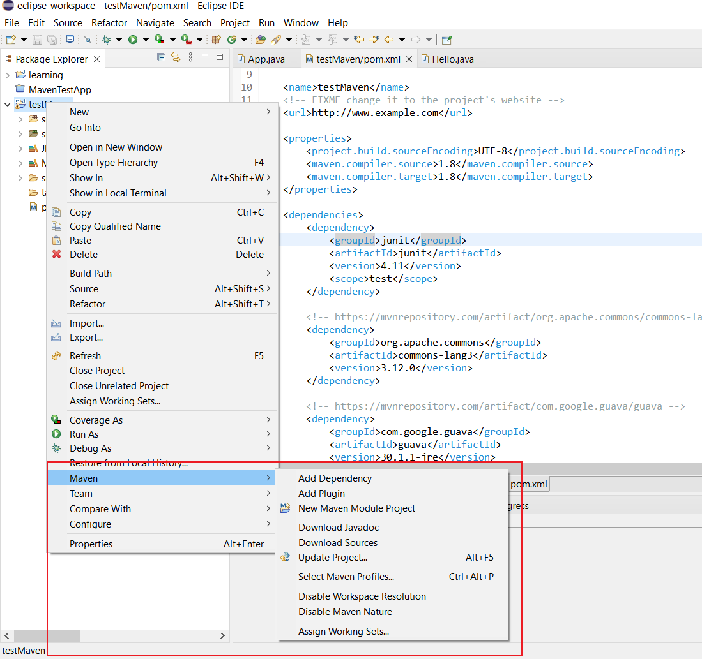
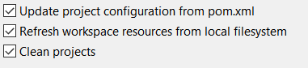
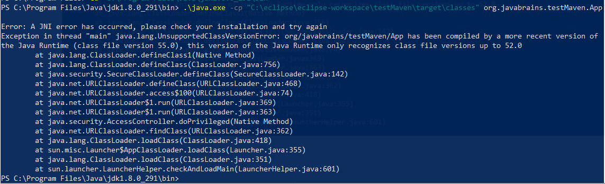

- [JavaBrains Maven tutorial](#javabrains-maven-tutorial)
  - [Common Problems and activities (why using Maven? what problems it solves?)](#common-problems-and-activities-why-using-maven-what-problems-it-solves)
  - [Set up Maven on your computer](#set-up-maven-on-your-computer)
  - [Understanding Archetypes and pom.xml](#understanding-archetypes-and-pomxml)
    - [Creating a Project with the mvn archetype:generate command](#creating-a-project-with-the-mvn-archetypegenerate-command)
    - [pom.xml](#pomxml)
  - [Maven build phases](#maven-build-phases)
    - [Build lifecycle](#build-lifecycle)
    - [Some phases](#some-phases)
    - [How to run a phase?](#how-to-run-a-phase)
  - [Adding a dependency](#adding-a-dependency)
  - [Intoduction to Plugins with Maven compiler plugin](#intoduction-to-plugins-with-maven-compiler-plugin)
  - [Maven Eclipse plugin (another Maven plugin)](#maven-eclipse-plugin-another-maven-plugin)
  - [Eclipse plugin](#eclipse-plugin)
  - [Setting the Java Version in Maven](#setting-the-java-version-in-maven)
    - [Java 9 and beyond](#java-9-and-beyond)

# JavaBrains Maven tutorial

## Common Problems and activities (why using Maven? what problems it solves?)

* Multiple jars and their dependencies (when developping a Spring project for example, you will be working with a lot of jars, and sometimes these jars depend on other jars and you'll have to provide all the needed jars/dependencies yourself and put them in the classpath)
* Dependencies versions: somtimes a specific version of jar X depend on another specific version of another jar Y, so when providing the dependency for X, you'll have to make sure to provide the right version of Y
* Project structure: what king of project structure we'll be using?
* Building (when we develop a project, we always need to compile all the classes, run all tests, package the app to a jar/war/etc format, etc and Maven heps automate this) & publishing & deploying:
	
## Set up Maven on your computer

1. go to https://maven.apache.org/ 
1. go to Download section
1. download the Binary zip archive (.zip)
1. extract it to a folder like C:\apache-maven-3.8.4
1. create two System Environment variables: M2_HOME & MAVEN_HOME, with that Maven path (C:\apache-maven-3.8.4)
1. add the path C:\apache-maven-3.8.4\bin to the Path environment variable

test that you successfully installed Maven by running the command: 

```bash
mvn --version
```


## Understanding Archetypes and pom.xml

### Creating a Project with the mvn archetype:generate command

1. run the command mvn archetype:generate
1. choose the number of the type of project you want, what particular type of app we want to create? Java ee? Spring? Hibernate? this controls the project structure/layout (by default it will be Mavne quickstart which contains a simple Maven project)
1. choose version of the archtype (I think just leave the default number here)
1. enter the Group ID: org.koushik.javabrains (will group all of our Projects/Apps (similar to a package name))
1. enter the Artifact ID: MavenTestApp (name of the Project/App  (similar to a class name))
1. enter the version (leave the default)
1. enter the package name (leave the default)
1. confirm to create the Project
		
### pom.xml

* all the infos provided to the mvn archetype:generate command will be in the pom.xml file

* pom.xml tags:
	
    ```xml
    <!-- these 3 are the key for any artifact / combined will be used to identify an artifact-->
    <groupId>org.koushik.javabrains</groupId>
    <artifactId>MavenTestApp</artifactId>
    <version>1.0-SNAPSHOT</version>

    <!--kind of packaging we want? jar? war? etc-->
    <packaging>jar</packaging>

    <!--properties of the app-->
    w
    <!--list of all the dependencies that this project has-->
    <dependencies>
        <dependency>
            <groupId>junit</groupId>
            <artifactId>junit</artifactId>
            <version>4.11</version>
            <scope>test</scope>
        </dependency>
    </dependencies>
    ```

## Maven build phases

### Build lifecycle

* it consists of phases (compile phase, test phase, package (into jar, war, etc) phase, etc)
* build phases have default behavior, for ex the compile phase takes whatever classes in src/main folder and compiles them.
* when you run a phase, previous phases will be executed. For ex, if you choose to package the app into a jar, previous phases like compile and test will be executed first
		
### Some phases 

* validate   : validations done before compilation. Do we have pom.xml? all java files in the right folder? right config?
* compile    : takes all the .java files and compile them (if we run this phase, validate will be automatically called)
* test           : running the test cases (if you run this phase, previous ones validate and compile will be automatically called)
* package   : package the app into a jar, war, etc 
* install       : installs the artifact into the local Maven repository
* deploy      : used to publish the artifact to the remote Maven reposiroty for other developers to use
			
### How to run a phase?

1. go to the app folder (where pom.xml is)
1. run
    ```bash
    mvn #phase-name#l
    ```

* example:
    ```bash
    mvn compile
    ```


    will compile the .java files and put the .class files into a folder named target/classes

* example:
    ```bash
    mvn install
    ``` 
            
    will install the app/artifact in the local Maven repo (all previous phases will be run before doing this.. some phases may be skipped, like the compile if no code changes happened)


## Adding a dependency

* We will add a dependency for the logging framework slf4j
* Lets change the App.java to use it and then see how to add the jar files for it

    ```java 
    package org.koushik.javabrains;

    import org.slf4j.*;

    public class App {
        final static Logger LOGGER = LoggerFactory.getLogger(App.class);
        public static void main( String[] args ){
            LOGGER.info("hello world!");
        }
    }
    ```
    
* Lets add the dependency for slf4j in the pom.xml

    ```xml  
    <dependencies>
        <!-- https://mvnrepository.com/artifact/org.slf4j/slf4j-api -->
        <dependency>
            <groupId>org.slf4j</groupId>
            <artifactId>slf4j-api</artifactId>
            <version>1.7.32</version>
        </dependency>
    </dependencies>
    ```

* Lets compile the project now with mvn compile (before doing the compile Maven will look at pom.xml and go download all the needed jar files from the local/remote Maven repo)
	
* The <dependency></dependency> tag has a child tag called <scope></scope>, but we did it include it for the slf4j dependency, so, by default, it will <scope>compile</scope>, which means that this dependency will be available in the compile phase. There are other scopes.


## Intoduction to Plugins with Maven compiler plugin

* plugins are a way to extend Maven functionality or can we say that Maven is just a set of plugins, each one do something and provide a functionality

* example:
    ```xml
    <build>
        <plugins>

            <!--an example of a plugin: maven compiler plugin => used to compile our .java files-->
            <plugin>
                <groupId>org.apache.maven.plugins</groupId>
                <artifactId>maven-compiler-plugin</artifactId>
                <version>3.3</version>
                <!--the config for the plugin-->
                <configuration>
                    <source>1.8</source>
                    <target>1.8</target>
                </configuration>
            </plugin>

        </plugins>
    </build>
    ```


## Maven Eclipse plugin (another Maven plugin)

* There is a Maven plugin that will help us convert a Maven project (generated from command line using mvn archetype:generate) to an Eclipse project. 

    To do this:
    1. go to the Maven project and run the command: mvn eclipse:eclipse 
    2. go to eclipse, import -> General -> Existing Projects into workspace    
   
    If you found some build errors, make sure the variable M2_REPO is set .
    1. right click on the Project -> Java Build Path -> Libraries
    2. add the varibale M2_REPO with the value being the local Maven repo path (something like C:\Users\atouba\.m2\repository) 

## Eclipse plugin

* There is a Maven plugin in eclipse that we can download to start working with Maven
    1. go to eclipse -> help -> install new software -> Work with: All available sites -> 
    1. search for "m2e - Maven Integration for eclipse"
    1. search for "m2e-wtp - Maven Integration for WTP"   
    
    install them

		
* Now you can work with Maven in eclipse and forgot about CMD   
    

* also if you click Run as, you will find the Maven commands:
  
    ```bash
    Maven test
    Maven package
    etc
    ```

## Setting the Java Version in Maven

* We can use the Maven compiler plugin to specify the desired Java version.
* In pom.xml add/change this code to specify java 1.8 
	
    ```xml
	<properties> 
		<!--means we want to use Java 1.8 language features and source code will be written in Java 8->
		<maven.compiler.source>1.8</maven.compiler.source> 
		
		
		<!--
			means the compiled class (the .class file) will be compatible with JVM 1.8. This can be set to
			another Java version, For example Java 11, but we will not able to use Java 8 to run the compiled classes (we would be able to run them using Java 11 or higher though). 
			Generally source and target will be the same.
		-->
		<maven.compiler.target>1.8</maven.compiler.target> 
		
	</properties>
	```
	
	Alternatively, we can configure the compiler plugin directly:
	
    ```xml
	<plugins> 
		<plugin> 
			<artifactId>maven-compiler-plugin</artifactId> 
			<configuration> 
				<source>1.8</source> 
				<target>1.8</target> 
			</configuration> 
		</plugin> 
	</plugins>
    ```

* The maven-compiler-plugin also has additional configuration properties that allow us to have more control over the compilation process beyond -source and -target versions.

* Note: when you change these guys in eclipse, you need to:
    1. right click on the Maven project
    1. Maven -> update
    1. make sure these 3 are checked
    

### Java 9 and beyond

* starting from the JDK 9 version, we can use a new -release command-line option.

    ```xml
    <properties> 
        <!--replaces 3 flags: source, target, bootclasspath-->
        <maven.compiler.release>11</maven.compiler.release> 
    </properties>
    ```

    And for the maven-compiler-plugin starting from the 3.6 version, this is what we can write:

    ```xml
    <plugin> 
        <groupId>org.apache.maven.plugins</groupId> 
        <artifactId>maven-compiler-plugin</artifactId> 
        <version>3.8.0</version> 
        <configuration> 
            <release>7</release> 
        </configuration> 
    </plugin>
    ```

* In the previous example, we compiled our app for Java 11. If we try to use JVM 1.8 to run some of the .classes for example, we will get this error:

    

    org/javabrains/testMaven/App has been compiled by a more recent version of the Java runtime (Java 11, class file version 55.0). This version (Java 1.8) only recognizes class file versions up to 52.0 (which means only able to run classes compiled for a Java version lower than 1.8)