- [Ben awad practical react tutorial (beginner)](#ben-awad-practical-react-tutorial-beginner)
	- [passing data between component](#passing-data-between-component)
	- [creating a counter app (how state work?)](#creating-a-counter-app-how-state-work)
	- [creating an image slider (how state works?)](#creating-an-image-slider-how-state-works)
	- [working with forms](#working-with-forms)
	- [how to fetch an api](#how-to-fetch-an-api)
	- [rendering arrays](#rendering-arrays)
	- [todo app](#todo-app)
- [create a counter using useState hooks (beginner)](#create-a-counter-using-usestate-hooks-beginner)
- [using setState with an object (beginner)](#using-setstate-with-an-object-beginner)
- [working with multiple form fields using setState](#working-with-multiple-form-fields-using-setstate)
- [using *useEffect* hook to fetch an api](#using-useeffect-hook-to-fetch-an-api)
- [understanding useRef hook (my explination)](#understanding-useref-hook-my-explination)
	- [useRef preserves value/state between renders (like useState)](#useref-preserves-valuestate-between-renders-like-usestate)
	- [does not trigger re-render (not like useState)](#does-not-trigger-re-render-not-like-usestate)
	- [generally used to target DOM nodes/elements](#generally-used-to-target-dom-nodeselements)
- [can you display how many times a page renders?](#can-you-display-how-many-times-a-page-renders)
- [can you create a form with one input field, and when the component renders the input will have the focus automatically?](#can-you-create-a-form-with-one-input-field-and-when-the-component-renders-the-input-will-have-the-focus-automatically)
- [A quick intro to props.children (or this.props.children)](#a-quick-intro-to-propschildren-or-thispropschildren)
- [React useContext Hook Tutorial (with Examples)](#react-usecontext-hook-tutorial-with-examples)


## Ben awad practical react tutorial (beginner)

### passing data between component

* we are going to create an App component and 2 components: Header and Body and pass data from App to Header and Body.

* Create an App component:

	```js
	import React, { Component } from "react"
	import "./App.css"
	import Body from "./Body"
	import Header from "./Header"

	class App extends Component {
		render() {
			return (
				<div>
					<div style={{ marginBottom: 10 }}>
						<Header title="this is a title from App component" />
					</div>

					<div>
						<Body
							number={17}
							text={"this is a text"}
							array={[1, 2, 3]}
							obj={{ name: "alae", email: "alae2ba@gmail.com" }}
							func={(a, b) => a + b}
						/>
					</div>
				</div>
			)
		}
	}

	export default App

	```

	* To the Header component we are passing just one prop: title
	* To the Body component we are passing 5 props.

* Create the Header component
	
	```js
	import React, { Component } from "react"

	export default class Header extends Component {
		render() {
			return <div> {this.props.title} </div>
		}
	}
	```

	we are accessing the title prop using: **this.props.title**

* create the Body component: 

	```js
	import React, { Component } from "react"

	export default class Body extends Component {
		render() {
			return (
				<div>
					number: {this.props.number} <br />
					text: {this.props.text} <br />
					array: {JSON.stringify(this.props.array)} <br />
					name: {this.props.obj.name} <br />
					email: {this.props.obj.email} <br />
					func: {this.props.func(1, 2)}
				</div>
			)
		}
	}

	```

* here the result.  
	
	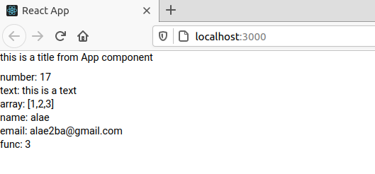


### creating a counter app (how state work?)

* Create an app component

	```js
	import React, { Component } from "react"
	import "./App.css"
	import Counter from "./Counter"

	class App extends Component {
		render() {
			return (
				<div>
					<Counter />
				</div>
			)
		}
	}

	export default App
	```

	the app component just renders a Counter comonent

* create a Counter component

	```js
	import React, { Component } from "react"

	export default class Counter extends Component {
		state = {
			count: 0
		}

		increment = () => {
			this.setState({
				count: this.state.count + 1
			})
		}

		decrement = () => {
			this.setState({
				count: this.state.count - 1
			})
		}

		render() {
			return (
				<div>
					<div>
						{" "}
						<h1>count: {this.state.count}</h1>{" "}
					</div>
					<button onClick={this.decrement}>decrement</button>
					<button onClick={this.increment}>increment</button>
				</div>
			)
		}
	}
	```

	* see how i change the **count** variable in the state. Im calling a method named **setState** and im passing to it a new object with the **count** state var now modified. but alae this is going to change the whole state no??? no, just the **count** var, which means if we have other vars in the **state** object they will not change!

	* see how im handling the **click event** on the buttons

* here what it looks like

	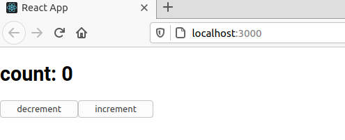


### creating an image slider (how state works?)

* create an App component
	
	```js
	import React, { Component } from "react"
	import "./App.css"
	import ImageSlider from "./ImageSlider"

	class App extends Component {
		render() {
			return (
				<div>
					<ImageSlider />
				</div>
			)
		}
	}

	export default App
	```

* create an ImageSliderComponent
	
	```js
	import React, { Component } from "react"

	//there is a bug with % in js, this is the right implementation
	Number.prototype.mod = function (n) {
		return ((this % n) + n) % n
	}

	export default class ImageSlider extends Component {
		state = {
			images: [
				"https://i.pinimg.com/originals/eb/92/b9/eb92b94f2565096ade8e9ff644952c66.jpg",
				"https://i.pinimg.com/236x/9a/74/c0/9a74c0a33095581cdcc23ad6b27860f2.jpg",
				"https://i.pinimg.com/236x/8f/1a/5e/8f1a5eaabe8af040631d259c2a6d1275.jpg"
			],
			index: 0
		}

		handleNext = () => {
			this.setState({
				index: (this.state.index + 1).mod(this.state.images.length)
			})
		}

		handlePrevious = () => {
			this.setState({
				index: (this.state.index - 1).mod(this.state.images.length)
			})
		}

		render() {
			return (
				<div>
					{" "}
					<br />
					<button onClick={this.handlePrevious}>previous</button>
					<button onClick={this.handleNext}>next</button>
				</div>
			)
		}
	}
	```

	when i click the **next button** im calling **handleNext** method.\
	notice how im changin the **state** with **setState**. Im passing an object to it but **images** is not changed in the **state object :)**


* here is how it looks like:

	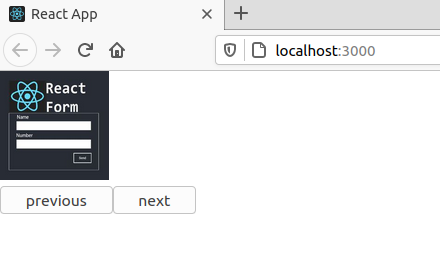

### working with forms

* create an App component:
	
	```js
	import React, { Component } from "react"
	import "./App.css"

	class App extends Component {
		state = {
			name: "",
			checked: true,
			title: "Miss."
		}

		handleInput = (event) => {
			this.setState({
				name: event.target.value
			})
		}

		handleCheck = (event) => {
			// this.setState({ checked: !this.state.checked })
			this.setState({
				checked: event.target.checked
			})
		}

		handleSelect = (event) => {
			this.setState({
				title: event.target.value
			})
		}

		handleSubmit = (event) => {
			event.preventDefault()
			console.log(this.state)
		}

		render() {
			const formStyle = {
				border: "1px solid black",
				padding: "10px",
				width: "50%",
				marginLeft: "auto",
				marginRight: "auto",
				marginTop: "20px"
			}

			return (
				<div>
					<form onSubmit={this.handleSubmit} style={formStyle}>
						<div>
							your name: <br />
							<input
								type="text"
								value={this.state.name}
								onChange={this.handleInput}
							/>{" "}
							<br />
							name: {this.state.name} <br />
						</div>

						<div>
							<input
								type="checkbox"
								onChange={this.handleCheck}
								checked={this.state.checked}
							/>{" "}
							<br />
							checked? {String(this.state.checked)}
						</div>

						<div>
							<select value={this.state.title} onChange={this.handleSelect}>
								<option>Mr.</option>
								<option>Miss.</option>
								<option>Mme.</option>
							</select>
							<br />
							title: {this.state.title}
						</div>

						<div>
							<button type="submit">submit</button>
						</div>
					</form>
				</div>
			)
		}
	}

	export default App
	```

	for every change in the input field, a method named **handleInput** gets called and it changes the value of **name** in the **state** and Im taking this value (this.state.name) and Im rendering it in the view.

	for other input we have other events.

### how to fetch an api

in react we fetch an api using the **fetch API** built in into Js.

when we are working with a class component like here we fetch the data when the component renders which means in the **componentDidMount** method.

* create an App component

	```js
	import React, { Component } from "react"
	import "./App.css"

	class App extends Component {
		state = {
			loading: true,
			user: null
		}

		async componentDidMount() {
			const url = "https://jsonplaceholder.typicode.com/users/1"

			try {
				const response = await fetch(url)
				const json = await response.json()
				this.setState({
					loading: false,
					user: json
				})
			} catch (error) {
				console.error(error)
			}
		}

		displayUser() {
			return (
				<div>
					name: {this.state.user.name} <br />
					mail: {this.state.user.email} <br />
					website: {this.state.user.website} <br />
					phone: {this.state.user.website}
				</div>
			)
		}
		render() {
			return (
				<div>
					{this.state.loading || !this.state.user ? (
						<div> loading... </div>
					) : (
						this.displayUser()
					)}{" "}
				</div>
			)
		}
	}

	export default App
	```

* here is how it looks like when the data is fetched.

	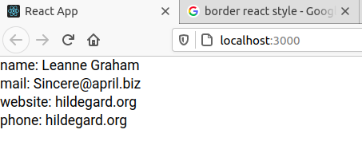

### rendering arrays

* create an App component class
  
	```js
	import React, { Component } from "react"
	import "./App.css"

	class App extends Component {
		state = {
			loading: true,
			people: []
		}

		async componentDidMount() {
			const url = "http://jsonplaceholder.typicode.com/users?_limit=5"

			try {
				const response = await fetch(url)
				const json = await response.json()
				this.setState({
					loading: false,
					people: json
				})
			} catch (error) {
				console.error(error)
			}
		}

		displayUsers() {
			const style = {
				border: "1px solid black",
				width: "50%",
				padding: "10px",
				marginBottom: "10px"
			}

			return this.state.people.map((user) => (
				<div style={style} key={user.id}>
					name: {user.name} <br />
					mail: {user.email} <br />
					website: {user.website} <br />
					phone: {user.website}
				</div>
			))
		}
		render() {
			return (
				<div>
					{this.state.loading || !this.state.people.length ? (
						<div> loading... </div>
					) : (
						this.displayUsers()
					)}{" "}
				</div>
			)
		}
	}

	export default App
	```

	notice how we're using the **map** method on the **people** array and for each user we are rendering some **jsx**.

	> componentDidMount is called when the component finishes rendering.

* here is how it looks like
  
	

### todo app

* create an App component:
	
	```js
	import React, { Component } from "react"
	import "./App.css"
	import TodoList from "./TodoList"

	class App extends Component {
		render() {
			return (
				<div>
					<TodoList />
				</div>
			)
		}
	}

	export default App
	```
	
* create a TodoList Component

	```js
	import React, { Component } from "react"
	import AddTodo from "./AddTodo"
	import TodoItem from "./TodoItem"
	import shortid from "shortid"

	export default class TodoList extends Component {
		state = {
			todos: [],
			whatToShow: "all"
		}

		addTodo = (title) => {
			this.setState({
				todos: [
					...this.state.todos,
					{
						id: shortid.generate(),
						title,
						complete: false
					}
				]
			})
		}

		toggleTodo = (id) => {
			this.setState({
				todos: this.state.todos.map((todo) => {
					if (todo.id === id) {
						todo.complete = !todo.complete
					}

					return todo
				})
			})
		}

		deleteTodo = (id) => {
			this.setState({
				todos: this.state.todos.filter((todo) => todo.id !== id)
			})
		}

		deleteAllComplete = () => {
			this.setState({
				todos: this.state.todos.filter((todo) => !todo.complete)
			})
		}

		handleWhatToShow = (str) => {
			this.setState({
				whatToShow: str
			})
		}

		render() {
			let todos = []

			if (this.state.whatToShow === "all") {
				todos = this.state.todos
			} else if (this.state.whatToShow === "active") {
				todos = this.state.todos.filter((todo) => !todo.complete)
			} else if (this.state.whatToShow === "complete") {
				todos = this.state.todos.filter((todo) => todo.complete)
			}

			return (
				<div>
					<div>
						<AddTodo addTodo={this.addTodo} />

						{todos.map((todo) => (
							<TodoItem
								key={todo.id}
								todo={todo}
								deleteTodo={this.deleteTodo}
								toggleTodo={this.toggleTodo}
							/>
						))}
					</div>

					<div>active todos: {this.state.todos.filter((todo) => !todo.complete).length}</div>

					<div>
						{this.state.todos.some((todo) => todo.complete) ? (
							<button onClick={this.deleteAllComplete}>delete all complete</button>
						) : null}

						<button onClick={() => this.handleWhatToShow("all")}>show all </button>
						<button onClick={() => this.handleWhatToShow("active")}>show active</button>
						<button onClick={() => this.handleWhatToShow("complete")}>show complete</button>
					</div>
				</div>
			)
		}
	}
	```

* create an AddTodo component:
	
	```js
	import React, { Component } from "react"

	export default class AddTodo extends Component {
		state = {
			title: ""
		}
		addTodo = (event) => {
			event.preventDefault()
			// console.log(this.state.title)
			this.props.addTodo(this.state.title)
			this.setState({
				title: ""
			})
		}
		render() {
			return (
				<div>
					<form onSubmit={this.addTodo}>
						<input
							type="text"
							onChange={(e) => this.setState({ title: e.target.value })}
							value={this.state.title}
						/>
						<button type="submit">add todo</button>
					</form>
				</div>
			)
		}
	}
	```

* create a TodoItem component:
	
	```js
	import React, { Component } from "react"

	export default class TodoItem extends Component {
		render() {
			const todoItemStyle = { textDecoration: this.props.todo.complete ? "line-through" : "" }
			const deleteButtonStyle = {
				borderRadius: "10px",
				background: "red",
				color: "white",
				fontWeight: "bold"
			}

			return (
				<div style={{ display: "flex" }}>
					<div
						onClick={() => this.props.toggleTodo(this.props.todo.id)}
						style={todoItemStyle}
					>
						{this.props.todo.title}
					</div>

					<button
						style={deleteButtonStyle}
						onClick={() => this.props.deleteTodo(this.props.todo.id)}
					>
						x
					</button>
				</div>
			)
		}
	}
	```

* here is how it looks like

	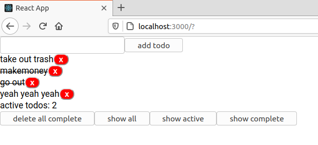

## create a counter using useState hooks (beginner)

* here is what it should looks like

	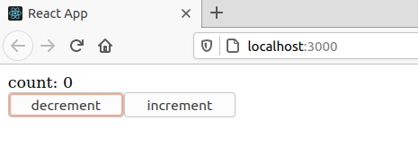

* lets create an App component and create our **Counter** using **setState**:
	
	```js
	import React, { useState } from "react"

	function Counter() {
		const [count, setCount] = useState(0)

		return (
			<div>
				count: {count} <br />
				<button onClick={() => setCount(count - 1)}> decrement </button>
				<button onClick={() => setCount(count + 1)}> increment </button>
			</div>
		)
	}

	function App() {
		return (
			<div>
				<Counter />
			</div>
		)
	}

	export default App
	```

* here is the same example using a **class based comonent**:

	```js
	import React from "react"

	class Counter extends React.Component {
		state = {
			count: 0
		}

		render() {
			return (
				<div>
					count: {this.state.count} <br />
					<button onClick={() => this.setState({ count: this.state.count - 1 })}>
						decrement
					</button>
					<button onClick={() => this.setState({ count: this.state.count + 1 })}>
						increment
					</button>
				</div>
			)
		}
	}

	function App() {
		return (
			<div>
				<Counter />
			</div>
		)
	}

	export default App
	```

## using setState with an object (beginner)

we want to display a person's information to the screen (name, age) and we wanna have a button and when we click it the name must be changed.

* here is how it should look like
	
	* before clicking the button
	
	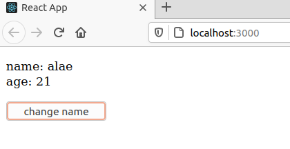

	* after clicking the button

	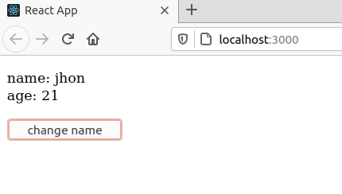

	* after clicking the button

	

* lets create an App component

	```js
	import React, { useState } from "react"

	function Person() {
		const [person, setPerson] = useState({ name: "alae", age: 21 })

		const handleChange = () => {
			setPerson({
				...person,
				name: person.name === "alae" ? "jhon" : "alae"
			})

			// <=>
			// setPerson((previousPersonValue) => {
			// 	return {
			// 		...previousPersonValue,
			// 		name: previousPersonValue.name === "alae" ? "jhon" : "alae"
			// 	}
			// })
		}

		return (
			<div>
				<p>
					name: {person.name} <br />
					age: {person.age}
				</p>

				<button onClick={handleChange}> change name </button>
			</div>
		)
	}

	function App() {
		return (
			<div>
				<Person />
			</div>
		)
	}

	export default App
	```

	notice the **handleChange** function how we are keeping other values of the object using **...person** and changing just the **name property**

## working with multiple form fields using setState

we want a form that lets us enter infos about a person, and then this person gets pushed into a list and this list of persons must be dipslayed under the form.
> an id must be generated automatically for each person 
> 
* here how it should look like
	
	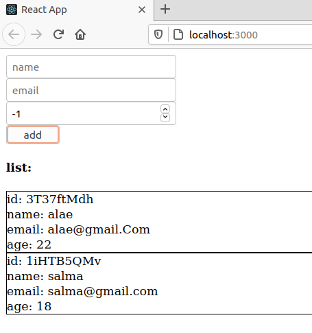

* solution: lets create an App Component

	```js
	import React, { useState } from "react"
	import shortid from "shortid"

	function Form() {
		const [person, setPerson] = useState({ name: "", email: "", age: 0 })
		const [persons, setPersons] = useState([])

		const handleChange = (event) => {
			setPerson({
				...person,
				[event.target.name]: event.target.value
			})
		}

		const handleSubmit = (event) => {
			event.preventDefault()
			const newPerson = {
				...person,
				id: shortid.generate()
			}

			setPersons([...persons, newPerson])
			setPerson({ name: "", email: "", age: -1 })
		}

		return (
			<div>
				<form onSubmit={handleSubmit}>
					<input
						type="text"
						name="name"
						onChange={handleChange}
						placeholder="name"
						value={person.name}
					/>
					<br />

					<input
						type="text"
						name="email"
						onChange={handleChange}
						placeholder="email"
						value={person.email}
					/>
					<br />

					<input
						type="number"
						name="age"
						onChange={handleChange}
						placeholder="age"
						value={person.age}
					/>
					<br />

					<button type="submit">add</button>
				</form>

				<div>
					<h4>list:</h4>

					{persons.map((p) => (
						<div key={p.id} style={{ border: "1px solid black" }}>
							id: {p.id} <br />
							name: {p.name} <br />
							email: {p.email} <br />
							age: {p.age} <br />
						</div>
					))}
				</div>
			</div>
		)
	}

	function App() {
		return (
			<div>
				<Form />
			</div>
		)
	}

	export default App
	```

## using *useEffect* hook to fetch an api

use **useEffect** to fetch a list of users and then display this list and give the user the possibility to add a new user to the list (name, email).

* here is how it should look like
  
	* when the page loads for the fisrt time
		
		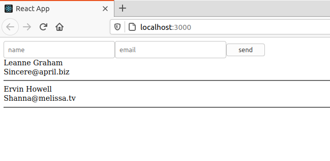

	* after adding alae/alae@gmail.com
		
		


* lets create an App component:
	
	```js
	import React, { useState, useEffect } from "react"
	import shortid from "shortid"

	function Users() {
		const [users, setUsers] = useState([])
		const [user, setUser] = useState({ name: "", email: "" })

		useEffect(() => {
			fetch("https://jsonplaceholder.typicode.com/users/?_limit=2")
				.then((response) => response.json())
				.then((json) => setUsers(json))
				.catch((err) => console.log(err))
		}, [])

		const handleChange = (event) => {
			setUser({
				...user,
				[event.target.name]: event.target.value
			})
		}

		const handleSubmit = (event) => {
			event.preventDefault()

			const newUser = {
				...user,
				id: shortid.generate()
			}

			//add the new user to the users array
			setUsers([...users, newUser])

			setUser({ name: "", email: "" })
		}

		return (
			<div>
				<div>
					<form onSubmit={handleSubmit}>
						<input
							type="text"
							name="name"
							value={user.name}
							onChange={handleChange}
							placeholder="name"
						/>
						<input
							type="text"
							name="email"
							value={user.email}
							onChange={handleChange}
							placeholder="email"
						/>
						<button type="submit"> send </button>
					</form>
				</div>
				<div>
					{users.map((u) => (
						<div key={u.id}>
							{u.name} <br />
							{u.email} <br />
							<hr />
						</div>
					))}
				</div>
			</div>
		)
	}

	function App() {
		return (
			<div>
				<Users />
			</div>
		)
	}

	export default App
	```

	--Why did you pass this argument **[]** as a second param to **useEffect**?
	
	by default (if we didnt pass that second param) to useEffect, the code inside it will run each time the component renders.. and we know that the component renders each time the state changes. which means that each time when we add a user (submit the form), the useEffect will run and will erase what we had in the users array and will fetch the data from the api again!! and we dont want that.

	if we pass some state variables in the array as a second argument to useEffect than useEffect will run when the component renders for the first time and then will run just if one of the state variables (in the array) changed.

	In our case we pass an empty array which means taht we want useEffect to run just one time (when the component renders for the first time).

	if instead we called useEffect with a second argument like this:

	```js
	useEffect (() => {
		//todo
	}, [user])
	```

	then useEffect will run as usual after the component renders for the first time and will aslo run each time the state variable **user** changes.


## understanding useRef hook (my explination)

the three main things about **useRef** are:

1. preserves value/state between renders (like useState)
1. does not trigger re-render (not like useState)
1. generally used to target DOM nodes/elements


### useRef preserves value/state between renders (like useState)
Q: can you explain this sentence: "useState preserves state between renders"?\
A: yes! lets see an example. Lets create a Counter, like this.

* it looks like this
	
	

* lets create an App component:
	
	```js
	import React, { useState } from "react"

	function Counter() {
		const [count, setCount] = useState(0)

		const handleIncrement = () => {
			setCount(count + 1)
		}

		return (
			<div>
				{count} <br />
				<button onClick={handleIncrement}>increment</button>
			</div>
		)
	}

	function App() {
		return (
			<div>
				<Counter />
			</div>
		)
	}

	export default App
	```

	the first value of the state variable **count** is **0**. when we click the button it will be **1** and the component will re-reneders and we will see **1** in the screen. This means that when the component renders, the value of **count** is not lost (always 1). And that what we mean by **useState** preserves state between renders.


Q: can explain now what you mean by **preserves value/state between renders (like useState)**?\
A: yes! in this regards, **useRef** work in a similar manner. we will see an example, we will create another variable **count2** using **useRef** this time. This variable will have the value 0 initially (like **count**), and we will see that with each render, **count2** will not lose its value (just like a variable with **useState**).

* how it looks like

	* when the app renders for the first time
	 
		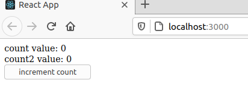

	* after clicking the button 
	  
		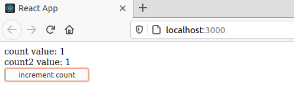

* lets see the code (create an App component)

	```js
	import React, { useState, useRef } from "react"

	function Counter() {
		const [count, setCount] = useState(0)
		const count2 = useRef(0)    //initial value of count2 is 0

		//when this runs, the component re-renders (because we are changing state)
		const handleIncrement = () => {
			setCount(count + 1)

			count2.current = count2.current + 1
		}

		return (
			<div>
				count value: {count} <br />
				count2 value: {count2.current} <br />
				<button onClick={handleIncrement}>increment count</button>
			</div>
		)
	}

	function App() {
		return (
			<div>
				<Counter />
			</div>
		)
	}

	export default App
	```

	we are creating a variable **count2** using **useRef**.

	when we click the button we change the value of the state variable **count** (from 0 to 1) and **count2** also.. because the state changed, now the component will re-render. We see that the value of the variable **count2** remains the same between re-renders (always 1 :) just like a state variable created with **useState**).
 
### does not trigger re-render (not like useState)
Q: can you explain the sentence **useRef does not trigger re-render (not like useState)**?\
A: yes! when the value of a variable created using **setState** changes, then the component re-renders.. this is not true with a variable created using **useRef**. Lets see an example with a counter app.

* create an App component
	
	```js
	import React, { useState, useRef } from "react"

	function Counter() {
		//count2 = {current: 2} this is the shape of count2
		const count2 = useRef(0)

		const handleIncrement = () => {

			count2.current = count2.current + 1
			console.log(count2.current)
		}

		return (
			<div>
				count2 value: {count2.current} <br />
				<button onClick={handleIncrement}>increment count</button>
			</div>
		)
	}

	function App() {
		return (
			<div>
				<Counter />
			</div>
		)
	}

	export default App
	```

* here is how the app looks like initialy 
  
	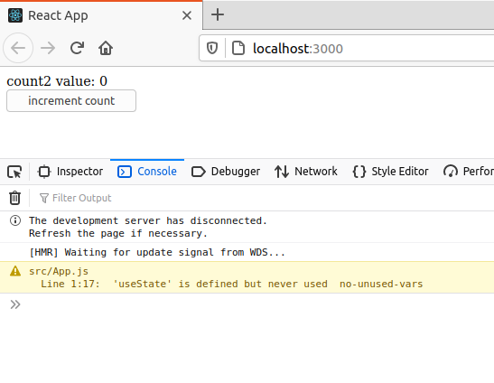

* how it looks like after clicking 4 times in the button 

	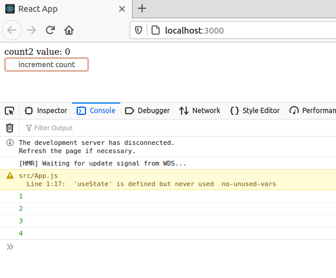

we can clearly see, that even if the variable **count2** changes, the component does not re-render :)


### generally used to target DOM nodes/elements

**useRef** is generally used to control dom elements. here is an example: suppose i have a form with one two inputs (name, email) and i want when the user submit the form console.log its name and email.

Lets create this without using **setState** hook.

* here is how the app should look like after submitting the form:
	
	

* here is the code (insode App component)
	
	```js
	import React, { useRef } from "react"

	function Counter() {
		const nameInputRef = useRef(null)	//references the name input
		const emailInputRef = useRef(null) //references the email input field

		const handleSubmit = (e) => {
			e.preventDefault()

			//name input 
			console.log(nameInputRef.current)
			
			//name input value
			console.log(nameInputRef.current.value)

			console.log(emailInputRef.current.value)
		}

		return (
			<div>
				<form onSubmit={handleSubmit}>
					<input type="text" placeholder="name" ref={nameInputRef} />
					<input type="text" placeholder="email" ref={emailInputRef} />

					<button type="submit">submit</button>
				</form>
			</div>
		)
	}

	function App() {
		return (
			<div>
				<Counter />
			</div>
		)
	}

	export default App
	```

## can you display how many times a page renders?

this is a tricky question. In first I may think: I need to set a state variable named **count** using **useState**, its initial value must be 1, and with each render increment its value. we know that **useEffect** run by default after each render, so this will be a good place to increment the **count**. we need just something to change the state so that the compnent re-render. We will use a dummy boolean value and a button to change its value and with each change, the component will re-render and useEffect will run and our count will increment.

the code may look somthing like this:

```js
import React, { useState, useEffect} from "react"

function Counter() {
	const [count, setCount] = useState(1)
	const [dummy, setDummy] = setState(false)


	useEffect(() => {
		setCount(count + 1)
	})

	return (
		<div>
			the page rendred {count} times <br />
			
			<button onClick={() => setDummy(!dummy)}>change state </button>
		</div>
	)
}

function App() {
	return (
		<div>
			<Counter />
		</div>
	)
}

export default App
```

but there is a problem with this code! lets execute in our head and see, the component will render for the first time, useEffect will be called, it will change the value of count and thus changing the state ang thus the component will re-render and then useEffect will be called ... INFINIT LOOP :).

the solution to this problem is using **useRef hook** because **useRef does not trigger re-render :)**.

* here is how the app will look like:

	* initialy 
		
		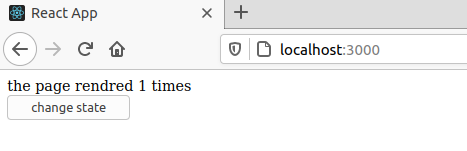


	* afetr 2 clicks in the button
		
		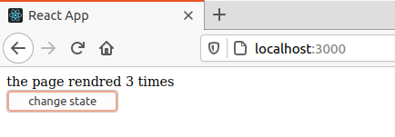

* here is the code
	
	```js
	import React, { useState, useEffect, useRef } from "react"

	function Counter() {
		const [dummy, setDummy] = useState(false)

		const countRef = useRef(1)

		useEffect(() => {
			countRef.current = countRef.current + 1
		})

		return (
			<div>
				the page rendred {countRef.current} times <br />
				<button onClick={() => setDummy(!dummy)}>change state </button>
			</div>
		)
	}

	function App() {
		return (
			<div>
				<Counter />
			</div>
		)
	}

	export default App
	```

## can you create a form with one input field, and when the component renders the input will have the focus automatically?

I need to execute somthing (put the focus on the input) when the component renders! where we do that normally? **useEffect**, because useEffect runs when the component renders. And we will use **useRef** because **useRef** to target the input element.

* here is how it should look like when the component renders:

	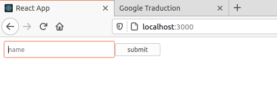

* here is the code:
	
	```js
	import React, { useEffect, useRef } from "react"

	function Counter() {
		const inputRef = useRef(null)

		useEffect(() => {
			inputRef.current.focus()
		})

		return (
			<div>
				<form>
					<input type="text" placeholder="name" ref={inputRef} />
					<button>submit</button>
				</form>
			</div>
		)
	}

	function App() {
		return (
			<div>
				<Counter />
			</div>
		)
	}

	export default App
	```

	useRef will run when the component renders, and inside it we put the focus on the input :) and we dont need to pass the second argupent to **useEffect** because **useRef** does not trigger re-render and so we will not cause an infinite loop. 

## A quick intro to props.children (or this.props.children)

**props.children** (in a function based component or **this.props.children** in a class based component) is whatever you include between the opening and closing tags when invoking a component.

* example:
	
	Here is a component name **Picture**:

	```js
	import React from "react"

	const Picture = (props) => {
		return (
			<div>
				 <br />
				{props.children}
			</div>
		)
	}

	export default Picture
	```

    This component contains an **\** that is receiving some **props** and then it is displaying **{props.children}**

    Whenever this component is invoked **{props.children}** will also be displayed and this is just a reference to what is between the opening and closing tags of the component.

	Here is the code for the **App** component:

	```js
	import React from "react"
	import Picture from "./Picture"

	function App() {
		return (
			<>
				<Picture
					src="https://www.inovex.de/blog/wp-content/uploads/2022/01/one-year-of-react-native.png"
					width={200}
				>
					<h1>my name is alae toouba</h1>
				</Picture>
			</>
		)
	}

	export default App
	```
	Instead of invoking the component with a self-closing tag **\<Picture />** if we invoke it will full opening and closing tags **\<Picture> \</Picture>** we can then place more code between it.

	in this case the code we placed in between is an **h1** so this is what will be **props.children** of the **Picture** component.

* Here is how this looks like 
	
	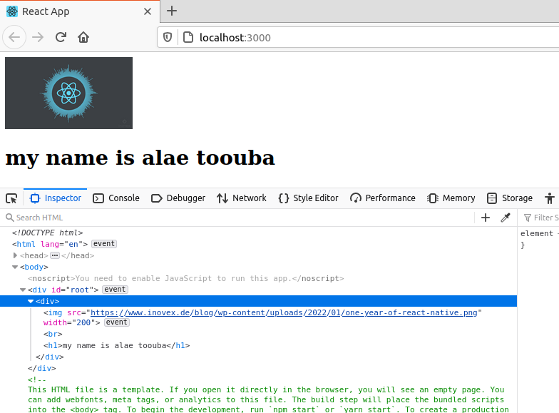

## React useContext Hook Tutorial (with Examples)
https://daveceddia.com/usecontext-hook/

todo:
https://daveceddia.com/useeffect-hook-examples/
https://daveceddia.com/ajax-requests-in-react/
https://daveceddia.com/how-i-learned-react/
https://daveceddia.com/react-is-trending/
https://daveceddia.com/why-react/
https://daveceddia.com/usestate-hook-examples/