- [CodeJava Apache Tomcat youtube tutorial](#codejava-apache-tomcat-youtube-tutorial)
	- [What is Apache Tomcat](#what-is-apache-tomcat)
	- [Install Apache Tomcat on Windows](#install-apache-tomcat-on-windows)
	- [Tomcat's Key directories and files](#tomcats-key-directories-and-files)
	- [Start/Stop Tomcat](#startstop-tomcat)
	- [Deploy a Java Web app into Tomcat](#deploy-a-java-web-app-into-tomcat)
	- [Add and use tomcat to Eclipse EE](#add-and-use-tomcat-to-eclipse-ee)
	- [Deploy a web app in Tomcat in Eclipse EE](#deploy-a-web-app-in-tomcat-in-eclipse-ee)

# CodeJava Apache Tomcat youtube tutorial

## What is Apache Tomcat

* Tomcat is a server for hosting web apps
* Free & open source
* Supports Java technologies:
    * Java Servlet
    * JavaServer pages (JSP)
    * Java Expression Language (EL)
    * Java Websocket
* Also called a Servlet container
* Developed by Apache software fondation
  
website: tomcat.apache.org

## Install Apache Tomcat on Windows 
	
* We will install Tomcat 9. it supports the following Specs:
    * Servlets 4.0
    * JSP 2.3
    * EL 3.0
    * WebSocket 1.1
    
* Java 1.8 is required for it.

* Install Steps:
    1. head to tomcat.apache.org and click the Downloads link (for tomcat version 1. download the Windows service installer

        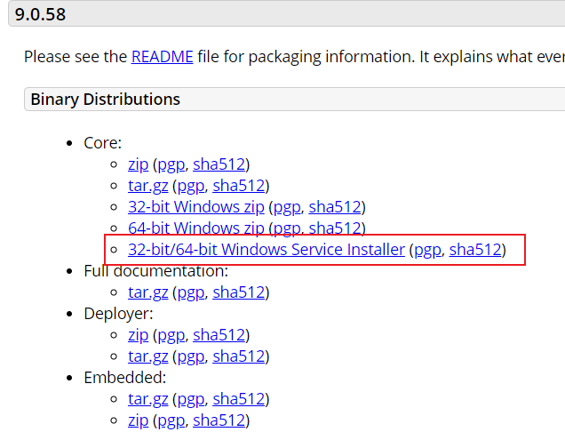      

    2. run the .exe file to install
    3. check all the boxes in the Choose components wizard

        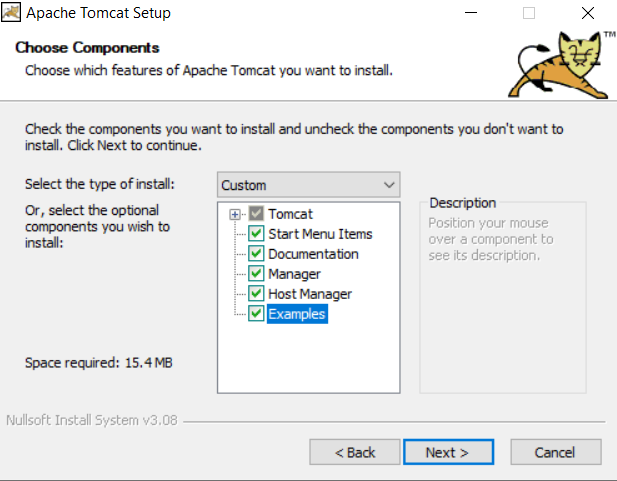
       
    4. configure Tomcat (port number, manager username/password)

       

    5. select the Java virtual machine path (tomcat 9 requires Java 1.8 and above)

           

    6. specify the tomcat installation destination directory

        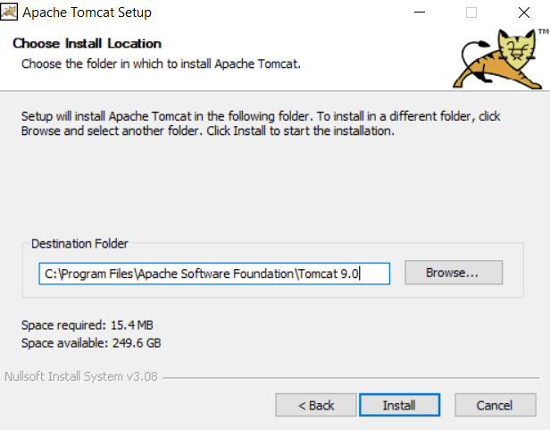
    
    7. add a new Envirenment variable CATALINA_HOME with tomcat installation directory as value

        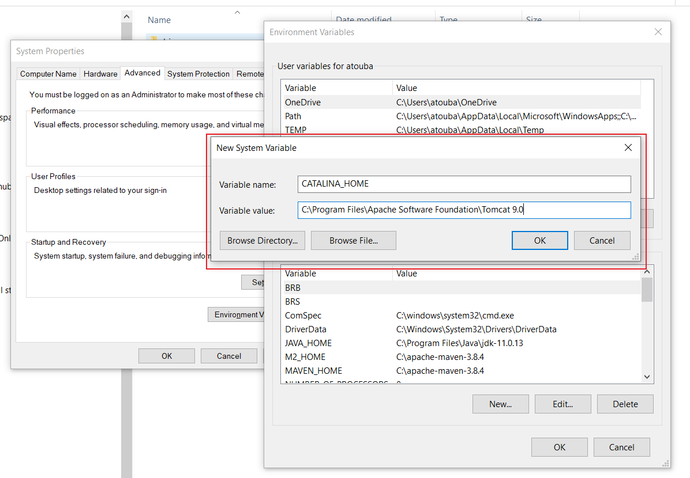

    8. check if tomcat is successfully installed by going to localhost:8080

        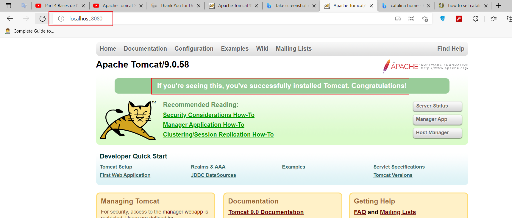

## Tomcat's Key directories and files

* **/bin:** startup, shutdow … scripts
* **/conf:** configuration files
* **/lib:** Tomcat's jar files (servlet api jar, jsp api jar, etc) and external libraries
* **/logs:** log files
* **/temp:** temporary files used by the JVM
* **/webapps:** deployed Java web apps
* **/work**: temporary files for deployed web apps
    
## Start/Stop Tomcat

* using Windows services app
    * open windows services app 
    * search for Tomcat and then start/stop as a windows service

        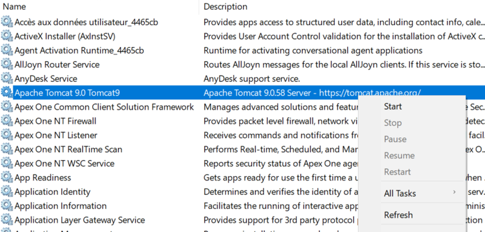

* using the Tomcat Monitor program
    * head to tomcat bin folder and run Tomcat9.exe 

        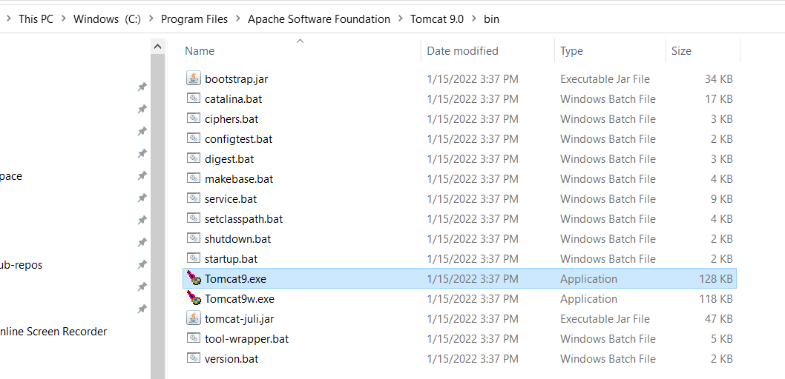

        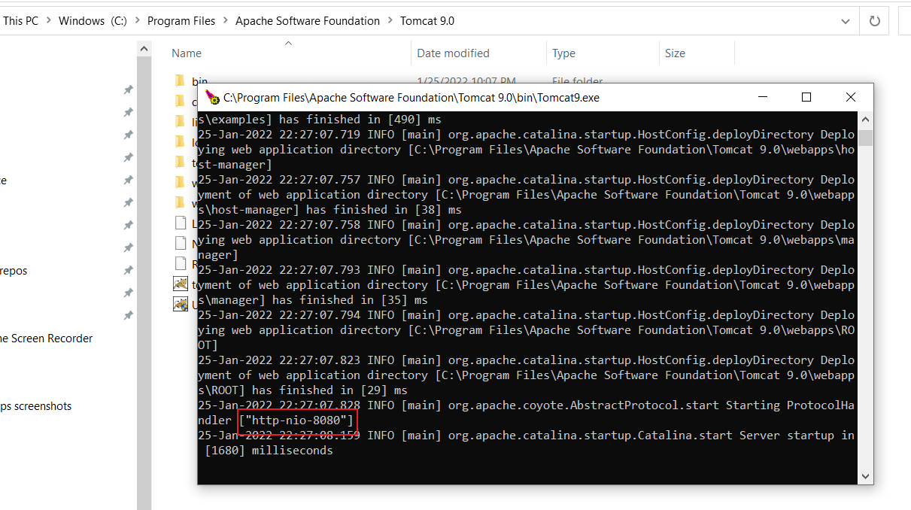

* using startup.bat/    
	* from command line, head to bin folder and run the batch file startup.bat

		

## Deploy a Java Web app into Tomcat

* In order to deply java web apps in tomcat, you need to package the app in a WAR format.
* **WAR**: standard zip file that contains resources/files for a Java web app 
	
* There 2 ways to deploy WAR files in Tomcat:
	* **static deploy** (can be used when having direct access to the server directory):
    	1. stop server
    	2. copy the app's WAR to webapps
    	3. restart the server
		
		&nbsp;

		* example:
			* we will deploy an app for which we have the WAR file.
			* copy the war file to webapps tomcat directory
				
				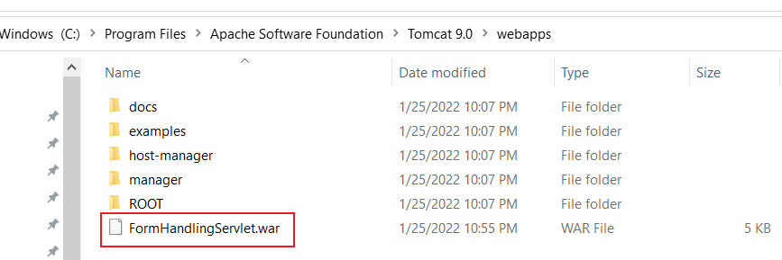

			* start the server and go to app manager (localhost:8080/manager) and see that the app is deployed

				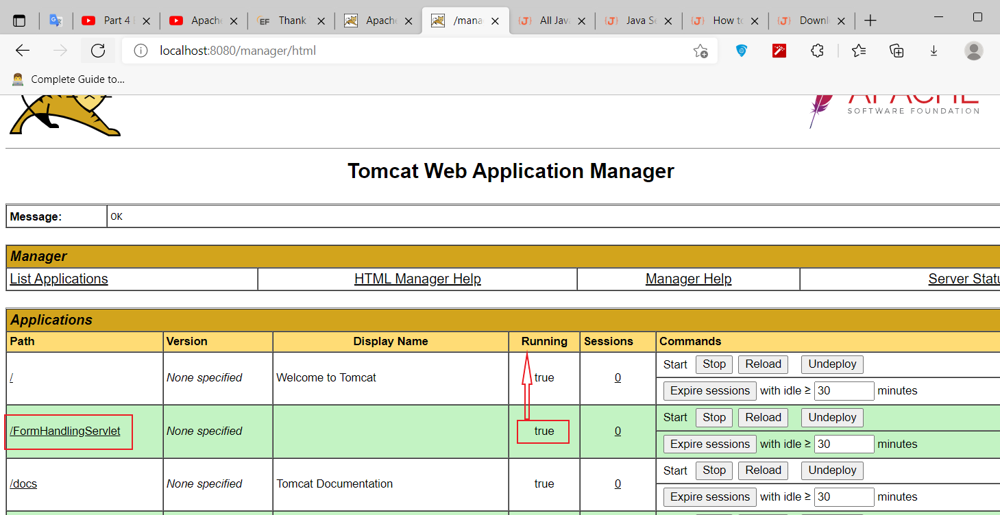

			* to test it go to localhost:8080/FormHandlingServlet/FormDemo.html

				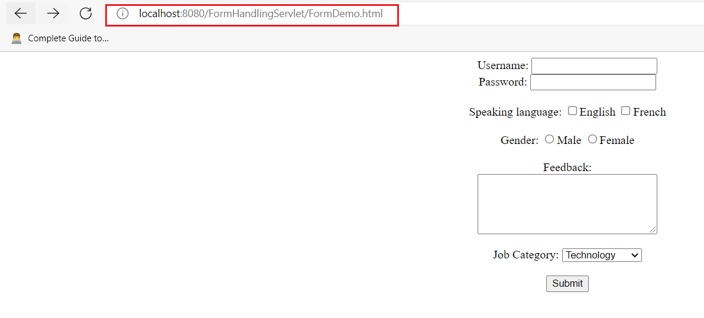

			
	* **Hot deploy** using Tomcat manager app
		1. head to tomcat server manager app (localhost:8080/manager)
		1. in the section "War file to deploy" upload your WAR file and click Deploy

			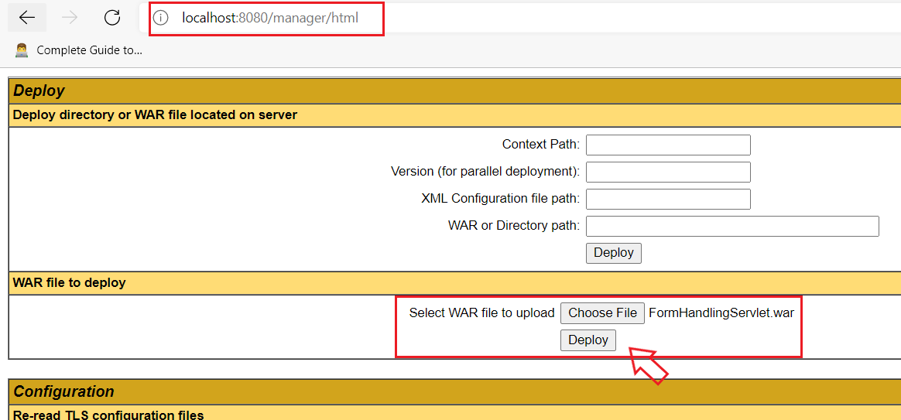

## Add and use tomcat to Eclipse EE

* click on the link available under Servers tab 

	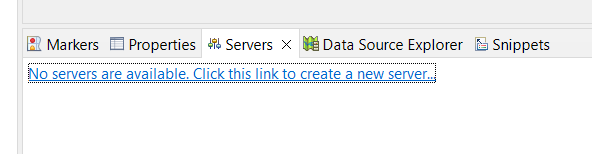

* Select the server type and choose the version of Tomcat that you installed in the machine

	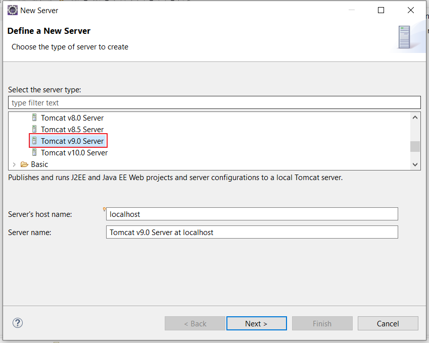

* choose server name (whatever), tomcat installation directory and JDK version you are working with

	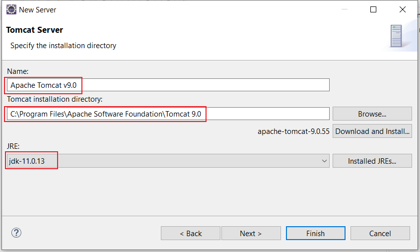

* now the server will available for use
	
	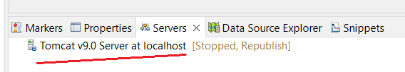

* Double click on the server and change the Tomcat admin port (give a valid port number)

	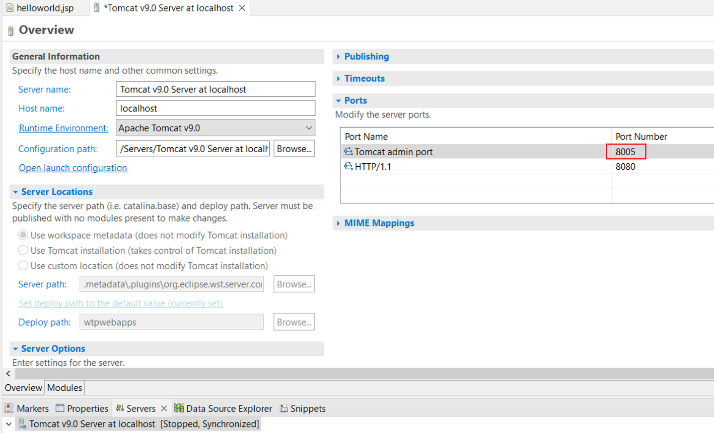

## Deploy a web app in Tomcat in Eclipse EE

There are 3 ways to do this

1. first method, Drag and drop the project from package explorer to the Tomcat server, you will see the project like this

	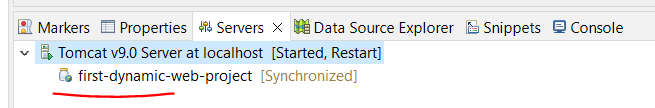

	Now you can just head to https://localhost:8080/first-dynamic-web-project and see that the project is deployed

	

1. 	2. second method, right click on the tomcat server instance under **Servers** tab and add the project

	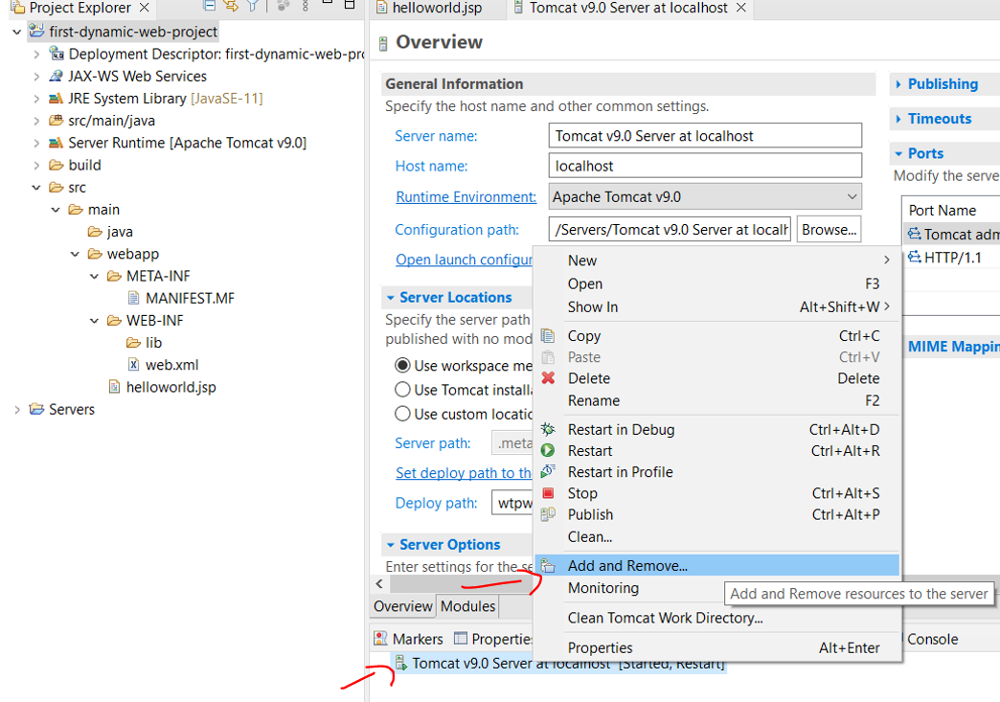

	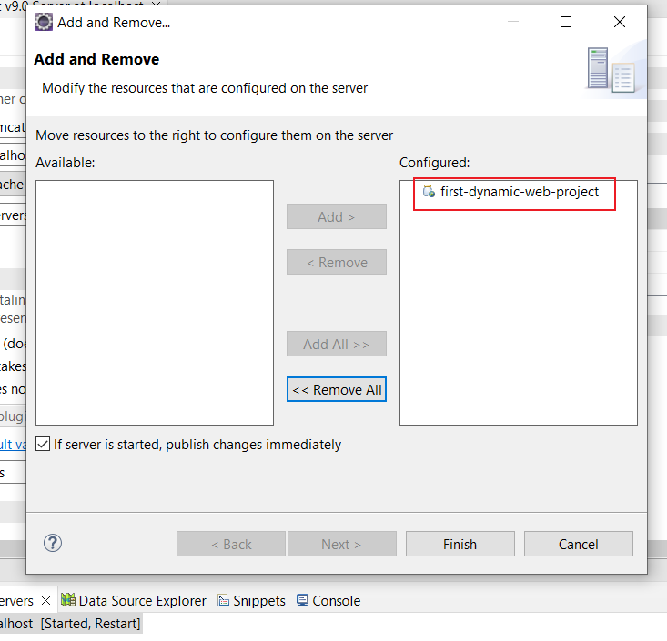

1. third method, from *Project explorer*, right click on the project -> Properties -> Targeted Runtimes -> choose tomcat server

	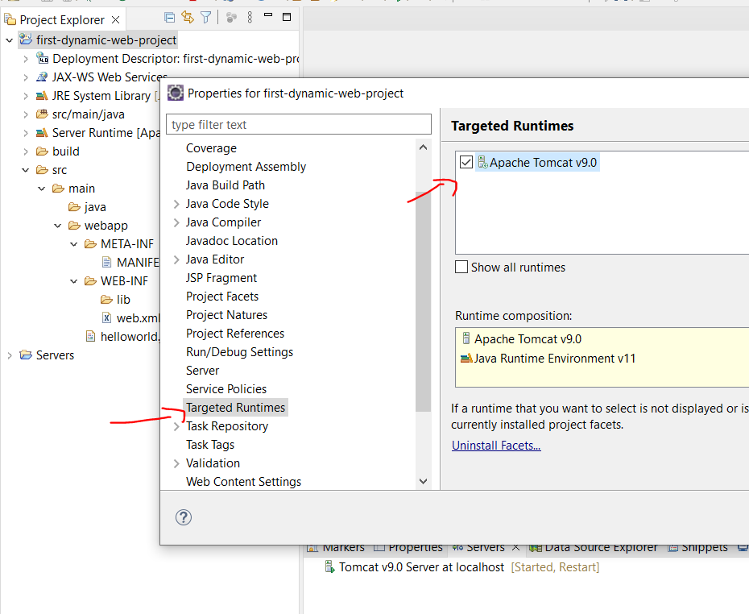

